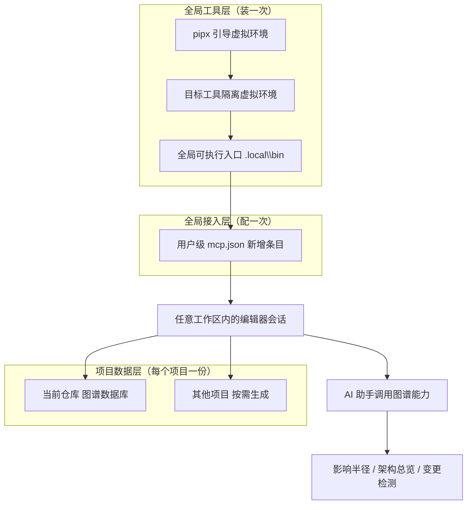

## 用户需求

把 code-review-graph（本地代码知识图谱工具）部署成**一次安装、所有项目通用**的全局能力，而不是只服务于当前这一个仓库。经两轮确认，最终口径为：

- **全局化**：安装在用户级位置，任意目录下都能直接调用该命令，不绑定某个 conda 环境、不污染任何项目
- **全局接入**：写入用户级编辑器接入配置，任何工作区打开都能用
- **按需建图**：不扫描、不批量纳管存量项目；某个项目用到时各自初始化一次
- **更新方式**：本期不启用常驻后台进程，改为手动增量刷新
- **验证样本**：在当前仓库跑通一次建图，作为「可用」的证据

## 产品概述

为本地开发环境加一层「全局代码理解能力」。装一次之后，在任何项目里向 AI 助手提问（改这里会影响哪些文件、这个模块负责什么、整体架构长什么样），助手只需读取本次真正相关的少量文件，而不是把整个代码库读一遍。

对使用者而言，可直接感知的变化有三处：命令行在任意目录都能调用；编辑器的 AI 助手多出一批可调用的图谱能力；每个用过的项目里会多出一个可再生的图谱数据目录。

## 核心功能

1. **全局命令可用**：在任意磁盘位置、任意项目目录下都能执行，无需先激活某个环境或进入特定目录
2. **编辑器全局接入**：接入配置写在用户级，所有工作区共享同一份，无需逐个项目配置
3. **单项目按需建图**：进入目标项目执行一次构建即完成接入；未建图的项目使用图谱能力时只返回空结果或提示，不会报错崩溃
4. **变更影响与架构视图**：给出改动的影响半径（哪些调用方、哪些测试会受牵连）、模块架构总览、可读的架构文档
5. **图谱保鲜**：改完代码手动执行一次增量刷新，只重新解析变化的文件
6. **可视化与导出**：生成可交互的图谱页面，也可导出成图片或通用图数据格式
7. **一键回滚**：提供从「只恢复接入配置」到「彻底清空安装痕迹」的分级还原路径

**视觉与交互效果**：命令行侧输出带边框的状态面板，展示本次查询相比「整库读取」节省的上下文字数；可视化命令会生成一份可在浏览器直接打开的图谱页面。

## 技术栈选择

| 项 | 选择 | 理由 |
| --- | --- | --- |
| 安装载体 | **pipx**（先引导，再安装目标工具） | 用户明确选择；全局唯一、隔离运行、不被任何项目环境污染、卸载干净 |
| 运行时 Python | **3.10.20**（`E:\08_Anaconda3\Anaconda3\envs\mcp-form-demo\python.exe`） | 已实测：该环境满足 3.10+；conda base 仅 3.9.13 不达标，系统 Python 3.14.4 过新、预编译包缺失风险高 |
| 目标工具 | code-review-graph 2.3.x（MIT，纯 Python） | 本地优先；Tree-sitter 解析 AST；无外部数据库、无云依赖 |
| 通信方式 | MCP over stdio | 编辑器以子进程方式拉起，无需常驻端口 |
| 接入配置落点 | `C:\Users\10355\.codebuddy\mcp.json` | 用户级配置，天然对所有工作区生效 |
| 图谱数据落点 | 各仓库根目录下的 `.code-review-graph\` | 单文件 SQLite，属可再生产物 |
| 解析目标 | TypeScript / TSX（内置支持） | 无需自定义语言配置 |


**不引入任何前端依赖，`package.json` 不变。**

## 实施方案

采用**三层结构**：全局工具层（装一次）→ 全局接入层（配一次）→ 项目数据层（每个项目各一份）。

1. **安全前置**：备份接入配置与用户 PATH 原始值，形成可回滚基线。
2. **事实核对**：安装前先读官方仓库的打包定义，确认包名、命令行入口、平台标识与可选依赖组名，避免装错包或写错参数。
3. **引导 pipx**：用 3.10.20 建一个独立轻量虚拟环境承载 pipx 本体，不往 `mcp-form-demo` 里装任何包。
4. **安装目标工具**：用 pipx 安装，并把虚拟环境钉在 3.10；仅装基础依赖。验证命令可用性与子命令清单。
5. **写入接入配置**：先预览再执行，把条目写入用户级配置；**命令行必须写成绝对路径**。
6. **建图验证**：在当前仓库构建图谱，核对解析范围；实测各命令并如实记录能力边界。
7. **交付说明**：给出「新项目接入三步」、能力边界与回滚路径。

### 关键决策与权衡

- **为何必须用绝对路径写接入配置**：编辑器由桌面快捷方式启动时，进程 PATH 未必包含 `%USERPROFILE%\.local\bin`；若条目写成裸命令名，图谱服务会启动失败。绝对路径可彻底消除该风险，因此写入后需以该绝对路径手工冒烟一次。
- **为何 pipx 与目标工具都钉在 3.10**：既满足 3.10+ 要求，又避开 3.14 无预编译包、3.9 不达标的双重风险，是唯一确定可行的解释器。
- **为何不装向量嵌入可选依赖**：会连带拉入体积巨大的深度学习框架，而当前样本仓库仅 28 个源文件，向量检索边际收益极低；无向量时语义检索自动回退关键词检索，功能不缺失。后续需要时可用 `pipx inject` 单独追加。
- **为何不启用常驻后台更新**：用户选择后置。且自动提交钩子只对部分编辑器平台安装，当前编辑器不在其列，本次采用手动刷新与本方案自洽。
- **为何不做版本控制初始化**：当前仓库并非版本控制仓库，相关「变更检测」能力受限，但擅自初始化会改变项目状态，超出授权范围，故保留现状并如实标注边界。

### 性能与规模

- 冷启动建图耗时随仓库规模线性增长，官方基准约 3000 文件 40 秒；当前样本仓库不足 30 个源文件，预计数秒内完成。
- 增量更新只重新解析内容哈希变化的文件。
- 默认忽略清单已覆盖依赖目录、构建产物、锁文件等，无需额外配置即可避开海量无关文件；非版本控制模式下排除规则由仓库根的忽略文件承担。

## 执行注意事项

- 命令行输出含制表符边框与中文路径，PowerShell 会话先设 UTF-8 输出编码，避免乱码被误判为故障。
- 依赖源超时或卡顿时回退国内镜像。
- 环境变量变更需新开终端才生效；同一会话内统一用绝对路径调用更稳妥。
- 命令存在性以 `--help` 实测为准，不得凭文档假定；本次需重点核实「状态查询」子命令是否存在。
- 若部分文件解析失败，结果为降级状态并在错误流打印警告，属于正常降级而非失败，需如实记录。
- 写入接入配置前必须备份；写入后校验其为合法结构、原有条目完整、新增条目字段齐备。
- 全程不改动业务源码，不上传源码，不启用任何云端能力。

## 架构设计



要点：**全局能力只装一次，图谱数据每个仓库各自一份**；未建图的项目使用图谱能力时返回空结果而非报错。

## 目录与文件变更

```
C:\Users\10355\.codebuddy\
├── mcp.json                       # [MODIFY] 新增目标工具的接入条目；现有 8 个条目必须保持原样
├── settings.json                  # [可能 MODIFY] 仅在安装程序声明需要时改动；以预览输出为准，已备份
└── skills\ / plugins\             # [可能 NEW] 若安装程序附带技能包；以预览输出为准，可用开关关闭

C:\Users\10355\.local\
├── pipx-bootstrap\                # [NEW] 承载 pipx 本体的独立轻量虚拟环境（Python 3.10.20）
├── pipx\venvs\code-review-graph\  # [NEW] 目标工具自己的隔离虚拟环境（由 pipx 管理）
└── bin\code-review-graph.exe      # [NEW] 全局可执行入口

用户级环境变量 PATH                # [MODIFY] 追加 %USERPROFILE%\.local\bin

e:\13_dingdian\02_产品\06_函证系统\04_函证智能化\01_回函管理智能化\
├── .code-review-graph\            # [NEW] 本项目图谱数据库（验证样本）
└── .code-review-graphignore       # [条件 NEW] 仅当构建摘要显示解析到非源码文件时创建

$env:TEMP\crg-backup-20260916\      # [NEW] 接入配置原始备份 + PATH 快照
```

**明确不改动**：`src/**`、`docs/**`、`public/**`、`package.json`、`package-lock.json`、`vite.config.ts`、`tsconfig.json`、`index.html`、`.gitignore`；不执行版本控制初始化；不改动 `mcp-form-demo` 环境内的包集合。

## 关键结构：接入条目约定

新增条目需与现有条目形态一致（以现有 `Draw.io` 条目为参照），字段为 `autoApprove` / `timeout` / `command` / `args` / `type` / `disabled`：

```
"code-review-graph": {
  "autoApprove": [],
  "timeout": 60000,
  "command": "C:\\Users\\10355\\.local\\bin\\code-review-graph.exe",
  "args": ["serve"],
  "type": "stdio",
  "disabled": false
}
```

说明：`command` 与 `args` 的最终取值以安装程序的预览输出为准；若预览给出的是裸命令名，必须替换为上述绝对路径。

## 风险与回滚

| 风险 | 缓解 |
| --- | --- |
| 接入配置被写坏，导致编辑器现有 8 个服务全部失效 | 先备份；写后校验结构合法、原条目完整、新条目字段齐备 |
| 条目用裸命令名，编辑器启动时 PATH 缺失导致服务起不来 | 强制写绝对路径，并以该路径手工冒烟一次 |
| 引导 pipx 失败或下载不到预编译包 | pipx 与目标工具均钉在 3.10.20；退路是装进现有 3.10 环境（可一条命令卸载撤销） |
| 污染正在使用的 conda 环境 | pipx 宿主用独立虚拟环境承载，该 conda 环境只提供解释器、不装包 |
| 用户 PATH 被改坏 | 改动前记录原始值；回滚时移除追加项 |
| 建图误吞大目录 | 核对构建摘要的文件数与语言分布；异常时补忽略文件 |


**回滚路径（由浅至深）**：恢复接入配置备份 → 用工具自带卸载命令清理平台侧写入 → 用 pipx 卸载目标工具 → 删除 pipx 相关目录 → 从用户 PATH 移除追加项 → 删除各项目图谱目录。

## 验收标准

1. pipx 列表显示目标工具已安装；可执行入口文件存在
2. **在任意目录**（如磁盘根目录）执行帮助命令均成功，证明全局可用成立
3. 用户级接入配置为合法结构，含原有 8 个条目加新增 1 个；新条目 `command` 为绝对路径，且以该路径手工启动服务不报错
4. 当前仓库出现图谱数据库；构建摘要显示解析到 `src/` 下的 TS/TSX，且未包含依赖目录与构建产物；若为降级状态则如实记录失败文件
5. 帮助、构建、增量更新、可视化四条命令实测通过；状态查询子命令是否存在、非版本控制下变更检测的实际表现，均以实测结论如实记录
6. 交付中文说明，必须包含「新项目接入三步」、能力边界（非版本控制项目的影响、小仓库收益有限）、**重启编辑器**的收尾动作与回滚方式
7. 追加当日工作记忆到项目记忆目录（已存在则追加）

## Agent Extensions

### MCP

- **GitHub**
- Purpose: 在安装前读取目标仓库的打包定义文件与官方文档，核对包名、命令行入口点、平台的准确标识符以及可选依赖组的精确名称
- Expected outcome: 得到权威且可执行的安装参数清单（包名、平台标识、可选依赖组、入口命令），避免因文档滞后或参数拼写错误导致安装失败或写入错误配置