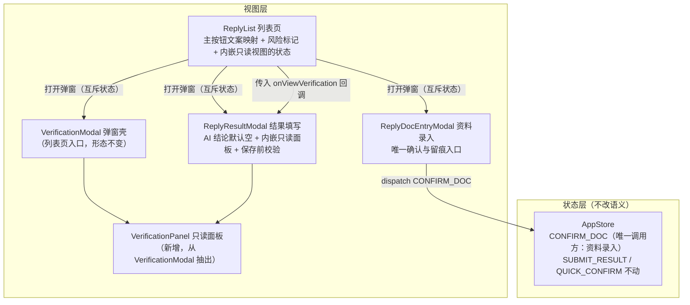

## 用户需求

当前列表行的操作区有四个入口（主按钮、AI 核验、查看、删除），用户提出三个可理解性疑问：

1. 主按钮在「确认资料」与「填写结果」之间切换，业务人员如何区分两者、如何知道该点哪个
2. 「AI 核验」在什么时候该看
3. 「AI 核验」的结论在什么时间节点进入「填写结果」表单，由谁决定是否采用

## 产品概述

这是一次围绕「三个入口的职责边界与信息流转」的可用性改造：把「AI 核验」的定位收敛为「看依据」（只读、不承担确认留痕），把「确认与留痕」收敛到第二步「确认回函资料」一次完成，把「AI 核验结论如何进入结果表单」改为「只作建议展示、必须人工采纳」，并让主按钮文案与回函进度列用同一套词自然对应。改造后业务人员不再需要自行推断「哪一步该点哪个」。

## 核心功能

**一、明确三个入口的分工**

- 主按钮承担「这一步该做什么」：进度为「待确认回函资料」时按钮为「确认回函资料」，进度为「待填写回函结果」时按钮为「填写回函结果」—— 与回函进度列去掉「待」字即对应，无需序号
- 「AI 核验」只用于查看 AI 的判断依据，不再承担确认动作（去掉其中的确认按钮，仅保留关闭），因此「已人工核验」留痕只在一处产生
- 「查看」与「删除」保持平铺不变

**二、同一行不会出现两个主按钮**

两个主按钮由回函进度互斥决定，不存在选择困难；已完成的行不显示主按钮（只需查看与删除）。

**三、AI 核验的时机可见**

有风险提示且尚未人工核验的行，AI 核验入口带标记，悬停说明存在几项风险提示、建议先核对依据；无风险行与已核验行保持原有中性外观，业务人员一眼看出哪几封必须看。

**四、AI 核验结论进入表单的方式明确**

- 打开「填写回函结果」时，AI 结论以建议形式呈现（结论 + 一句话依据），但**默认不填入表单**，必须由业务人员点采纳才进入
- 建议区块更名为「AI 核验结论」，与「AI 核验」入口在命名上连通，并说明该区块的完整明细在 AI 核验中
- 区块内提供「查看完整核验」入口，存疑时可直接查看四项检测明细，且不会丢失已填内容
- 未采纳必填项时，保存动作给出明确提示并说明缺哪一项，不静默保存

## 视觉与交互效果

- 操作区仍为平铺四项，宽度基本不变；仅在需要关注的行上多一个风险标记
- 三个建议项从「三种容器形态」统一为同一种骨架（结论、依据、采纳动作），与核验页的「结论条、事实清单、处理动作」骨架一致
- 未处理的必填项以浅红底高亮并给出文案提示，按钮保持可点（避免出现点不动却不知原因）
- 不引入任何新色相，红绿仍只出现在风险与相符两类状态上；无装饰性动效

## 交付边界

包含列表页、AI 核验弹窗、回函资料录入弹窗、回函结果填写弹窗四个界面，以及需求文档对应功能块与变更记录；不涉及识别链路、归属匹配、字段结构与既有视觉体系。

## 技术栈

沿用项目现有技术栈，不新增任何依赖：React 18 + TypeScript + Vite + Ant Design 5，样式走既有 CSS 变量令牌（单一靛蓝色系，红绿仅作状态）。数据全部来自前端 Mock 与 `AppStore` 的 reducer。

## 实现方案

### 总体策略

本轮改动分三条线，核心是**收敛触发点**而不是新增机制：

1. **留痕单一触发点** —— 「已人工核验」的写入只保留 `CONFIRM_DOC` 一处调用方（回函资料录入弹窗）。`VerificationModal` 去掉确认按钮与 `dispatch`，成为纯只读视图。
2. **视图层只做映射** —— 主按钮文案、风险标记均由已有数据推导（`replyProgress`、`verification.riskReasons`），不新增状态。
3. **AI 结论改为纯建议态** —— 结果填写弹窗的两个初值由「等于 AI 值」改为 `undefined`，与第三个字段对齐，真正实现「不采纳不进入表单」。

### 关键决策与理由

**决策一：不新增 action，只删除调用方**

`CONFIRM_DOC` 的语义已经是「人工确认并留痕 + 推进进度到待填写回函结果」，保持不变；本轮只是让 `VerificationModal` 不再调用它。这样 `QUICK_CONFIRM`（快速通道）与 `CONFIRM_DOC`（逐项确认）仍共用同一套留痕字段（`verifyStatus` / `verifiedBy` / `verifiedAt` / `confirmMode`），语义不分裂。

**决策二：风险标记用「图标 + 悬停」而不撑宽列**

操作列当前 228px，装四项已经接近上限。风险标记采用在「AI 核验」文字前加一个 `WarningFilled` 图标（风险红，属「状态」范畴，不违反单色系约定），不新增独立徽标控件；实际渲染后核对列宽，必要时微调列宽与 `scroll.x`，不做换行。

判定口径与「是否该看」严格对齐：**仅当 `verifyStatus === 'pending'` 且 `riskReasons` 非空**时标记。已核验的行即使有风险历史也不再标记（避免长期黄色噪音）；无风险因而不标记（无噪音）。`riskReasons` 为空但 `riskLevel` 为低的行，说明 AI 全项通过，同样不需要引导去看依据。

**决策三：「查看完整核验」用抽取出的只读面板内嵌，而不是切换弹窗**

列表页的弹窗由**单一互斥状态** `activeModal` 驱动，且每个弹窗用 `key={modalKey(kind)}` 重建。若「查看完整核验」跳到 `kind: 'verify'`，`ReplyResultModal` 会被卸载，**已填但未保存的表单内容会全部丢失** —— 用户"存疑去看一眼"回来发现填写白做了，这比不做这个入口更糟。

因此把 `VerificationModal` 的主体抽成无弹窗壳的 `VerificationPanel`：

- `VerificationModal` = `FullscreenModal` + `VerificationPanel`（列表页入口继续用，形态不变）
- `ReplyResultModal` 内用一个受控的非全屏 `Modal` 承载 `VerificationPanel`（只读，仅「关闭」），**不改变 `activeModal`**，因此结果填写弹窗不卸载、草稿完整保留

这个抽取同时满足复用（两处共用同一份检测明细渲染）与职责分离（内容与弹窗壳解耦），符合项目既有的组件拆分习惯。

**决策四：默认空 + 保存前校验，而不是禁用按钮**

`函证结果是否相符` 与 `回函盖章是否与被询证方名称一致` 两项为必填。采用「按钮保持可点 + 点击时校验」，原因是禁用按钮会让用户"点不动却不知道缺什么"。校验未通过时：不清空、不关窗，给出明确提示（列出缺哪几项），并把对应建议块与行内控件以浅红底高亮。`回函结果不相符处的描述` 与附件类字段保持非必填。

**决策五：AI 建议条三容器统一为同一骨架**

现有三项的容器形态各不相同（`tone-block`、`--c-fill-light` 浅底块、第三种），且标题只写「AI 建议」，与「AI 核验」入口连不上。统一为「结论 + 一句话依据 + 采纳动作」三段，并复用核验页已在 `Marks.tsx` 抽出的 `ResultBar` / `InfoRow`，与需求文档 5.3 定义的「结论条 → 事实清单 → 处理动作」骨架对齐；**结论文字仍只讲结果、不讲实现方式**（沿用 v2.13 已确立的准则）。

**决策六：文案同词对应，不引入序号**

进度列显示「待确认回函资料」→ 按钮「确认回函资料」；进度「待填写回函结果」→ 按钮「填写回函结果」。去掉「待」字即为动作，用户从同一行内自然对上，无需序号，也避免在「已完成」行（无主按钮）出现孤立序号的尴尬。同时把 `PROGRESS_HINT` 措辞与按钮动作对齐，并顺带修正回函进度列上方误写的分组注释。

### 性能与可靠性

- **无新增热点**：风险标记判定只读 `record.verification.riskReasons.length` 与 `verifyStatus`，O(1)/行；主按钮文案为常量映射；改动均不进入筛选、排序、渲染热点路径。
- **不增加渲染轮次**：`VerificationPanel` 抽取后，结果填写页的内嵌只读视图由局部 `useState` 控制显隐，不触达 `activeModal`，因此不会引发列表页重渲染与弹窗重建。
- **草稿保护**：决策三从结构上消除了"跳转丢草稿"的可能；不依赖任何持久化机制。
- **静默失败兜底**：保存前校验一次列出全部缺失项（而非逐项弹提示），避免多次点击。
- **爆炸半径受控**：识别链路、归属匹配、快递导入、快速通道判定与 `finalizeTask` 零改动；`CONFIRM_DOC` / `SUBMIT_RESULT` 的 reducer 逻辑不改，只改调用方与初值。

### 工程注意点

- 全部使用既有 CSS 变量令牌，不得出现硬编码色值；浅红底高亮用 `--c-risk-high-bg`，图标用 `--c-risk-high`（两者都在「状态」范畴内，符合单色系约定）。
- 移除 `VerificationModal` 的确认按钮后，同步清理不再使用的 `dispatch` / `useApp` 引用，避免留下未使用的导入。
- 结果填写页的既有约定必须保留：`key={modalKey('result')}` 重建、`closeModal` 用 `afterPaint` 延后一帧、左侧 `PdfPreview` 与差异表（科目余额分录 / 询证事项核对表）逻辑不动。
- 记忆中的踏坑经验：**不要并行编辑同一文件**（`ReplyList.tsx` 会被两处改动触及，需串行）。
- 本项目曾出现工具报告成功但内容未落盘的情况：每次写入后用检索逐条核对关键行。

## 架构设计

改动集中在三层，新增一个只读视图组件：



**分层理由**：留痕是状态层职责，界面只负责在唯一入口触发它；把检测明细渲染抽成无壳面板，使「内容」可被两种承载方式复用（独立弹窗 / 内嵌只读），避免为了一个入口复制四大明细组件。

## 目录结构

```
01_回函管理智能化/
├── src/
│   ├── components/
│   │   ├── VerificationPanel.tsx      # [NEW] 只读核验面板（从 VerificationModal 抽出）。
│   │   │                              #   承载标题栏、核验进度与徽标、左右分栏（左侧常驻回函
│   │   │                              #   预览 + 批注图例、右侧检测项卡片清单与四项明细）、
│   │   │                              #   以及一行定位说明（本页用于查看 AI 的判断依据，确认与
│   │   │                              #   留痕在「确认回函资料」时一次性完成）。props 仅接收
│   │   │                              #   record，不含弹窗壳与关闭逻辑，便于两种承载方式复用
│   │   ├── VerificationModal.tsx      # [MODIFY] 退化为「FullscreenModal 壳 + VerificationPanel」；
│   │   │                              #   底栏去掉「确认核验结果并标记已人工核验」按钮（核验进度
│   │   │                              #   与核验徽标作为只读信息保留），仅留「关闭」；清理
│   │   │                              #   dispatch / CONFIRM_DOC 相关引用；「未完成识别」分支保持
│   │   ├── ReplyDocEntryModal.tsx     # [MODIFY] 底栏在既有留痕提示旁补一句下一步预告：确认后 AI
│   │   │                              #   核验结论（相符性 / 盖章一致性 / 差异描述）会带入「填写回函
│   │   │                              #   结果」由人采纳或修改。它是 CONFIRM_DOC 的唯一调用方
│   │   └── ReplyResultModal.tsx       # [MODIFY] ① two 个初值改为 undefined，与差异描述对齐，
│   │                                  #   实现「不采纳不进入表单」；② AI 建议区块更名「AI 核验结论
│   │                                  #   （可采纳，采纳后仍可修改）」，三项容器统一为「结论条 →
│   │                                  #   事实清单 → 处理动作」骨架，复用 ResultBar / InfoRow；
│   │                                  #   ③ 区块底部加「完整核验明细见 AI 核验」一行 + 「查看完整
│   │                                  #   核验」按钮，点击以内嵌受控 Modal 承载 VerificationPanel
│   │                                  #   （只读、仅关闭），不改 activeModal 以保住草稿；④ 保存前
│   │                                  #   校验两项必填，缺失则列出全部缺项并浅红底高亮对应区块与
│   │                                  #   控件，不保存不关窗；⑤ 新增 onViewVerification 可选回调
│   └── pages/
│       └── ReplyList.tsx              # [MODIFY] ① primary.text 改为「确认回函资料」「填写回函结果」
│                                      #   （与进度列去掉「待」字同词对应）；② 「AI 核验」按钮在
│                                      #   verifyStatus 为 pending 且 riskReasons 非空时前置警告图标
│                                      #   并挂悬停说明（存在 N 项风险提示，建议先核对依据），其余
│                                      #   情况保持原样；③ 修正回函进度列上方误写的分组注释；④ 向
│                                      #   ReplyResultModal 传入 onViewVerification，用 afterPaint
│                                      #   打开核验视图；⑤ 实测后核对操作列宽与表格横向滚动宽度
└── docs/
    └── 需求文档.md                     # [MODIFY] 5.3 AI 智能核验（明确只读定位：用于查看判断依据，
                                      #   不承担确认留痕）；5.5 回函资料录入（唯一确认与留痕入口，
                                      #   并把结论带入结果填写）；5.6 回函结果填写（默认空必须采纳、
                                      #   核验明细入口、保存前校验）；5.7 列表与筛选（主按钮同词对应
                                      #   文案、AI 核验风险标记规则）；4.5 流转图中标注的确认触发点由
                                      #   「AI 核验 + 资料录入」改为「资料录入（确认并留痕）」；末尾追加
                                      #   一行版本记录（当前最新为 v2.16）
```

## 关键代码结构

两处新增契约需要精确定义（多模块依赖）：

```ts
/** 结果填写页询问"完整核验明细"的回调 —— 由列表页决定如何展示，弹窗自身不关心承载方式 */
// ReplyResultModal props 新增：
onViewVerification?: (recordId: string) => void

/** 风险标记判定（纯读，O(1)，供列表行渲染）—— 只在"待核验且确有风险原因"时提示去看依据 */
const needsVerifyAttention = (m: ReplyRecord) =>
  m.verifyStatus === 'pending' && (m.verification?.riskReasons?.length ?? 0) > 0
```

只读面板的组件边界（供两种承载方式复用）：

```
/** 只读核验面板：无弹窗壳、无关闭逻辑，仅渲染核验内容；record 为空或未完成识别时自行降级 */
export default function VerificationPanel({ record }: { record?: ReplyRecord })
```

## 实施注意

- **顺序约束**：`ReplyList.tsx` 会被「主按钮与风险标记」和「内嵌核验视图的状态与回调」两处改动触及，必须**串行**修改，不可并行编辑同一文件。
- **宽度实测**：AI 核验按钮加图标后宽度增加，需在浏览器实测操作列是否换行或截断；若不足，按 4px 栅格微调列宽并同步 `scroll.x`，不做换行。
- **关闭路径**：内嵌只读视图必须保留 `Esc` 与点击关闭两种退出方式；全屏弹窗仍遵循三处关闭入口（右上角、Esc、底栏）的既有规范。
- **文案一致性**：区块更名为「AI 核验结论」后，确保页内其余文案（底栏提示、必填提示）使用同一称谓，不再混用「AI 建议」。
- **写入校验**：每次文件写入后用检索核对关键行（按钮文案、初值、图标导入、回调签名），不只依赖工具返回值。

## Agent Extensions

### Skill

- **mermaid转图片**
- Purpose: 4.5 数据流转图中标注的确认触发点需要从「AI 核验 + 资料录入」改为「资料录入（确认并留痕）」，改动后需要重新渲染文档配图，保证 `docs/figures/` 下的 PNG 与文档中的 Mermaid 源码一致
- Expected outcome: 三张配图重新渲染成功且尺寸合理（数据分工图与业务操作路径图内容不变、流转图的确认节点标注已更新），产物可直接用于文档评审与后续 Word 导出，不出现截断或比例失衡（流程类图保持纵向布局以避开极端宽高比）