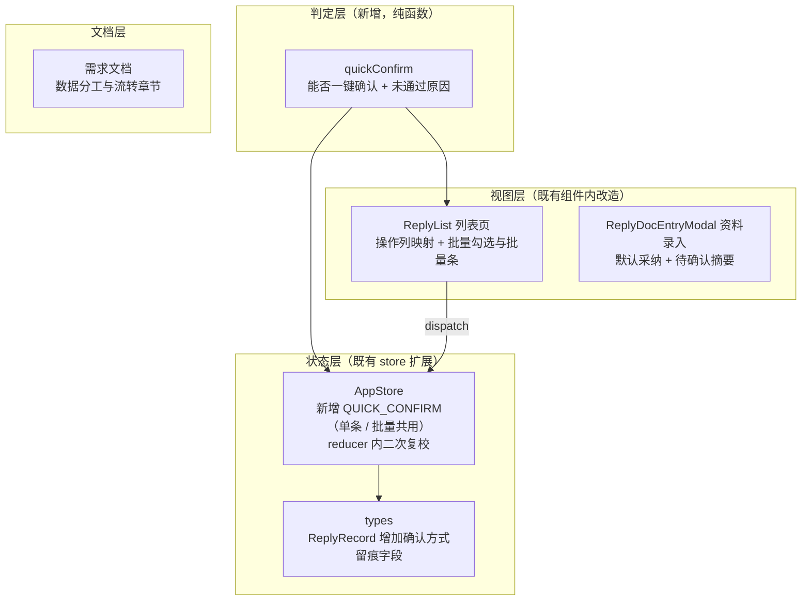

## 功能内容

**一、需求文档新增「数据分工与流转」章节**

在需求文档第 4 章业务流程内新增一节，用三张 Mermaid 图把系统讲透：

1. **数据分工图** —— 三栏对照：

- **AI 核验产出**（给结论，人工可采纳/修正）：一致性比对（逐项科目金额 + 差异额）、印章识别（是否有章 / 骑缝章 / 章名与被询证方是否一致 / 落章区域）、手写体转录与所处区域、银行函证四要素与询证项金额、快递面单（运单号 / 快递公司 / 发件人 / 寄件时间）
- **必须人工录入/判断**：收件人姓名·电话·地址（全表唯一 AI 完全识别不了的字段）、函证结果是否相符（必填）、盖章是否与被询证方名称一致（必填）、盖章不一致原因描述（不一致时填）、替代性测试文件与进一步核查底稿（附件，按需）、银行函证归属确认（confirm 档确认 / manual 档指定）
- **系统自动推导**：归属落点、风险等级与原因、回函进度、最终有效回函、核验人与核验时间

2. **数据流转图** —— 上传回函文件 → 批次 → 逐封回函任务 → 归属匹配（自动归属 / 人工确认 / 人工指定）→ 唯一写入出口落库 → 人工核验留痕 → 进度推进 → 结果填写归档；快递数据 Excel 为独立可选的旁路支线
3. **业务操作路径图** —— 上传 → 处理待指定归属 → 回列表处理新行 → AI 核验 → 资料录入 → 结果填写 → 保存归档 → 循环下一条

配套「三条关键约束」表：归属未确定不落库 / 所有回函数据只从唯一出口写入 / 人做定性判断、系统做推导。同时同步列表字段章节（操作列形态改写）、功能清单（新增快速确认与批量确认）与版本记录。

**二、列表操作区收敛**

把现在并列的五个文字按钮（查看 / AI 核验 / 资料录入 / 结果填写 / 删除）收敛为：**一个按回函进度变化的主按钮 + AI 核验 + 「更多」下拉**。主按钮随进度变化：待确认回函资料 → 「确认资料」；待填写回函结果 → 「填写结果」；已完成 → 「查看」。其余入口收进「更多」下拉（按当前状态启用）。业务人员的动线从「自己判断该点哪个入口」变成「点下一步就对了」。

**三、无风险件一键确认（快速通道）**

当一封函证的 AI 核验**全项通过且高置信度**时，列表行主按钮位置直接变为「一键确认」：点一下即完成「采纳全部 AI 资料 + 标记已人工核验 + 回函进度推进到待填写回函结果」，**停在列表不跳转**，便于先把一批函证快速过完、再逐条填结果。留痕照打（记录核验人与时间，并标注本次为快速确认），不因为走得快而丢失审计痕迹。

**四、批量确认**

表格增加勾选列，可勾选多封**无风险**函证一次性批量确认（一次上传几十份时提升最明显）；存在风险提示的函证勾选框不可选，仍强制逐条人工核对。选中后出现操作条（已选 N 封 + 批量确认按钮），批量确认前弹出二次确认，列明将确认的函证编号并说明动作内容；确认后一次性完成并反馈结果。

**五、资料录入默认全采纳**

打开资料录入弹窗时，高置信度的 AI 预填字段**默认已采纳**，界面顶部明示「已自动采纳 N 项，M 项待你确认」，把需要业务人员决定的少数几项（低置信度、未识别）凸显出来；「全部采纳 / 全部清除」保留。必填但尚未确认的项给出提示，不阻断继续。

## 视觉与交互效果

- 操作区从五个并列文字链变为「主按钮 + 次按钮 + 下拉」，密度下降、焦点明确
- 无风险函证一进入列表就有醒目的主色「一键确认」，一眼看出「这封不用细看」
- 有风险函证没有快速通道，业务人员知道「这封必须看」
- 勾选行后出现浅底批量操作条，视觉上明确区分「单条处理」与「批量处理」两个档位
- 严格延续现有单一靛蓝色系：不引入任何新色相，红/绿仍只出现在风险与相符性标签上；AI 产出仍靠主色浅底 + 「✦ AI」前缀 + 虚线识别
- 无装饰性动效，交互反馈沿用既有缓动与时长规范

## 技术栈

沿用项目现有技术栈，**不新增任何依赖**：React 18 + TypeScript + Vite + Ant Design 5；样式走既有 CSS 变量令牌（单一靛蓝色系）。

## 实现方案

### 总体策略

本轮改动分三条线，彼此解耦：

1. **判定逻辑独立成纯函数模块** —— 「能否一键确认」是一条业务规则（内控口径），不属于表现层也不属于演示数据，抽成 `src/utils/quickConfirm.ts` 的纯函数，输入 `ReplyRecord`、输出判定结果与**未通过原因**。原因字段是必需的：批量场景要能告诉用户「这几封为什么没被纳入」。
2. **状态变更复用既有模式** —— 新增一个 `QUICK_CONFIRM` action，**单条与批量共用同一个 action**（单条即长度为 1 的数组）。这样只写一份 reducer、只触发一次渲染，避免批量时 dispatch N 次。
3. **视图层只做映射** —— 列表操作列按「进度 + 判定结果」映射出按钮组合；批量交互用 AntD 表格既有的 `rowSelection` 能力，不手写勾选逻辑。

### 关键决策与理由

**决策一：一键确认不新增独立 action 分支，而是走「确认」语义的复用**

现有的「确认」动作已经存在（打「已人工核验」+ 记录核验人时间 + 推进进度到待填写回函结果）。一键确认在业务语义上与之相同，差别只是**同时采纳了全部 AI 资料**并**标注了确认方式**。因此新增 `QUICK_CONFIRM` 只处理「批量 + 快速通道」这两件事，不重复定义确认语义。

关于「唯一写入出口」：该约束针对的是**新增记录**（识别结果写入列表），由 `finalizeTask` 独占；确认与结果填写属于**更新已有记录**，不产生新记录，因此不构成对该原则的绕过。此点会在需求文档的约束表中写明，避免后续实现误判。

**决策二：reducer 内部对判定做二次复校**

即使界面已经用判定函数过滤过，reducer 仍对传入的每条记录重新跑一次判定，只更新通过的记录。理由：内控口径不能依赖前端的「按钮是否显示」来兜底 —— 任何过期视图、竞态或后续新增的调用方都不应该能把有风险的函证批量确认掉。代价是 O(k) 次判定（k 为选中条数），可忽略。

**决策三：一键确认的落点「停在列表」**

用户已明确选择不跳转。这同时降低了实现复杂度：无需在列表页处理「确认后接力打开结果填写」的跨弹窗编排，也避免了连续弹窗对「先批量过一遍」节奏的打断。

**决策四：判定口径严格取用户口径**

条件为：核验状态为待确认 + 进度为待确认回函资料 + **无任何风险原因** + 风险等级为低/无 + 全部检测点已完成 + 落章区域为「信息证明无误」（即相符）+ 所有 AI 预填字段置信度 ≥ 90%。用「无任何风险原因」这一条统一兜住骑缝章缺失、手写区域不一致等各类提示 —— 只要有一个提示就不给快速通道，与用户原话「只要有一个提示（如未检出骑缝章）就不给快速通道」完全一致，且未来新增检测点时会自动纳入，无需逐项枚举。

**决策五：批量可选范围 = 可快速确认**

勾选框只对可快速确认的行开放，其余置灰并给出悬停原因。这样「已选 N 条」恒等于「N 条可批量确认」，操作条无需再区分两类；同时在操作条上补一句当前列表还有多少条需逐条处理，避免用户误以为漏选。

**决策六：默认采纳的边界由置信度决定，而不是全盘采纳**

高置信度 AI 字段默认采纳、低置信度保持未采纳、AI 识别不了的字段（收件人三项）继续留给人工 —— 既减少了点击，又保住了「低置信度必须人工看一眼」的产品原则。必填项缺失只做提示不阻断，避免把演示流程堵死。

### 性能与可靠性

- **判定结果按记录缓存**：判定函数内部会构造约十余个预填字段对象，若在每次渲染时对全表每行调用，会在筛选/输入关键字时反复重算。做法是用 `useMemo`（依赖 `state.records`）一次性产出 `记录 id → 判定结果` 的映射表，行渲染与批量统计都查表。复杂度 O(N) 一次，非热点。
- **批量确认单次渲染**：一个 action 更新全部选中行，避免 N 次 dispatch 造成 N 轮渲染与 N 次 message。
- **静默失败兜底**：批量确认后若实际更新条数与请求条数不符（例如期间状态已变化），以实际条数反馈，不给「已确认 N 条」的虚假承诺。
- **不改动识别链路**：`finalizeTask`、识别队列、归属匹配逻辑零改动，把爆炸半径限制在列表页与资料录入弹窗。

### 工程注意点

- 全部使用既有 CSS 变量令牌，不得出现硬编码色值；一键确认按钮用主色（与「AI 产出 = 主色」的既有约定一致），不新增色相
- 表格操作列会由「五个文字按钮」变为「主按钮 + 次按钮 + 下拉」，需要重新核算列宽，并确认固定列在小屏下的可用性
- 批量确认属于需要二次确认的批量动作，二次确认弹窗中要列明将确认的函证编号与动作内容（符合项目既有的「批量/破坏性操作必须二次确认」规范）
- 资料录入弹窗的字段初值来自预填构造函数，改动其默认采纳状态后需确认弹窗的初始化时机（初始化即带默认采纳态，不能出现先全未采纳再刷成已采纳的跳变）
- 记忆中的踏坑经验：**不要并行编辑同一文件**，改动按文件逐个落地

### 待实现确认点

- 列表页行模型与操作列的现状结构、批量操作条的挂载位置
- 资料录入弹窗字段状态的初始化方式（决定默认采纳改动的落点）
- 需求文档版本记录表当前最新版本号（将在其基础上追加）
- 需求文档新章节的插入位置（第 4 章业务流程内作为新的一节）与相邻章节的编号衔接

## 架构设计

改动集中在三层，判定层为新增：



**分层理由**：判定是业务规则、会随内控口径变化，独立成模块后可单独验证；状态变更沿用既有 reducer 模式，不引入新的状态管理方案；视图层只做「查询判定结果 → 映射按钮」。

## 目录结构

```
01_回函管理智能化/
├── src/
│   ├── utils/
│   │   └── quickConfirm.ts          # [NEW] 快速通道判定模块。导出判定函数（输入回函记录，
│   │                                #   输出「可通过 / 不可通过 + 原因」）与批量判定辅助（把一组记录
│   │                                #   分成「可批量确认」与「需逐条处理」两组并归集原因）。判定口径：
│   │                                #   核验状态待确认 + 进度待确认回函资料 + 无任何风险原因 + 风险等级
│   │                                #   低/无 + 检测点全部完成 + 落章区域为信息证明无误 + 全部 AI 预填字段
│   │                                #   置信度 ≥0.9。纯函数、只读、无副作用，便于复用与单测
│   ├── types/
│   │   └── index.ts                 # [MODIFY] ReplyRecord 增加「确认方式」可选留痕字段（人工逐项确认 /
│   │                                #   快速确认），供核验徽标区分展示，满足审计可追溯要求
│   ├── store/
│   │   └── AppStore.tsx             # [MODIFY] Action 联合类型新增 QUICK_CONFIRM（携带记录 id 数组，
│   │                                #   单条与批量共用）；新增对应 reducer：逐条二次复校判定后更新，
│   │                                #   打「已人工核验」+ 记录核验人与时间 + 标注确认方式 + 进度推进到
│   │                                #   「待填写回函结果」；返回实际更新条数供界面反馈
│   ├── pages/
│   │   └── ReplyList.tsx            # [MODIFY] ① 操作列由五个并列文字按钮收敛为「主按钮（按进度变化）
│   │                                #   + AI 核验 + 更多下拉」；可快速确认时主按钮位替换为「一键确认」，
│   │                                #   悬停说明确认内容；② 按记录 id 缓存判定结果的映射表；
│   │                                #   ③ 表格增加勾选列（仅可快速确认行可选，其余置灰并给出原因），
│   │                                #   顶部增加批量操作条（已选条数 + 批量确认 + 取消选择 + 剩余需
│   │                                #   逐条处理的条数提示）；④ 批量确认二次确认弹窗（列明函证编号与
│   │                                #   动作内容）+ 结果反馈；⑤ 重新核算操作列宽
│   ├── components/
│   │   └── ReplyDocEntryModal.tsx    # [MODIFY] 顶部摘要改为「已自动采纳 N 项，M 项待你确认」；低置信度项
│   │                                #   与未识别项保持凸显；必填未确认项给出提示（不阻断继续）；
│   │                                #   保留「全部采纳 / 全部清除」；确认按钮文案与衔接逻辑不变
│   └── mock/
│       └── confirmations.ts         # [MODIFY] 预填字段构造函数的默认采纳初值改为按置信度决定：
│                                    #   高置信度 AI 字段默认已采纳、低置信度保持未采纳、AI 无法识别的
│                                    #   字段（收件人三项）继续留给人工。同步演示记录，确保列表上既有
│                                    #   可一键确认的样本，也有因存在提示而必须逐条核对的样本
└── docs/
    └── 需求文档.md                   # [MODIFY] 第 4 章新增「数据分工与流转」一节：三张 Mermaid 图
                                     #   （数据分工 / 数据流转路径 / 业务操作路径）+ 三条关键约束表
                                     #   （归属未确定不落库 / 唯一写入出口 / 人做定性系统做推导）；
                                     #   同步列表字段章节的操作列形态描述；功能清单新增「无风险件快速
                                     #   确认」与「批量确认」两项；视觉规范的 AI 标识小节补充快速确认
                                     #   留痕说明；末尾版本记录追加新版本行
```

## 关键代码结构

判定模块的对外契约（多模块依赖，需精确约定）：

```ts
/** 快速通道判定结果：未通过时给出可展示的原因 */
export interface QuickConfirmCheck {
  ok: boolean
  /** 未通过原因，用于悬停提示与批量纳入说明；通过时为空 */
  reason?: string
}

/** 单条判定：输入回函记录，输出能否一键确认（全项通过 + 高置信度 + 无任何风险提示） */
export function checkQuickConfirm(record: ReplyRecord): QuickConfirmCheck

/** 批量分组：把一组记录分成可批量确认与需逐条处理两组，并归集后者原因 */
export function splitByQuickConfirm(records: ReplyRecord[]): {
  eligible: ReplyRecord[]
  ineligible: { record: ReplyRecord; reason: string }[]
}
```

状态层新增动作（单条与批量共用，由 store 统一复校）：

```ts
| { type: 'QUICK_CONFIRM'; recordIds: string[] }
```

## Agent Extensions

### Skill

- **mermaid转图片**
- **Purpose**：把需求文档新增章节里的三张 Mermaid 图（数据分工、数据流转路径、业务操作路径）渲染为高清图片，便于文档评审与后续 Word 导出时图能正常显示
- **Expected outcome**：三张图成功渲染为高清 PNG/SVG 且内容与文档中的 Mermaid 源码一致（节点、连线、分支齐全无截断），产出物可直接查看与分享，作为本轮文档沉淀的附带交付物