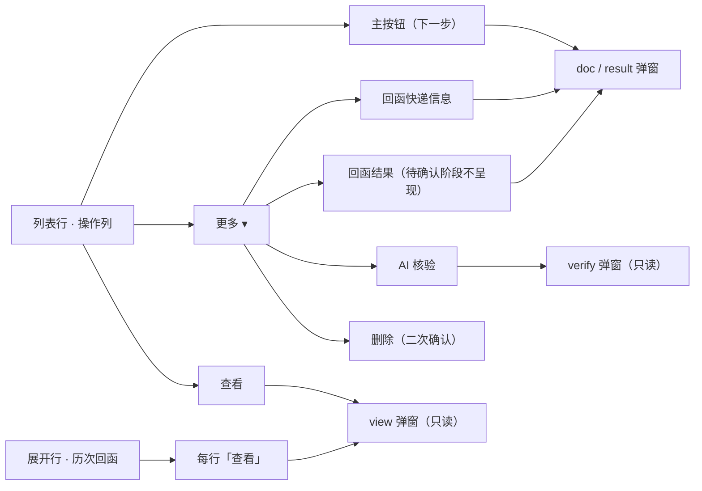

## 产品概述

回函管理列表的操作区与展开区做一轮"可预期性"改造：把因行而异的按钮收敛成每行结构一致的一组入口，让第一次使用的人也能看清"现在该点哪个、点了会发生什么"；同时去掉行内勾选框与快速确认，并把历次回函的只读查看能力补齐。

## 核心功能

- **去掉行内勾选框**：列表每行前的复选框移除，勾选后的批量操作条与批量确认一并下线，一封信一次操作。
- **取消一键确认**：移除"无风险件一键确认"，操作列不再因风险等级而出现额外按钮；无风险件与有风险件走同一套流程。
- **操作列收敛为三位**：一个"下一步"主按钮 + 一个"查看"按钮 + 一个"更多"下拉。主按钮文案随回函进度变化，点击打开当前该处理的弹窗；「更多」内含回函快递信息、回函结果、AI 核验、删除四项，不含与外部重复的查看。处于待确认阶段时，"回函结果"不进下拉（必须先完成回函快递信息的确认）。
- **下一步直接写在进度列**："回函进度"单元格在状态文字下方直接写出一行小字"下一步：xxx"，与主按钮文案同词，鼠标悬停不再是获知下一步的唯一途径。
- **历次回函可只读查看**：展开行的历次回函表中，每一行末尾增加"查看"，点击打开该次回函的完整详情；详情为纯只读，底部只有关闭，不给任何修改或保存入口，并标明这是第几次回函、是否已被覆盖。

## 视觉与交互效果

- 操作列由 5 个平铺按钮收窄为 3 个可见位，视觉更安静，行动线唯一。
- 存在风险提示需查看依据的函证，在「更多」按钮与下拉内的 AI 核验项上带一处红色警示点，悬停说明原因，其余行不标记。
- 展开行新增一列操作，仍沿用浅底区块与紧凑行距，不破坏既有栅格。
- 「回函进度」列因多出一行小字而略微增高，其余列与整体密度保持不变。

## 技术栈

沿用现有栈，**不引入任何新依赖**：React 18 + TypeScript + Vite 5 + Ant Design 5（原型，dev server 端口 5178）；状态由 `AppStore`（`useReducer` + Context）承载；mock 数据在 `src/mock/confirmations.ts`；文案与规范文档在 `docs/需求文档.md`。视觉延续单一靛蓝色系（红绿仅作状态标签），不引入新色相。

## 实现方案

### 一、移除快速通道（含批量），一次清干净

这条链路的落点分散在 5 个文件，**必须全部清除**，否则 `tsc` 的未使用告警或残留 import 会留下隐患：

| 文件 | 移除内容 |
| --- | --- |
| `src/utils/quickConfirm.ts` | 整个文件删除（`checkQuickConfirm` / `splitByQuickConfirm` / `buildQuickConfirmMap` 及两个常量） |
| `src/store/AppStore.tsx` | `checkQuickConfirm` import、`{ type: 'QUICK_CONFIRM'; recordIds }` action、`AppState.quickConfirmResult` 字段、reducer 的 `QUICK_CONFIRM` 分支（含逐条复校逻辑） |
| `src/types/index.ts` | `ReplyRecord.confirmMode?: 'manual' \ | 'quick'`（取消后无消费者） |
| `src/pages/ReplyList.tsx` | `buildQuickConfirmMap` import、`quickMap` / `quickEligibleCount` / `runQuickConfirm` / 反馈 `state.quickConfirmResult` 的 `useEffect`、`confirmBatchQuick`、`selectedKeys` state、批量操作条、`Table` 的 `rowSelection`、一键确认按钮、`ThunderboltOutlined`（若无其他用途） |
| `docs/需求文档.md` | 见下方"文档同步" |


**不动的东西**（本轮必须保住）：`CONFIRM_DOC` / `SUBMIT_RESULT` / `UPDATE_DOC` / `UPDATE_RESULT` 四个 action 与它们的 reducer —— 编辑态"不改进度、不重打留痕、只记 `lastEditedBy/At`"的语义是本项目的审计底线，上一轮刚落地并实测通过。

### 二、操作列新形态

```
[主按钮（文案随进度）]   查看   [更多 ▾]
                                   ├ 回函快递信息
                                   ├ 回函结果        ← 待确认阶段不呈现该项
                                   ├ AI 核验
                                   ├ ——————
                                   └ 删除（danger）
```

主按钮映射（**与进度列小字严格同词**）：

| 回函进度 | 主按钮 | 点击打开 | 样式 |
| --- | --- | --- | --- |
| 待确认快递信息 | 「确认回函快递信息」 | 快递信息弹窗（自动进首次确认态） | `primary` + `ghost` |
| 待填写回函结果 | 「填写回函结果」 | 结果弹窗（归档态） | `primary` + `ghost` |
| 已完成 | 「修改」 | 结果弹窗（编辑态，保存后进度仍为已完成） | `default` |


三条硬约束：

1. **「回函结果」在待确认阶段不呈现**（不是禁用）——`SUBMIT_RESULT` 会把核验状态置为已核验，从该状态进入等于绕过「确认回函快递信息」这个唯一的核验留痕入口。这条是 v2.19 确立的审计底线，**不可放宽**。
2. **下拉内不得出现「查看」** —— 外部已有固定「查看」按钮，重复入口正是 v2.15 用户亲自推翻过的问题。
3. **「已完成」行的主按钮用 Tooltip 补一句**"如需修改回函快递信息，请从『更多』进入"，避免"修改"二字让人以为能改全部内容。

风险红点：原 `needsVerifyAttention`（`verifyStatus === 'pending' && riskReasons.length > 0`）保留判定，呈现位置改为 ① 「更多」按钮前置 `WarningFilled`；② 下拉项「AI 核验」文字前同款红点 + Tooltip 说明原因。

列宽与滚动：3 个可见位，操作列 `320 → 约 220`；`Table` 的 `scroll.x` 由 `1344` 同步下调（约 `1244`）。实现时以截图核对为准微调。

### 三、进度列直写「下一步」

在进度文字下方追加一行小字（`--c-text-3`、约 12px）：

```
待确认快递信息
下一步：确认回函快递信息
```

- 文案表按进度给，**与主按钮严格同词**（`已完成` 行给「下一步：修改」，与主按钮「修改」对应）
- `PROGRESS_HINT` 的长说明**保留**（悬停仍有价值），但需与直写文案去重，避免同一句话出现两遍
- 列宽 `138 → 约 176`
- **主要代价是行高**：现有规范为 38px（紧凑 32px），两行内容需用紧凑 `line-height` 与收窄 padding 控制在约 42-46px，避免整表明显变高。这是本方案唯一的视觉副作用，须在截图核对时确认

### 四、历次回函的只读查看

- `HISTORY_GRID` 由 6 列增至 7 列（末尾加约 `56px` 的「操作」列），表头加「操作」
- 每行末尾加「查看」（`type="link"` `size="small"`）→ `setActiveModal({ kind: 'view', recordId: h.id })`。**注意用 `h.id` 而不是 `main.id`** —— `history` 数组的元素是独立的 `ReplyRecord`，每条回函各有一个 `id`
- 复用 `RecordDetailModal`（它本来就是纯只读、底部只有「关闭」），**不新增任何修改 / 保存入口**
- **语境提示**：给 `RecordDetailModal` 加一个**可选** prop（如 `note?: ReactNode`），在 `Descriptions` 上方渲染一条 `.tone-block`；列表页打开历史回函时传入「这是第 N 次回函，已被后续回函覆盖；当前有效为第 M 次」。主行与实体名点击打开时**不传该 prop**，行为完全不变

### 五、文档同步（含功能块编号重排）

- **删** 5.4「无风险件快速确认」整个功能块；删附录 A 的 **F-16**；删 4.5「让业务更顺的两处设计」第 2 条；改 5.7 操作列矩阵（去掉无风险件行与一键确认）
- **重排编号**：5.5→5.4、5.6→5.5、5.7→5.6、5.8→5.7、5.9→5.8、5.10→5.9、5.11→5.10，并**全文修正交叉引用**（「见 5.4」「详见 5.5 与 5.7」「见 5.6」「见 5.2」等）。**F 编号不做顺延**（只删 F-16），避免大面积改引用
- **重写** 5.6（原 5.7）的「操作列」小节与「回函进度」字段说明（补"直写下一步"）
- **保留 R-07「已填写信息的修改」** —— 该规则正是本轮的"能改"依据，不能因为入口收进下拉就删掉
- **追加** 第 10 章变更记录一行（v2.20），**不修改历史行**（v2.14 / v2.19 关于快速通道的表述作为历史保留）

## 实现要点（执行注意）

- **不并行编辑同一文件**：`src/pages/ReplyList.tsx` 本轮被三个任务连续触及（清除快速通道 → 操作列 → 进度列/展开行），必须按 todo 顺序串行推进。本项目曾因并行编辑丢失改动。
- **移除后先跑 `tsc`**：删除 `quickConfirm.ts` 后立刻编译，可以一次性暴露所有残留引用（这是最省事的核对手段，不要靠肉眼搜）。
- **不留"干摆着的灰禁用项"**：待确认阶段的「回函结果」走"不呈现"而非 `disabled`；`AI 核验` 的 `disabled={!m.verification}` 是兜底（mock 中所有记录都有 `verification`，实际不会触发）。
- **动效**：下拉展开/收起沿用 antd 默认，不额外加动画；既有约束"动效只动 `transform` / `opacity`、时长 ≤ 200ms"不破。
- **`Dropdown` 的 `onClick` 用 `key` 分派**：`view` / `doc` / `result` / `verify` 统一走 `setActiveModal`，`delete` 走既有的 `confirmDelete(row)`（保留二次确认）。
- **交付说明必须讲清三件事**（写给用户的回复里）：

1. 「更多」里为何只有 4 项 —— 去掉了用户列的第二个「查看」，理由是外部已有且 v2.15 用户亲口否决过菜单重复；
2. 取消一键确认的代价 —— 无风险件不再有"列表上点一下就过"的通道，一批几十份时要逐封走弹窗；
3. 「已完成」行主按钮实际打开的是什么（结果弹窗编辑态），以及改回函快递信息要走「更多」。

- **`mock/confirmations.ts` 不需要改**：华泰 / 招商两条"无风险待确认"样本取消快速通道后仍是合法形态，同时齐商银行（未盖章，high）保证有风险形态也在；国泰君安那条带 `expressInfo` / `resultInfo` / `lastEdited*` 的样本是本轮验证编辑态回显的关键，**保留不动**。

## 架构说明

沿用现有分层，不新增模式：**列表页单一互斥弹窗状态（`activeModal`）→ 弹窗（受控模式）→ store action（唯一写入出口）**。本轮变化集中在"入口组织方式"，是纯表现层调整：`ModalKind` 仍为 `'view' | 'verify' | 'doc' | 'result'` 四类，不新增弹窗种类；写入仍全部经 store reducer，未新增旁路；唯一新增的可选 prop（`RecordDetailModal.note`）是向后兼容的增量。



## 目录结构

```
01_回函管理智能化/
├── src/
│   ├── utils/
│   │   └── quickConfirm.ts              # [DELETE] 快速通道判定模块整体移除（无其他消费者）
│   ├── types/
│   │   └── index.ts                     # [MODIFY] 删除 ReplyRecord.confirmMode?；其余类型不动
│   ├── store/
│   │   └── AppStore.tsx                 # [MODIFY] 删 checkQuickConfirm import、QUICK_CONFIRM action、quickConfirmResult 字段与对应 reducer 分支；CONFIRM_DOC / SUBMIT_RESULT / UPDATE_DOC / UPDATE_RESULT 一律不动
│   ├── mock/
│   │   └── confirmations.ts             # [MODIFY] 仅在存在 confirmMode 赋值时删除该字段；演示数据形态保持不变（无风险待确认 + 有风险待确认 + 已完成带 expressInfo/resultInfo/lastEdited* 三条样本都要在）
│   ├── pages/
│   │   └── ReplyList.tsx                # [MODIFY] ① 删勾选列 / 批量操作条 / 一键确认 / quickMap 等快速通道痕迹；② 操作列改为「主按钮 + 查看 + 更多下拉（4 项，无重复查看）」并重算列宽与 scroll.x；③ 回函进度列直写「下一步：xxx」小字、列宽放宽；④ 展开行 HISTORY_GRID 加第 7 列「操作」、每行加只读「查看」；⑤ 打开历史回函时给 RecordDetailModal 传语境 note
│   └── components/
│       └── RecordDetailModal.tsx        # [MODIFY] 新增可选 note?: ReactNode prop，在 Descriptions 上方渲染一条 .tone-block 语境提示；不传时行为完全不变（纯增量、向后兼容）
└── docs/
    └── 需求文档.md                       # [MODIFY] 删 5.4 与 F-16、重排 5.5~5.11 编号并全文修正交叉引用、重写操作列与回函进度字段说明、保留 R-07、追加 v2.20 变更记录
```

## 关键代码结构

操作列的主按钮映射与下拉项构造（**interface 级约定，供实现对齐**）：

```ts
/** 主按钮 = 「这一步该做什么」；文案与「回函进度」列的小字严格同词 */
const primary: { text: string; kind: ModalKind } | null =
  m.replyProgress === '待确认快递信息'
    ? { text: '确认回函快递信息', kind: 'doc' }
    : m.replyProgress === '待填写回函结果'
      ? { text: '填写回函结果', kind: 'result' }
      : { text: '修改', kind: 'result' }   // 已完成 → 结果弹窗的编辑态

/** 「更多」下拉 —— 待确认阶段不呈现「回函结果」（审计底线，见 5.4） */
const moreItems = [
  { key: 'doc', label: '回函快递信息' },
  ...(m.replyProgress === '待确认快递信息' ? [] : [{ key: 'result', label: '回函结果' }]),
  { key: 'verify', label: 'AI 核验', disabled: !m.verification },
  { type: 'divider' as const },
  { key: 'delete', label: '删除', danger: true },
]
```

## 验证要求

- `npx tsc --noEmit` 与 `npm run build` 通过；全仓搜索确认 `quickConfirm` / `QUICK_CONFIRM` / `confirmMode` / `rowSelection` / `selectedKeys` / `quickMap` / `batch` **已无任何残留引用**。
- 浏览器实测（playwright）：

1. 列表四类行（待确认有风险 / 待确认无风险 / 待填写 / 已完成）的操作列构成一致 —— 均为主按钮 + 查看 + 更多，且**一行勾选框都没有**；
2. 「更多」展开后的 4 项与可点性，重点确认**待确认阶段没有「回函结果」项**、且**没有重复的「查看」项**；
3. 进度列每行都有「下一步：xxx」小字，且与同行主按钮文案**逐字一致**；
4. 三种进度下点主按钮分别打开 doc / result / result（编辑态），已完成行保存后**进度仍为「已完成」且核验留痕未被重打**；
5. 展开行历次回函每行的「查看」→ 打开只读详情，底部**只有「关闭」**，无任何修改 / 保存入口，且有"第 N 次回函 / 已被覆盖"的语境提示；
6. 控制台零错误；截图核对无新色相、操作列未挤压其他列、展开行新增列未破坏栅格、行高变化在可接受范围。

- **本机 playwright 踩坑（务必照做）**：脚本放 `%TEMP%\pw-verify\` 并在该目录运行（playwright 只装在那里）；`write_to_file `写该目录的 `.js` 会落成 0 字节 → **先写 `.txt` 再 `Copy-Item` 成 `.js`**；Ant Design 会给**两个汉字**的按钮插空格（`确认` 实为 `确 认`），`has-text("确认")` 匹配不到，改用 `.ant-modal-confirm-btns .ant-btn-primary`；全屏弹窗根节点 `.fs-modal`；表格展开图标是自定义 Button，用 `button[aria-label="展开详情"]`；新手引导是 4 步向导，用 `.ant-modal-close` 关闭。