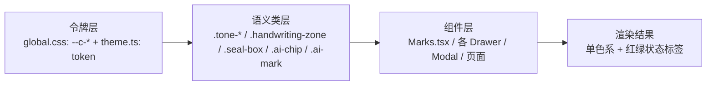

## 产品概述

对函证系统「回函管理」智能化工作台做**全站配色体系统一**：当前页面上同时存在 5 个色相（靛蓝主色、AI 紫、风险红、中风险橙、相符绿）交替出现在按钮、标签、徽标、提示底块与 AI 批注上，观感杂乱。本轮收敛为**单一靛蓝色系 + 红/绿仅用于状态标签**。

## 核心功能

- **全站统一为靛蓝 `#3B5BDB` 单色系**：结构区块用中性蓝灰、强调与当前态用主色、层次靠同色相深浅与留白拉开，不再换色相
- **AI 产出去紫色**：AI 建议条、AI 填充徽标、归属匹配看板、AI 批注框统一改为主色浅蓝底，改由「✦ AI」文字前缀 + 虚线描边 + 楷体等非色彩手段标识「这是机器产出、需人工确认」
- **风险只保留红/绿两色**：中风险取消橙色，并入红档（高风险用较深红底、中风险用较浅红底，靠浓度与文字区分），低风险与相符仍用绿；红色仅出现在风险标签、不相符判定、差异行等状态位
- **清理散落硬编码色值**：预览区灰蓝虚线与空状态图标等改为受控中性令牌
- **视觉规范同步**：需求文档第 8 章色彩规范重写为「单一色系 + 红绿状态标签」并追加版本记录

## 视觉效果

改造后整页肉眼只感知到一个蓝色调（从极浅的底、中浅的分区、到实心的主按钮形成完整色阶），红与绿作为「状态信号」在密集表格中跳出来；AI 相关区块与普通内容靠浅底 + 虚线 +「✦ AI」前缀区分，不再依赖紫色也能一眼认出。

## 技术栈

- 现有栈不变：React 18 + TypeScript + Vite + Ant Design 5 + 原生 CSS 变量令牌
- 色彩体系双层：`src/styles/global.css`（CSS 自定义属性 + 语义类）+ `src/theme.ts`（AntD ThemeConfig token）
- 校验：`npx tsc --noEmit -p tsconfig.json`、`npm run build`、Playwright 逐页截图

## 实现思路

**核心策略：在令牌层收敛色相，而不是逐个组件改颜色。** 全站颜色几乎都由 `--c-*` 变量与 `.tone-*` 语义类派生，因此把令牌改对，大部分组件自动跟随；再对少量直接引用色值/内联写死的地方做定点清理。

链路如下：



### 关键决策

**1. AI 令牌「保留名字、改掉值」** —— `--c-ai-bg`、`--c-ai-text` 名字不变，值改为主色系（浅蓝底与主色文字）。这样约 10 处消费点零改动即生效，且「AI 语义」这一层含义在令牌层保留，将来若需再次区分只改一处。同时删除已无用的 `--c-ai-purple` 纯紫值。

**2. 风险令牌只留红/绿两档，中风险在映射层并入红** —— `Marks.tsx` 的 `RISK_MAP` 是风险标签的集中封装（全站风险标签、核验徽标都走这里），把 `medium` 的底色指向红档即可覆盖绝大多数渲染。高风险红底保持现有 8%，中风险改用更浅一档（约 6%），配合标签文字本身「高风险/中风险」与 Tooltip 风险原因，做到「同色相、可区分」。

**3. 业务语义保留三档，视觉只呈现两色** —— `src/types/index.ts` 的 `riskLevel: 'high' | 'medium' | 'low'` 与 `mock/confirmations.ts` 的演示数据**不改**（审计上高/中风险的处置强度不同），仅视觉映射合并；需求文档中明确写为「语义三档、视觉两色」。

**4. AntD 内置语义 token 重映射（最容易漏色的地方）** —— `theme.ts` 的 `colorWarning` 当前指向橙色，会通过 Alert `warning`、Tag、Badge 等内置组件漏出橙色。改为指向红档；`colorSuccess`/`colorError`/`colorInfo` 维持绿/红/主色不变。

**5. 建立非色相识别体系（防止层级塌陷）** —— 收敛到一个色相后，AI 产出与普通内容、当前态、人工核验留痕会互相混淆，必须靠色彩以外的手段区分。项目中已具备基础（`Marks.tsx` 的 `AiMark` ✦ 前缀 + Tooltip「由 AI 自动识别…需人工确认后方可生效」、`RiskTag` 文字统一走墨色只靠底色表达、`VerifyBadge` 用主色浅底 + ✓ 标识），本轮只需把底色换成新体系并补齐虚线规则：

| 语义 | 区分手段（不再依赖色相） |
| --- | --- |
| AI 产出 | 「✦ AI」前缀 + 主色浅底 + **虚线描边** + 手写区保留楷体 |
| 普通结构区块 | 白底 + 多层柔和阴影，或中性浅底 `.subtle-block` |
| 当前态 / 选中 | 主色实底或主色浅底 + 实线描边 |
| 人工核验留痕 | 主色浅底 + ✓ 图标 + Tooltip（核验人/时间） |
| 高风险 / 中风险 / 不相符 | 红色标签（两档深浅区分） |
| 低风险 / 相符 | 绿色标签 |


### 性能与可靠性

纯样式与设计令牌调整，无运行时逻辑变更、无新增依赖、无渲染路径改动，包体积与运行性能不受影响。风险集中在「漏改导致残留紫/橙」，通过令牌收敛（源头）+ 全站色值 grep 兜底（验证）双保险控制。

### 避免技术债

不新增设计模式，全部复用现有 `--c-*` 令牌与 `.tone-*` 类体系；不做与本次无关的重构；`RISK_MAP`、`AiChip`、`AiMark`、`tone-block` 等既有封装一律复用而非另起一套。

## Implementation Notes

- **令牌值与类注释里的旧规范条文必须一起改**：`global.css` 中「颜色配额：AI 用紫 / 风险用红·橙·绿 —— 页面最多同时出现 4 色」等注释是给后续开发者的规范说明，若只改值不改注释，下次迭代会把紫色加回来
- **`.handwriting-zone` 去掉紫色后需要保留识别度**：它靠楷体 + 浅底已经足够，文字色改为主色
- **`.seal-box` 的绿/红语义保留**：印章定位框的「常规绿 / 异常红」属于状态判定，符合「红绿仅作状态标签」的规则，不改
- **`.pdf-canvas` 相关硬编码**（`#dfe3ec` 预览底色、`#8494b8` 未命中虚线、`#b6c0d4`/`#98a2b8` 空状态）改为中性蓝灰令牌值，避免出现「冷灰」与「蓝灰」两种中性色混排
- **删除变量前先确认无引用**：`--c-risk-medium*`、`--c-ai-purple` 若改为别名指向，需保证不留死引用；`--c-verify` 此前已在 CSS 中核对为不存在（`VerifyBadge` 已使用 `--c-primary-bg`），无需处理
- **验证方式**：改完先 grep 全站 `7c4dff|124, 77, 255|e8892b|232, 137, 43|ad4e00` 应为 0 命中，再跑 tsc/build，最后逐页截图核对

## 目录结构

```
src/
├── styles/
│   └── global.css                    # [MODIFY] 设计令牌与语义类 —— 本轮核心。
│                                     #   · 令牌：--c-ai-purple 删除；--c-ai-bg / --c-ai-text 改指主色系；
│                                     #     --c-risk-medium* 删除或并入红档；新增中性标注线/预览底令牌（如 --c-line-anno、--c-canvas-bg）
│                                     #   · 语义类：.tone-ai 改主色浅底 + 虚线描边；.tone-warn 并入红底；
│                                     #     .tone-caption-ai 改主色；.handwriting-zone 去紫改主色；
│                                     #     .pdf-canvas 相关硬编码灰蓝改令牌；注释中的色相规范条文同步重写
├── theme.ts                          # [MODIFY] AntD token —— colorAiPurple 删除或改指主色；
│                                     #   colorWarning 由橙改指红档；colorPrimary/Success/Error/Info 维持；配套注释同步
├── components/
│   ├── Marks.tsx                     # [MODIFY] 色彩收敛主抓手 —— RISK_MAP 的 medium 并入红档（浅一档底色）；
│   │                                 #   AiChip 低置信度底色由橙改红；AiMark ✦ 体系保留（这是 AI 识别的文字手段）
│   ├── AnnotatedPdfPreview.tsx       # [MODIFY] AI 批注框：手写区紫虚线框改主色虚线框，标签底色同步；
│   │                                 #   预览底色 #dfe3ec、未命中虚线 #8494b8、空状态 #b6c0d4/#98a2b8 改中性令牌
│   ├── BankTextRecognition.tsx       # [MODIFY] 归属匹配看板：档位结论条与候选表的紫/橙改为主色浅底 + 红绿状态
│   ├── VerificationModal.tsx         # [MODIFY] AI 核验四件套容器的风险档与 AI 标识改色
│   ├── ConsistencyDiff.tsx           # [MODIFY] 差异行与差异标签改色，确保只剩红/绿状态语义
│   ├── HandwritingRecognition.tsx    # [MODIFY] 手写转录区去紫改主色
│   ├── SealRecognition.tsx           # [MODIFY] 印章识别卡片 AI 提示改色
│   ├── ExpressImportDrawer.tsx       # [MODIFY] 快递导入的风险/状态标签改色
│   ├── RecognitionDrawer.tsx         # [MODIFY] 识别队列：待确定归属提示（橙）改红档；#c9cdd4 边框与 #e5484d 图标令牌化
│   ├── FloatingProgress.tsx          # [MODIFY] 悬浮进度卡的语义色核对
│   ├── KkFilePreview.tsx             # [MODIFY] 预览态色值令牌化
│   ├── ReplyResultModal.tsx          # [MODIFY] 结果填写：AI 建议条与 AI 归属改主色浅底
│   ├── ReplyDocEntryModal.tsx        # [MODIFY] 资料录入：AI 预填标识改色
│   └── RecordDetailModal.tsx         # [MODIFY] 详情弹窗标注色核对
├── pages/
│   └── ReplyList.tsx                 # [MODIFY] 列表页：展开区四要素结论文案与风险标签改色
└── mock/
    └── confirmations.ts              # [READ-ONLY 校验] riskLevel 中风险取值保留（语义三档），仅确认视觉映射生效

docs/
└── 需求文档.md                        # [MODIFY] 第 8 章视觉规范色彩章节重写为「单一靛蓝色系 + 红/绿状态标签」，
                                      #   补「AI 产出非色相识别规则」与「风险语义三档 / 视觉两色」说明；追加版本变更记录行
```

## 设计方向

**单色系秩序感**：整页收敛为靛蓝一个色相，靠「极浅底 → 浅分隔 → 主色强调 → 主色实底」四级色阶建立层级；红与绿被约束为纯粹的状态信号，只在风险标签、相符性判定、差异行出现，形成「安静底色 + 稀疏信号点」的观感。

## 色彩层级规则

1. **结构层**：白底卡片 + 多层柔和阴影（`.panel`）；次级分区用中性浅底 `.subtle-block`；分隔线用极淡发丝线。层次感由留白与阴影承担，不靠换色相。
2. **强调层**：主操作按钮、当前选中态、进度、链接用主色实底或主色浅底实线；同一屏内只有一处「实心主色」，避免多点抢焦点。
3. **AI 层**：主色浅底 + 虚线描边 +「✦ AI」前缀 + 手写区楷体。AI 与普通内容同色系，靠「虚线 vs 实线」「✦ 前缀」区分 —— 这是本次改造的视觉关键。
4. **状态层**：红仅用于高风险/中风险/不相符/金额差异；绿仅用于相符/低风险/已通过。风险标签一律「浅底无边框、文字走墨色」，仅在底色浓度上区分高中风险。

## 交互与动效

交互反馈沿用现有体系（hover 抬升阴影、150–180ms 自定义缓入缓出曲线）；本次仅调整色值，不改动效节奏，保证观感连贯。选中/聚焦态统一用主色描边，不再出现第二种高亮色。

## 响应式

仅色彩令牌变更，不涉及布局调整；各断点下的层级关系保持一致。

## Agent Extensions

### Skill

- **ui-skills-root**
- Purpose: 在动手改色前选定最小必要的 UI 上下文（配色与视觉规范类），避免引入与本项目规范冲突的建议
- Expected outcome: 明确本轮改色应遵循的 UI 规范上下文清单，并据此约束后续实现
- **better-colors**
- Purpose: 校验收敛后的色值映射 —— 浅底与文字的对比度是否达 WCAG AA、主色多级色阶的明度间隔是否足够、红绿在浅底上的可辨识度
- Expected outcome: 给出各令牌色值的对比度核验结论，必要时输出调整后的色值（如中风险浅红底的浓度、主色深档取值）
- **baseline-ui**
- Purpose: 改色完成后做一轮打磨，检查去除紫色后是否出现层级塌陷、标签可读性下降、间距与层级节奏问题
- Expected outcome: 输出需微调清单并完成修正，确保「单一色系」仍保有清晰的信息层级