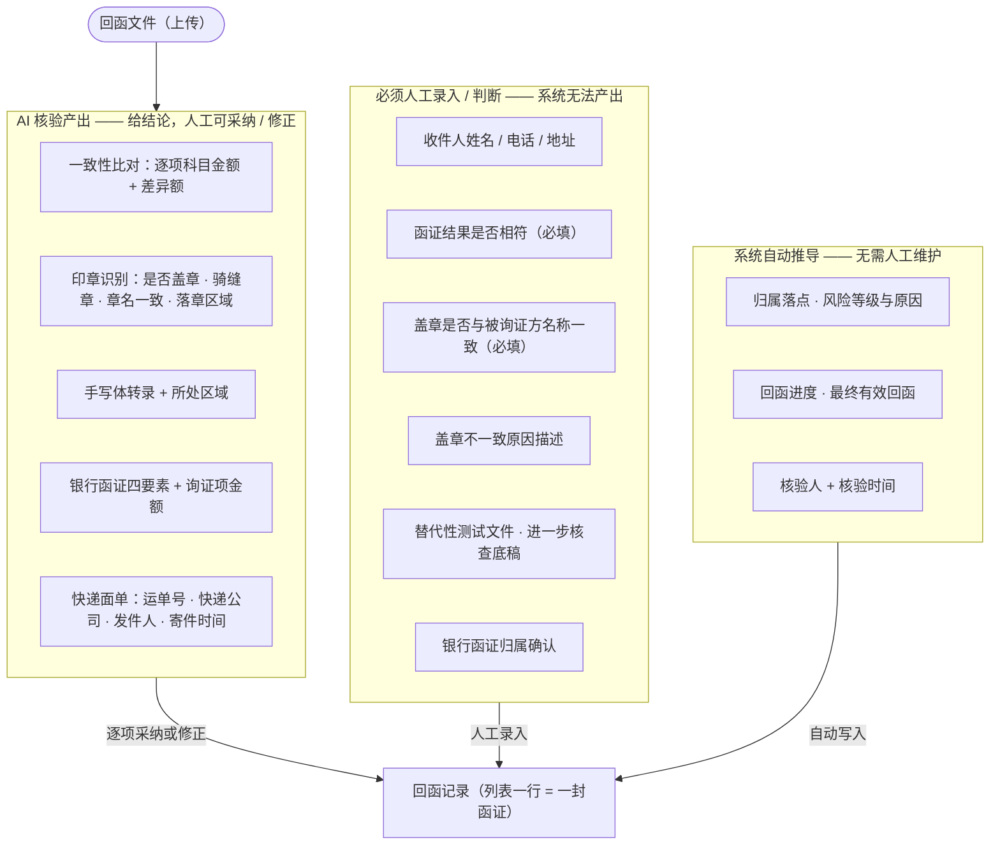
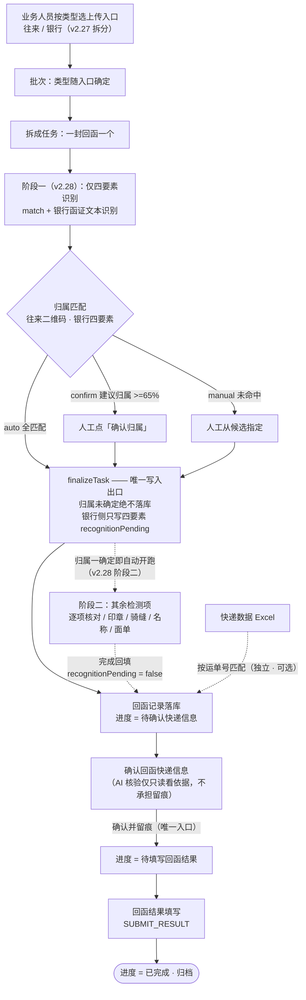
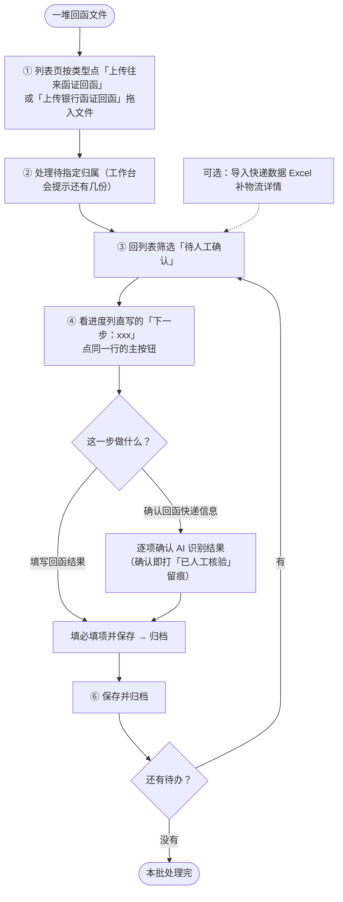

# 函证系统 · 回函管理智能化需求文档

## 1 文档信息

| 项 | 内容 |
|---|---|
| 文档名称 | 函证系统 · 回函管理智能化需求文档 |
| 版本 | v2.30 |
| 日期 | 2026-09-20 |
| 适用范围 | 函证系统「回函管理」模块的智能化改造与前端交互重构 |
| 状态 | 已评审，交互原型已验证 |
| 关联交付物 | 交互原型（本仓库 Vite 工程）、`README.md`、`docs/figures/`（文档配图） |

**文档结构**：第 1~4 章为总览（信息 / 背景 / 范围 / 业务流程）；**第 5 章为主体**，按 11 个功能块组织，每块含「用户场景 / 功能权限 / 功能描述 / 补充说明」四部分；第 6~10 章为附录（功能清单速查 / 视觉规范 / 非功能要求 / 待讨论事项 / 变更记录）。

---

## 2 背景与目标

### 2.1 现状与痛点

| 环节 | 现状 | 痛点 |
|---|---|---|
| 录入入口 | 回函登记 / 文件识别录入 / 按文件编号上传 / 快递数据导入 **四个并列入口** | 用户需自行判断「这封是往来还是银行、该走哪个按钮」，上手成本高 |
| 识别过程 | 同步执行，无任何进度反馈 | 大批量文件时界面长时间无响应，用户不知道系统在做什么 |
| 归档方式 | 往来按二维码；银行需人工先把文件重命名为函证编号 | 人工预处理工作量大，易出错 |
| 质量把关 | 无任何自动校验 | 印章是否盖章、科目金额是否一致、手写说明内容，全部依赖人工肉眼核对 |
| 结果呈现 | 无风险提示、无来源标注 | 无法区分「哪些数据是系统识别的、哪些是人工填的」 |
| 核验留痕 | 无 | 复核责任无法追溯，不满足审计证据链要求 |
| 重复发函 | 同一函证多次发函/回函时缺乏梳理 | 用户无法判断该以哪一次回函为准，历史数据与最新数据混杂 |
| 界面密度 | 筛选区堆叠 3~4 行、表格 14 列行高 56px | 有效信息占比低，视觉噪音大 |
| 使用引导 | 无 | 新用户需培训才能上手 |

### 2.2 本次目标

1. **合并入口、按类型分开（v2.27 修订）**：取消独立的「回函登记」与「文件识别录入」，统一为上传入口；往来函证与银行函证的智能检测事项差别很大，进一步拆为「**上传往来函证回函**」与「**上传银行函证回函**」两个并列入口，上传时类型即已确定，不再由系统事后判类型。
2. **精简筛选**：筛选区默认单行，高频条件外露，其余收入高级筛选。
3. **异步可视**：上传后的切分与识别过程异步执行，前端实时展示正在处理哪一封函证。
4. **字段精简与信息分层**：列表字段精简、密度提升，并明确标注 AI 识别来源、识别结果与风险。
5. **人工核验留痕**：标注是否已人工核验，记录核验人与时间。
6. **重复发函可管理**：同一函证多次回函时，以最新一次为准，历史回函可查可不处理。
7. **界面具指引性**：首次使用即可依界面完成操作，无需额外培训。

---

## 3 业务范围与约束

### 3.1 范围

- **包含**：回函管理模块的上传、识别、归档、核验、回函快递信息、结果填写、查看与删除。
- **不包含**：发函管理、未回函管理、回函过程检查等其他一级模块（顶部导航保留但为占位）。

### 3.2 业务约束

| 编号 | 约束 | 说明 |
|---|---|---|
| C-01 | **一个函证控制表内的函证类型必须一致** | 同一张控制表要么全部是往来函证，要么全部是银行函证，不会出现两者混排 |
| C-02 | **往来函证与银行函证并重** | 银行函证的归属匹配（四要素）与专属结果字段（询证事项逐项核对）已于 v2.5 细化（见 5.2 / 5.5）；两类函证在识别、核验、归档链路上统一处理 |
| C-03 | **AI 结果不自动入库** | AI 只产出建议、风险标签与置信度，必须经人工确认才写入数据 |
| C-04 | 银行函证唯一标识为四要素 | 银行名称 + 被审计单位名称 + 函证起始日期 + 函证截止日期 |
| C-05 | 往来函证按系统二维码识别 | 往来函证为我方发出、右上角带系统二维码，部分多页函证需加盖骑缝章 |
| C-06 | **往来函证二维码编码的是函证编号** | 二维码只标识「这是哪封函证的回函」，**不标识第几次发函**。系统据此把回函归属到函证，无需人工区分是第几次 |
| C-07 | 列表行粒度为**一封函证一行** | 行主体是函证，行上呈现该函证**最近一次回函**的数据；同一函证多次回函时，历次回函收进展开行 |
| C-08 | 本列表只含**已回函**的函证 | 表单初始为空，只有上传回函文件并成功匹配到函证的数据才进入；未回函的函证由「未回函管理」模块承载 |
| C-09 | 重复回函以**最新一次**为准 | 同一函证多次回函时，仅最近一次回函为「最终有效」；历史回函标为「已被覆盖，可不处理」，其回函快递信息与回函结果**非必填**、不参与风险提示与统计，但保留查看与 AI 核验留痕 |

---

## 4 业务流程

### 4.1 改造前

```
回函登记(仅勾选登记) ┐
文件识别录入(往来:二维码切分) ┤→ 附件挂载 → 快递数据导入(Excel按单号匹配)
按文件编号上传(银行:按函证编号命名) ┘        → 回函快递信息(人工点确定) → 回函结果填写
```

### 4.2 改造后（唯一入口 + 引导流水线）

```
① 统一上传
   拖拽 pdf / zip / 扫描件，系统自动判定「往来函证」或「银行函证」，无需人工选择入口
        │  异步执行
        ▼
② 智能识别
   系统内部执行：页面切分 → 二维码 / 文本定位 → 快递面单识别；
   前端展示：① 归属匹配（只给结果，不展示内部步骤）
             ② AI 智能核验（逐项列出各核查点及其结论）
        │
        ▼
③ 自动归档（落点是「函证」，不是「第几次发函」）
   往来函证：二维码解析出函证编号 → 归属该函证
   银行函证：按四要素匹配
   匹配失败 → 进入「待人工指定」队列，不静默丢弃
        │
        ▼
④ AI 智能核验（按函证类型两套检测项）
   往来：① 发函回函一致性 ② 印章识别 ③ 手写体识别
   银行：① 询证事项逐项核对（回函 × 系统内格式一/二） ② 印章识别 ③ 银行函证文本识别 → 输出风险等级
        │
        ▼
⑤ 人工复核确认
   AI 结果可一键采纳或修正；确认后打「已人工核验」标识，记录核验人与时间
        │
        ▼
⑥ 回函结果填写与归档
   函证结果、盖章一致性、差异说明、科目余额分录
```

### 4.3 关键判定规则

| 规则 | 内容 | 影响字段 |
|---|---|---|
| **R-01 相符性判定（v2.27 修订，按类型分流）** | **往来函证**：印章盖在「信息证明无误」区 → **相符**；盖在「信息不符」区 → **不相符**。**银行函证**：与系统内格式一 / 格式二数据**逐项核对**，有差异即判**不相符**；印章落章区域**不参与**银行函证的相符性判定 | 回函结果是否相符 |
| R-02 印章名称一致性 | 印章内容需与被询证单位名称一致 | 回函盖章是否与被询证方名称一致 |
| R-03 骑缝章 | 多页回函建议加盖骑缝章，未检出时提示 | 风险标签 |
| R-04 一致性差异 | 回函金额与比对基准不一致时，标红并计算差异额（往来=发函底稿；银行=系统内询证事项） | 风险等级、差异描述 |
| R-05 手写说明区域（仅往来函证） | 手写说明所处区域应与印章落章区域一致，不一致时提示人工复核；**银行函证不检测手写体** | 风险标签 |
| **R-06 最终有效回函** | 同一函证多次回函时，**回函时间最新**的那一次为**最终有效**；其余为历史回函，标为「已被覆盖，可不处理」 | 列表主行数据、统计口径 |

> **R-06 的实现方式**：「最终有效」不由人工标记，而是系统按回函时间自动推导 —— 新回函进来后自动成为最终有效，原回函自动降级为历史。这与用户认知一致：**历史回函了几次，当前次就是第几次回函**，无需关心第几次发函。

**R-07 已填写信息的修改（v2.19 新增）**

| 规则 | 内容 | 影响字段 |
|---|---|---|
| **R-07 已填写信息的修改** | 「回函快递信息」与「回函结果」两处内容，经人工确认 / 归档之后**仍可随时重新打开修改**；修改**不改变回函进度、不重复产生核验留痕**，但会记录**最近修改人与修改时间** | 回函快递信息、回函结果、修改留痕 |

> **为什么允许改**：函证在归档后被要求补正、修正的情形真实存在（复核发现录入有误、被询证方补充说明等）。若不给入口，业务人员只能绕道（找管理员改库 / 重新走一遍流程），反而破坏留痕。
> **为什么改后状态不变**：用户明确选择「已完成的行修改后**保持已完成**」—— 状态表达的是「这一步做完了没有」，修正不改变「已做完」这个事实，把进度退回「待填写」会让统计口径与业务认知都失真。
> **为什么不再留一次签字**：核验留痕（核验人 + 时间）是「**第一次人工确认**」的凭证，只在 5.4 的唯一入口打一次。修正不是第二次确认，因此不再签字；但「改过」这件事必须有痕迹，故补一条**最近修改留痕**（`lastEditedBy` / `lastEditedAt`），在列表展开行的「修改留痕」区块展示 —— 既守住审计可追溯，又不制造「同一件事两处签字」的困惑。
> **修改入口在「更多」下拉里**：列表操作列固定为「一个下一步按钮 + 查看 + 更多」；改已填内容走「更多 → 回函快递信息 / 回函结果」（见 5.6 操作列矩阵）。


### 4.4 回函进度状态机

「回函进度」不是数据库原生字段，而是把「识别 → 资料确认 → 结果填写」串成的一条流程状态，**取值即用户视角的「下一步要做什么」**。

```
【上传回函文件】→ 匹配成功 → 才进入「回函管理」列表
                              │
                    ① 待确认快递信息
                       AI 已识别并归属到函证，等待人工逐项确认
                       （该步骤同时完成 AI 六项检测的人工确认）
                              ↓ 确认
                    ② 待填写回函结果
                       回函快递信息已确认，等待填写回函结果
                              ↓ 填写并保存
                    ③ 已完成
```

| 取值 | 业务含义 | 用户下一步动作 | 是否需人工介入 |
|---|---|---|---|
| 待确认快递信息 | AI 已识别归档，等人工逐项确认回函快递信息 | 打开「回函快递信息」逐项确认 | ✓ |
| 待填写回函结果 | 回函快递信息已确认，等填写回函结果 | 打开「回函结果」填写并保存 | ✓ |
| 已完成 | 回函快递信息与回函结果均已人工确认 | 如需修正，随时打开「回函快递信息」或「回函结果」修改（**改后仍为已完成**，见 R-07） | ✗ |

> **进度表达的是「下一步」，不是「能不能改」** —— 三个状态都是**当前待办**的表达，不代表数据被锁定。任一状态下都可重新打开两个业务入口查看与修改已保存的内容（详见 R-07、5.4、5.5）。

> **为什么没有「未回函 / 待识别」**：本列表只承载**已回函**的函证 —— 表单初始为空，只有上传回函文件并成功匹配到函证的数据才会进入。未回函的函证由「未回函管理」模块承载。

> **回函进度只针对「最终有效回函」表达**。历史回函的进度不参与主行展示，也不计入统计。

### 4.5 数据分工与流转

#### 4.5.1 谁产出什么：AI 读取 · 人工定性 · 系统推导



**一句话**：**AI 包了「读取」，人保留「定性」与「补充」** —— 回函快递信息这一环 AI 几乎全包（人工只补收件人信息），但**「回函结果是否相符」与「盖章是否与被询证方名称一致」这两个必填判断永远由人签字**，这是审计留痕的底线。

| 分工 | 内容 |
|---|---|
| **AI 核验产出**（可采纳 / 修正） | 一致性比对（往来=发函×回函；银行=回函×系统内询证事项）、印章识别（是否盖章 / 骑缝章 / 章名一致 / 落章区域）、手写体转录（**仅往来函证**）、银行函证四要素与询证项金额、快递面单 |
| **人工必须录入 / 判断** | 收件人姓名·电话·地址（**全表唯一 AI 完全识别不了的字段**）、函证结果是否相符（必填）、盖章是否与被询证方名称一致（必填）、盖章不一致原因描述、替代性测试文件与进一步核查底稿、银行函证归属确认 |
| **系统自动推导**（无需人工维护） | 归属落点、风险等级与原因、回函进度、最终有效回函、核验人与核验时间 |

#### 4.5.2 数据流转路径



**三条关键约束**：

| 约束 | 含义 |
|---|---|
| **归属未确定不落库** | 归属错了却已进列表，比晚进列表危险得多 —— 因此状态写入闸门卡在归属确认之后 |
| **唯一写入出口** | 所有回函数据只从 `finalizeTask` 进入列表，不存在多个入口各写一份的可能（确认与结果填写属于**更新已有记录**，不违反该约束） |
| **人做定性、系统做推导** | 风险等级、回函进度、最终有效回函都是推导值，不需要人工维护；人的动作只保留「确认」与「填写」 |

#### 4.5.3 业务人员的操作路径



**让业务用起来不费解的两处设计**（详见 5.6）：

1. **操作列每个位置恒定、含义单一** —— 每行都是「一个下一步按钮 + 查看 + 更多」三个位置：主按钮说「这一步该做什么」，点它就打开对应的处理弹窗；要改已填内容走「更多」。同一个位置在任何行上都是同一件事，业务人员只需记一次。
2. **下一步直接写在进度列里** —— 「回函进度」单元格在状态下方直写一行「下一步：确认回函快递信息」，与主按钮文案**逐字相同** —— 不必悬停、不必猜，也就自然能回答「点这个按钮会有什么结果」。（已完成行没有下一步，这张小字与其主按钮位一并留空。）

---

## 5 功能块说明

> 本章按用户动线拆为 11 个功能块，每块含 **用户场景 / 功能权限 / 功能描述 / 补充说明** 四部分。
> **功能权限**部分本期留空（暂不涉及角色与权限边界，见附录 D 待讨论事项）。

### 5.1 回函文件上传与识别

#### 用户场景

业务人员手上攒了一批回函 —— 往来函证是拼接件（多封回函 + 快递面单拼在一个 PDF 里），银行函证是银行自行出具的扫描件。他要做的是把这批文件交给系统，而不想先自己分类（哪封是往来、哪封是银行）、也不想先把银行文件重命名成函证编号。上传之后，他还需要知道「系统在处理哪一封、到哪一步了」，以便判断能不能先去做别的事。

#### 功能权限

> 本期不涉及权限控制 —— 功能块暂不区分角色与操作权限边界。

#### 功能描述

**入口（v2.27 拆为两个，按类型并列）**

- 列表页主操作行提供「**上传往来函证回函**」与「**上传银行函证回函**」两个并列入口，各自打开「**智能识别工作台**」抽屉（标题与演示数据按本次入口类型呈现）。
- **工作台内不铺上传说明文字（v2.30）** —— 文件形态、归属方式与检测项，统一由两个入口按钮的**悬停说明**表达一次；工作台的拖拽区只留一行「将…回函文件拖到此处，或点击上传」。
- 两类函证的智能检测事项差别很大：**往来函证**的一致性来自「发函件 × 回函件」比对；**银行函证**只需上传**回函件**（格式一 / 格式二数据已存于函证系统），识别回函后直接与系统数据逐项核对，且**不检测手写体**。从入口就分开，上传时类型即已确定，**不再由系统事后判类型**。
- 原「回函登记」「文件识别录入」「按文件编号上传」三个入口**全部取消**，业务人员不需要自行判断该走哪个。
- **最小化与展开（v2.21 引入点外收起，v2.22 正名）**：识别进行中可随时把工作台**最小化**到右下角的悬浮进度卡 —— 识别任务不中断，仍可边识别边浏览列表（见附录 C 的 N-01 / N-02）。底栏「**最小化**」按钮、点击工作台**外部区域**（左侧列表页）、标题栏 `×`、`Esc` **四条入口都走同一套最小化逻辑**，都**不会取消识别**；悬浮卡上的「**展开**」把工作台原样召回。工作台**内部**的点击不触发最小化；遮罩层**不可见**（背景透明），左侧列表照常清晰可见、不变暗，这一层只用于接收外部点击。

**上传**

- 支持拖拽与点击上传，支持批量：`pdf` / `zip` / 扫描件。
- 函证类型**随入口确定**（往来 / 银行），类型结果显示在识别队列的批次卡片上。
- 演示数据按入口只给本类型那一批：往来函证拼接回函（9 页 / 5 封）、银行函证回函（11 页 / 3 封 · 含三档归属）。

**异步识别（v2.28：银行函证分两阶段 —— 先对应、后细查）**

- 上传后立即返回，识别在后台异步执行，**界面全程可交互**。
- 识别队列中：一个上传批次一张卡片（文件名 / 大小 / 页数 / 类型 / 已完成计数），批次下每封回函一个任务卡片。
- **两阶段节奏（仅银行函证；往来函证一次性跑完）**：
  - **阶段一（快）**：只做页面切分 + **四要素识别**（银行名称 / 被审计单位 / 函证起止日期）+ 归属匹配 —— 任务卡**只显示**「识别四要素」两项，其余检测项**不铺开**，避免结果先于对应出现；
  - **工作台对应清单**：阶段一完成即列出「银行回函 → 系统内函证」—— 自动归属的已标好、建议归属的给候选、未命中的待指定；用户**逐条确认或改派**，卡片上提示「确认对应后，系统将自动继续识别其余检测项」；
  - **阶段二（自动异步）**：归属一确认（含 auto 档自动归属），**立即对该份开跑**其余检测项（询证事项逐项核对 / 印章三项 / 快递面单），未确认的份继续等人工对应，**互不阻塞**（调度按「对应通道 / 细查通道」双通道并行推进）；
  - **识别中态**：归属确认即写入回函列表，但「回函是否相符 / AI 风险」**暂不给结论**，显示中性「识别中」（悬停说明「AI 识别中 —— 归属已确认，其余检测项完成后自动刷新结论」）；阶段二完成后该行**自动刷新**为正式结论。
- 每个任务逐行展示检测点，**状态统一用圆形图标表达**：待检测 ○ / 检测中 ⟳ / 已完成 ✓ / 失败 ✕ —— **队列内一律不使用横向进度条**。
- 检测点共 6 项，**按类型两套**：① 一致性检测（往来=**发函回函一致性检测**；银行=**询证事项逐项核对**，回函 × 系统内格式一/二数据）② 回函文件是否印章检测 ③ 骑缝章检测 ④ 印章与被询证单位名称一致检测 ⑤ 往来函证为**手写体检测**、银行函证为**银行函证文本识别**（银行侧该项在**阶段一**执行，是四要素归属的输入）⑥ 快递面单识别。
- 队列可最小化为右下角悬浮卡，**不阻塞列表浏览**；悬浮卡按阶段表达（「正在对应 N 份 / 正在细查 M 份」）；识别中途结果会自动写入列表。

**展示口径（重要）**

| 环节 | 原则 |
|---|---|
| **归属匹配**等系统内部处理 | **不暴露内部步骤** —— 页面切分、二维码 / 文本定位、快递面单识别的过程不展示，只给最终结果（归到哪封函证） |
| **AI 智能核验** | **必须把每个核查点列全**及其结论 —— 用户需要知道 AI 到底做了哪些检查，这是审计证据链的组成部分 |

一句话：**内部实现细节不暴露，AI 的核查内容必须全暴露。**

**失败恢复**

- 识别失败给出**明确原因**，并提供三类动作：**手动指定函证 / 重新识别 / 跳过该页**。
- 失败不会静默丢弃；被跳过的页标注「已人工跳过，不纳入本次归档」。

#### 补充说明

- 对应功能编号：F-01（统一上传）、F-02（类型自动判定）、F-03（异步识别队列）、F-05（失败恢复）。
- 原型实现：识别为**前端 Mock**（`src/services/mockRecognition.ts` 用定时器模拟异步阶段推进，每 600ms 推进一次，支持失败注入）；生产环境需替换为真实识别服务（见附录 D）。
- 识别完成后，工作台底部给出结论条：无待指定归属时提示「已归档 N 封函证…请前往 AI 智能核验列查看详情并完成人工核验」；有待指定时提示「还有 N 份回函未确定归属，**确认归属后才会写入回函管理列表**」。

### 5.2 归属匹配

#### 用户场景

一批回函进来后，最要紧的问题是「**这份回函属于哪封函证**」。往来函证是我方发出、右上角带系统二维码，可以精确命中；银行回函由银行自行制作、文件里没有系统标记，只能靠内容里的四要素去推。推得准的可以自动落库，推不准的**不能由系统自己决定** —— 归属错了却已进列表，比晚进列表危险得多。

#### 功能权限

> 本期不涉及权限控制 —— 功能块暂不区分角色与操作权限边界。

#### 功能描述

**归属落点是「函证」，不是「第几次发函」**

- 往来函证二维码编码的是**函证编号**，只标识「这是哪封函证的回函」；系统据此把回函归属到函证，并自动记录为该函证的第 N 次回函。

**两条匹配路径**

| 函证类型 | 匹配方式 |
|---|---|
| **往来函证** | 解析回函右上角二维码 → 得到函证编号 → **精确归属**（无需人工干预） |
| **银行函证** | 文件内无二维码，按**四要素加权匹配**（见下） |

**银行函证：四要素加权匹配**

| 要素 | 权重 | 说明 |
|---|---|---|
| 银行名称 | **50%** | **关键判据** —— 决定能否进入「建议归属」及以上档位 |
| 被审计单位名称 | 20% | 辅助验证项 |
| 函证起始日期 | 15% | 辅助验证项 |
| 函证截止日期 | 15% | 辅助验证项 |

**归一化（比对前统一处理）**

| 类型 | 归一化内容 |
|---|---|
| 银行名称 / 被审计单位名称 | 全角转半角、去空白与标点、繁转简、**剥离企业组织形式后缀**（股份有限公司 / 有限责任公司 / 有限公司 / 公司 等）；维护常见简称别名表（工行 / 工商银行 → 中国工商银行 等） |
| 日期 | 兼容 `2024-01-01`、`2024/01/01`、`2024.01.01`、`2024年1月1日`、`20240101` 五种写法，统一为 `YYYY-MM-DD` |

**单要素命中三态**

| 命中方式 | 计分 | 典型场景 |
|---|---|---|
| **精确命中** | 计满分权重 | 归一化后完全一致；银行简称与规范名一致 |
| **模糊命中** | 计 **80%** 权重 | 回函落款为**分支行**（`齐商银行张店支行` 包含 `齐商银行`）、使用简称、文字轻微差异（相似度 ≥ 80%） |
| **未命中** | 不计分 | 名称不一致或日期不符 |

**三档处置**

| 档位 | 判定条件 | 处置 |
|---|---|---|
| **自动归属** | 银行名称精确命中且加权总分 = 100% | 识别完成即落库，无需人工干预 |
| **建议归属** | 银行名称命中（含模糊）且总分 ≥ 65% | 给出建议归属函证，**需人工确认**后方可落库 |
| **待人工指定** | 银行名称未命中，或总分 < 65% | 展示候选函证，由人工指定归属 |

**归属匹配看板（识别工作台内）**

- **档位结论条**（按档位着绿 / 主色 / 红）
- **四要素对照表**：要素 / 回函识别值（含归一化提示）/ 发函底稿值 / 匹配方式 / 权重 / 置信度
- **候选函证表**（未自动归属时展示）：按匹配度降序，展示函证编号、被询证银行、函证期间、匹配度、命中要素；支持按银行名称或函证编号搜索
- 归属来源徽标（见下方留痕）

**人工操作**

- **确认归属**：采纳系统建议（建议归属档）
- **指定归属**：从候选中改派（待人工指定档，或对建议不认同）
- 无候选时提示确认该回函是否属于本期控制表，并提供「确认不属于本期」的动作

**归属来源留痕（三态）**

| 来源 | 呈现 | 说明 |
|---|---|---|
| 自动归属 | 中性灰标签 | 四要素全匹配，系统自动完成 |
| 人工确认 | **主色**标签（主色底） | 人工采纳了系统建议，记录操作人与时间 |
| 人工指定 | **主色**标签（主色淡底） | 人工从候选中改派，记录操作人与时间 |

> 两档人工操作**同走主色、靠标签文字区分** —— 不引入第二个色相（全站单色系约定，见附录 B）。

#### 补充说明

- 对应功能编号：F-04（归属匹配）、F-05（失败恢复）。
- **关键约束（不可违背，v2.28 修订）**：**归属未确定前，该份回函不写入回函管理列表**。自动归属档在**阶段一（四要素）完成时即落库**并自动开跑阶段二；建议归属与待人工指定档在**阶段一完成后即可操作**「确认归属 / 指定归属」（**不再等其余检测项跑完** —— 先对应、后细查），确认后才落库。落库时只写四要素与状态（`recognitionPending = true`），核验数据由阶段二完成后回填。
- **展示口径（v2.29 精简，用户要求「用户只想知道匹配上了没、匹配到哪封系统函证」）**：
  - **文案只回答两件事** —— 结论统一为「已匹配到系统函证 `<编号>`」/「建议匹配到系统函证 `<编号>`，请确认」/「未匹配到系统函证，需人工指定」/「不在本期函证控制表内，需人工指定」；**得分、阈值、命中数、相似度、匹配度等内部指标一律不进界面**（v2.25 原则），它们仍保留在 `BankTextResult` 结构里供逻辑使用；
  - **同一句话只出现一次** —— 归属结论只放在识别进度的「**归属匹配**」行；看板（`BankTextRecognition`）内**不再复述结论**，只保留「归属来源标签 + 动作按钮（确认归属 / 改派 / 选择归属）」并**右对齐到顶部**；候选表保持原样（它是选择器，匹配度用于比较候选）；
  - **未确认归属前不显示回函落款单位名** —— 任务卡标题按档位显示「建议归属 / 待指定归属」（+ 函证类型 + 页数），**归属确认后**才显示「函证编号 + 被询证单位」；原「未写入列表」标签去掉（该信息已由底栏「N 份待对应（确认后自动继续识别）」与完成提示各表达一次）；
  - **归属行状态符区分「已完成 / 待你处理」** —— 待确认归属时用**主色实心圆点**（而非绿勾），提示这里需要人工动作；
  - **未匹配到系统函证时，四要素表的「发函底稿值」列显示「—」** —— 此时没有对应底稿，展示最高分候选的名称会被当成「已比对的底稿」。
- 写入统一收敛于状态层的 `finalizeTask`（用 `applied` 标记保证原子、不重复写入）。
- 算法落点：`src/services/bankMatch.ts` —— **纯函数、无随机数、可整体替换为真实接口**。
- 三档判定唯一出口为 `decideLevel`，避免多处判断出现口径漂移。

### 5.3 AI 智能核验

#### 用户场景

回函进来了，业务人员要知道「**这份回函有没有问题**」—— 回函金额和发函底稿对不对得上、有没有盖章、章是不是被询证方盖的、有没有手写说明写明了差异原因。过去这些全靠肉眼逐项核对；现在 AI 先跑一遍，把每项检测的结论摆出来，人再去核对 AI 的判断依据。**核验的本质是「拿着 AI 的结论去原文上找依据」**，所以结论和原文必须同屏。

#### 功能权限

> 本期不涉及权限控制 —— 功能块暂不区分角色与操作权限边界。

#### 功能描述

**四项检测能力**

| 检测项 | 输出 | 说明 |
|---|---|---|
| **回函一致性检测**（往来） | 逐行明细：事项 / 期间 / 科目 / 发函金额 / 回函金额 / 差异 / 比对结论 / 置信度 | 识别回函表格内的科目数据，按「科目 + 截止日期·期间」与发函底稿逐行比对；支持按「全部 / 相符 / 不符 / 发函缺失 / 回函新增」筛选 |
| **询证事项逐项核对**（银行） | 逐项明细：询证事项 / 系统数据（发函）/ 回函金额 / 差异 / 核对结论 | 银行函证的专属检测项：识别**回函件**后与**系统内已存的格式一 / 格式二数据**逐项比对 —— 这是银行函证相符性的**唯一依据**（有差异即判不相符） |
| **印章识别**（两类通用） | 是否盖章、印章数量、是否有骑缝章及数量、印章类型（公章 / 财务章）、印章名称、与被询证单位是否一致、**落章区域** | 在识别进度中拆为三个独立检测点：回函文件是否印章检测 / 骑缝章检测 / 印章与被询证单位名称一致检测；**银行函证侧只作风险提示，不参与相符性判定** |
| **手写体识别**（仅往来） | 转录文本 + 所处区域 + 与印章区域一致性判定 | 回函「信息不符」区域的手写说明；可一键带入「回函结果不相符处的描述」字段。**银行函证不检测手写体** |
| **银行函证文本识别**（银行） | 四要素取值 + 各询证项金额 | 银行名称、被审计单位、函证起止日期 —— 用于归属匹配 |

> **核心输出（v2.27 修订）**：相符性判定**按类型分流**（规则 R-01）—— 往来函证**由落章区域判定**；银行函证**由询证事项逐项核对判定**。该结论作为「回函结果填写」页的 AI 建议值，**人工可覆盖**。

**页面结构：左右分栏**

- **左侧**：常驻回函预览（可随时切「原始文件 / AI 批注」，默认批注），下方常驻 **AI 批注图例**。
- **右侧**：**检测项卡片清单** → 点选卡片展开该项明细。
  - 每张卡片含：**状态点**（绿＝通过 / 红＝需关注 / 主色＝提示）+ 检测项名称 + **结果摘要**。
  - 不展开也能一眼看全「做了哪些检测、结果是什么」。
- 页面**不重复函证基础信息**（标题栏已有函证编号与被询证单位）、**不设笼统结论 Alert**（风险等级由标题栏风险标签表达，悬停可看原因）。

**四项明细统一骨架**

**① 结论条 → ② 事实清单 → ③ 处理动作**

- **结论条**：状态图标 + 一句话结论；**只讲检测结果，不讲实现方式与业务规则**。
- **事实清单**：该检测的具体事实（字段行或明细表）。
- **处理动作**：统一下沉到明细底部，不塞进结论条。

**风险分级**

- 依据核验结果输出**高风险 / 中风险 / 低风险**（另有「未核验」态）。
- **风险标签**（红 / 绿两档；标签文字用深档语义色以提升辨识度，见附录 B 7.1）；**悬停标签可查看具体风险原因**。
- **列表行首不再画标记条**（v2.23 去掉）—— 风险已由本列标签表达，行首再画一条属于**重复表达**；`row-risk-high` 只保留给明细表的「差异行 / 未匹配行」（那些表没有独立的风险列，需要左侧标记做视觉定位）。

**本页只读 —— 只「看依据」，不承担确认**

- 核验页底栏**仅有「关闭」**，不再提供确认按钮；页内明确说明「本页用于查看 AI 的判断依据；核验确认与留痕在『确认回函快递信息』时一次性完成」。
- 「已人工核验」的留痕**统一在「确认回函快递信息」时打掉**（见 5.5）—— 同一件事不设两处签字，用户也就不会困惑「该点哪个入口」。
- 未打留痕的函证，在列表中「人工核验」列显示为待核验。

**批注层（AI 判断依据的可视化）**

| 批注 | 形态 |
|---|---|
| 印章定位框 | **主色**框（异常章转红） |
| 落章区域高亮 | 命中项按相符性着色（相符绿 / 不符红 +「← 印章落于此区」指示）；未命中为墨灰虚线 |
| 手写识别区 | **主色**虚线框 |

- 批注按**页面百分比坐标**叠加，随缩放与滚动自动跟随。
- **标注防遮挡约定**：同页多个标注框常互相套叠（印章本就落在签章栏内），标签必须**错开贴不同的角** —— 区域类大框标签贴右上外侧、印章定位框标签贴左上外侧、手写区标签贴左上外侧、「印章落于此区」贴框下右侧。新增标注须遵循「错开贴边」原则，并用**矩形相交检测**验证零遮挡。

#### 补充说明

- 对应功能编号：F-06（AI 智能核验）、F-07（风险分级）、F-08（人工确认与留痕）。
- **AI 输出通用约束（不可违背）**：
  1. 所有 AI 输出必须携带**来源出处**与**置信度**；
  2. AI 输出均为**建议态，不写库**，须经人工「采纳」或「修正」后才写入；
  3. 人工可覆盖 AI 判定，覆盖后系统记录为「人工判定」，并保留 AI 原始结论备查；
  4. 置信度低于 90% 时，界面必须给出显式的「建议人工核对」提示。
- **一致性检测不设操作列**：差异属客观事实，无需逐行采纳；结论条补一句「差异项将在回函结果填写页说明」。
- 手写体识别**不展示原图裁剪**（左侧常驻预览已有手写区批注，避免同屏重复）。
- 印章识别项**不内嵌第二个 PDF 预览**（同屏两个 PDF 是反模式），改为点选该项时主视图自动切批注视图。

### 5.4 回函快递信息

#### 用户场景

AI 已经把回函文件、快递面单、快递公司、运单号、发件人信息、寄件与签收时间都识别出来了，但其中有些字段它没把握（置信度偏低），还有些字段（收件人信息）它根本识别不了。业务人员要做的是：**确认它识别对的、补上它没识别的** —— 而不是把每一项都重新点一遍「采纳」。

#### 功能权限

> 本期不涉及权限控制 —— 功能块暂不区分角色与操作权限边界。

#### 功能描述

**字段清单**

| 字段 | 必填 | AI 预填 | 来源 |
|---|---|---|---|
| 回函文件 | 是 | 是 | 识别切分结果 |
| 快递面单 | 是 | 是 | 拼接文件最后一页 |
| 快递公司 | 是 | 是 | 面单承运商标识 |
| 快递运单号 | 是 | 是 | 面单条码识别 |
| 发件人姓名 / 电话 / 地址 | 是 | 是 | 面单寄件人栏 |
| **收件人姓名 / 电话 / 地址** | 是 | **否** | **人工填写**（全表唯一 AI 完全识别不了的字段） |
| 寄件时间（下单时间） | 是 | 是 | 面单时间栏 |
| 签收时间（回函时间） | 是 | 是 | 面单签收栏 |

> 上述「必填」约束仅适用于**最终有效回函**；历史回函的这些字段均为非必填。

**默认采纳规则**

- **置信度 ≥ 90% 的 AI 字段默认已采纳**；低置信度与未识别的字段**留待人工确认**。
- 打开弹窗即提示「**已自动采纳 N 项，M 项待你确认**」，把业务人员真正需要决定的那几项凸显出来。

**单项呈现**

- 每个 AI 字段展示：**来源出处**（悬停）+ **置信度胶囊**（`AI 96%`）+ 「采纳 / ✓ 已确认」。
- **置信度低于 90%** 的字段：**红档浅底** + 顶部汇总提示「有 N 项 AI 识别置信度低于 90%，已留待人工确认并高亮」。
- AI 识别不了的字段（收件人三项）：显示「需人工填写」+ 中性底。

**批量与校验**

- 提供「**全部采纳** / **全部清除**」批量操作。
- 底栏提示**必填未处理项**（如「还有 5 项必填待处理：发件地址、收件人姓名…」）—— **只提示、不阻断**。

**确认与修改（两种模式）**

底栏按钮按**是否已打过核验留痕**分为两种模式 —— 判定单点来自记录的核验状态，弹窗内不自行猜测：

| 模式 | 进入条件 | 底栏按钮 | 行为 |
|---|---|---|---|
| **首次确认** | 核验状态为待确认 | 「**确认并进入结果填写**」 | 打「已人工核验」+ 记录核验人与时间，并**直接衔接「回函结果」**（无需退回列表再点一次） |
| **修改** | 已人工核验（含已完成归档） | 「**保存修改**」 | 只写回内容 + 记录**最近修改人与时间**；**不改回函进度、不重打核验留痕** |

- 「AI 核验」页只读（见 5.3），**留痕只在「首次确认」这一处产生** —— 用户不必再判断「该在哪里签字」。
- 首次确认底栏预告下一步：「确认后记录核验人『张审计』与核验时间（核验留痕的唯一入口），并把 AI 核验结论带入『填写回函结果』由你采纳或修改」。
- 修改底栏说明：「本次修改只更新回函快递信息 —— 不改变回函进度、不重复产生核验留痕；系统会记录修改人与修改时间」。
- **左侧只展示「回函快递面单」这一页**（v2.31）—— 本弹窗承载的是快递信息，左侧就给面单：直接渲染**面单本身**（单页文件）并**只渲染这一页**（滚不出其它页、页码指示恒为 `1 / 1`），缩放（适应宽度 / 适应页面 / 1:1 / Ctrl+滚轮）仍可用；**不展示整份回函附件**（要看函证正文从列表行操作区的「查看」入口进）。面单上没有印章 / 落章区域 / 手写区，故不提供「原始文件 / AI 批注」切换。
- **未识别到面单时给空态**：说明「面单随回函一并寄回、由识别阶段读出」，并提示「可对照右侧『快递面单』字段核对单号」—— 不退回展示函证正文。

**值回显（重新打开时看到什么）**

- **已保存过的人工确认值优先回显**，字段右侧标「**人工确认**」标签（取代 AI 置信度胶囊与「采纳」按钮）—— 让业务人员一眼看出「这是我上次确认的值」，而不是 AI 的原始猜测。
- 顶部提示相应变为「**已回显 N 项上次确认值**」。
- **未识别 / 未填写的项不写入记录** —— 否则「—」会被当成一个有效的人工确认值存下来，重开弹窗又把它显示成已确认。
- 尚未有任何人工保存值时，仍走「默认采纳」逻辑（见上）。

#### 补充说明

- 对应功能编号：F-09。
- **字段底色只标「需要你处理」的项**：低置信度走红档、未识别的待填写项走中性底；**已采纳是默认常态，不再上色** —— 避免整片浅底破坏单色系。
- 原设计「置信度低的字段置灰并打 ✓ 已确认」已调整为「默认采纳 + 未采纳项高亮」，理由是：默认采纳后已确认项占多数，逐项点「采纳」是纯重复劳动。

### 5.5 回函结果填写

#### 用户场景

资料确认完了，最后一步是落结论：**这封回函到底相符还是不相符？不相符的差异写在哪、原因是什么？盖章有没有问题？** 往来函证要看科目余额对不对，银行函证则要看标准询证函上的固定询证项逐项是否一致。

#### 功能权限

> 本期不涉及权限控制 —— 功能块暂不区分角色与操作权限边界。

#### 功能描述

**① 通用字段（两类函证一致）**

| 字段 | 必填 | AI 建议 | 依据 |
|---|---|---|---|
| **函证结果是否相符** | 是 | 是 | 往来：**印章落章区域**；银行：**询证事项逐项核对结果**（回函 × 系统内格式一/二，存在差异即判不相符；印章落章区域不参与） |
| **回函盖章是否与被询证方名称一致** | 是 | 是 | 印章识别（印章名称 vs 被询证单位） |
| **是否为公章** | 是 | 是 | 印章识别（印章类型）：检出「公章」判「是」，财务章等其他印章判「否」；未检出印章时无法判定 |
| **是否有骑缝章** | 是 | 是 | 印章识别（骑缝章）：检出即「是」（带检出数量），未检出为「否」；**单页回函不存在该概念，人工可选「不适用」**（三态：是 / 否 / 不适用（单页回函）） |
| 回函结果不相符处的描述 | 否 | 是 | 手写体识别转录文本 |
| 盖章不一致处原因描述 | 否 | 否 | 人工填写 |
| 替代性测试文件 | 否 | 否 | 人工上传（JPG / JPEG / PDF，可多附件） |
| 拟执行的进一步核查程序及底稿指引 | 否 | 否 | 人工上传（Excel） |

> **两个必填判断永远由人签字** —— AI 只给建议值（并标注来源与置信度），人工可覆盖。

**② 往来函证 —— 科目余额分录**

| 字段 | AI 建议 | 依据 |
|---|---|---|
| 截止日期 / 所属期间 | 是 | 回函正文表格 |
| 科目 | 是 | 回函正文表格 |
| 询证金额 | 是 | 发函底稿 |
| 科目金额 | 是 | 回函识别值，人工可修正 |
| 差异 | 是 | 自动带入回函识别的差异科目 |

**③ 银行函证 —— 询证事项逐项核对表**

> 银行回函是银行盖章的**格式化证明**，与我方发出的标准《银行询证函》逐项对应，因此核对对象是**固定询证项**而非往来科目余额。

| 字段 | AI 建议 | 依据 |
|---|---|---|
| 询证事项（序号 + 名称） | 是 | 标准《银行询证函》固定询证项：银行存款、银行借款、注销银行账户、委托贷款、担保（含保函）、票据贴现、未到期保理、应付票据、信用证等 |
| 发函金额 | 是 | 发函底稿对应询证项 |
| 回函金额 | 是 | 银行回函识别值，人工可修正 |
| 差异 | 是 | 回函金额 − 发函金额 |
| 核对结论 | 是 | 相符 / 不一致 |
| 备注 | 是 | 银行回函中的补充说明（如「本期无该事项」「回函补充列示该担保」） |

**交互**

- 顶部 **「AI 核验结论」区块**：把 AI 的**相符性判定、盖章一致性、是否为公章、是否有骑缝章、不相符描述**摆出来（共 5 项，与下方结果表单的印章类字段一一对应），每项统一为「**结论 → 一句话依据 → 采纳动作**」骨架（与核验页明细同一套），可采纳、采纳后仍可修改。
- **默认不填入表单 —— 必须人工采纳才进入**：各项口径一致（原先相符性与盖章一致性默认已等于 AI 值，等于 AI 自动写入，与约束 C-03 相悖）。
- 区块底部提供「**查看完整核验**」：以内嵌只读面板展示四项检测明细，**不卸载本弹窗、已填草稿不丢**（无需关掉重开）。
- 差异行**整行标红**（往来与银行一致）。
- 存在差异时给出提示：「询证事项存在 N 项差异，核实后请填写『回函结果不相符处的描述』」。
- **保存前校验**：`函证结果是否相符`、`回函盖章是否与被询证方名称一致`、`是否为公章`、`是否有骑缝章` **四项均为必填**，未处理时点「保存并归档」会被拦下并**列出缺哪几项**，同时把对应区块标浅红底；按钮保持可点（避免「点不动却不知道缺什么」）。
- 保存并归档 → 回函进度置为「**已完成**」。
- **已归档的函证仍可修改**：重新打开时底栏按钮变为「**保存修改**」，并说明「该函证已归档 —— 本次修改只更新回函结果，**保持「已完成」状态**；系统会记录修改人与修改时间」；保存**不改变回函进度、不重打留痕**（见 R-07）。
- **重新打开时回显上次保存的判断**：相符性、盖章一致性、是否为公章、是否有骑缝章四项按记录中已保存的人工判断回填；**从未保存过时保持空白**，等人工采纳 AI 建议（口径与 5.4 的值回显一致）。

**布局**

- 全屏弹窗，**左函证文件 + 右表单**双栏：左侧预览为弹性主区域（约 55%），右侧表单 label 统一 200px 右对齐，AI 建议条与表单**共用同一栅格**上下对齐成一条线。

#### 补充说明

- 对应功能编号：F-10。
- **相符性判定依据按类型分流（v2.27 修订）**：往来 = **印章落章区域**（口径不变，未识别印章仍是「无法判定」）；银行 = **询证事项逐项核对结果**（回函 × 系统内格式一 / 格式二数据，有差异即判不相符）—— 银行侧**不看**印章落章区域，印章问题（未盖章 / 名称不一致 / 缺骑缝章）只进入 AI 风险提示，与相符性分开表达。
- 附件类字段（替代性测试文件、进一步核查程序及底稿指引）按需上传，不是必填。
- 归档后若收到新的回函，该函证按 R-06 自动切换「最终有效」，本条转为历史回函（历史回函的结果字段非必填）。

### 5.6 回函管理列表与筛选

#### 用户场景

这是业务人员的主界面。他每天打开系统，需要第一眼知道：**现在有哪些回函、哪些还没处理、哪些有风险**，然后按「待办优先」的顺序一条条清掉。他不想在筛选上做太多思考，也不想在一屏里被十几个列和一堆灰色文字淹没。

#### 功能权限

> 本期不涉及权限控制 —— 功能块暂不区分角色与操作权限边界。

#### 功能描述

**行粒度与数据范围**

- **一封函证一行** —— 行主体是函证，行上呈现该函证**最近一次回函**（最终有效）的数据；同一函证多次回函时，历次回函收进展开行。
- 本列表**只含已回函的函证** —— 表单初始为空，只有上传回函文件并成功匹配到函证的数据才会进入；未回函的函证由「未回函管理」模块承载。

**默认展示字段（9 列 = 展开列 + 8 个数据列，按用户决策动线排列）**

| 层级 | 字段 | 来源 | 说明 |
|---|---|---|---|
| — | （展开列） | — | 行首 chevron 箭头，点击展开该函证的历次回函与核对型信息 |
| 函证级 | **被询证单位（银行）** | 系统 | 用户的识别锚点，置于首列；点击打开函证查看 |
| 函证级 | 函证编号 | 系统 | 后缀标签标识函证类型（往来 / 银行） |
| 回函级 | **回函是否相符** | AI → 人工 | **识别中 / 相符 / 不相符 / 无法判定**。**识别中（v2.28）**：银行函证归属已确认但阶段二尚未回填时，显示中性「识别中」，悬停说明「AI 识别中 —— 归属已确认，其余检测项完成后自动刷新结论」，**不表达任何结论**；识别完成后自动刷新为下列口径。回函结果尚未填写时显示 **AI 建议值**（带 `✦` 前缀，悬停说明「AI 建议 —— 尚未经人工确认」并给出依据：**往来 = 印章落章区域；银行 = 询证事项逐项核对结果**）；填写过结果后**以人工确认值为准**（悬停显示「已人工确认」）。不相符时悬停可见差异 / 风险原因 |
| 回函级 | AI 风险 | AI | 高风险 / 中风险 / 低风险 / 未核验；悬停查看风险原因 |
| 回函级 | 人工核验 | 人工 | **只表达「是否已完成人工核验」**（`待核验` / `✓ 已人工核验`，悬停可见核验人与核验时间）。**不显示 AI 检测点计数** —— 原「核验进度 N/6」已于 v2.25 去掉（用户：「不展示 6/6 这个数字，因为用户不知道 6/6 是啥、有什么含义」）；AI 究竟查了哪几项，在「更多 → AI 核验」页逐项列出，不需要在列表上用计数暗示。已核验态用**主色文字 + 浅底**、待核验态用**中性灰**，二者拉开差距 |
| 函证级 | **是否重新发函** | 系统 | 该函证**存在历史回函记录**（回函次数 > 1）时标记「**重新发函**」；只有一次回函显示「—」。悬停说明「共几次回函、本次是第几次」，并提示历史回函可在展开行查看。**客观事实标记，走中性灰阶**（不占用红 / 绿两档语义色）。**位置：倒数第二个字段** —— 前面依次是「定位 → 结论」，这个事实标记收在流程状态之前，不打断阅读主线 |
| 回函级 | 回函进度 | 系统 | 状态文字 + **下方直写一行「下一步：xxx」**（与操作列主按钮文案**逐字相同**，不必悬停）；**已完成行没有下一步，故不显示该行小字**。取值 待确认快递信息 / 待填写回函结果 / 已完成（详见 4.4）。**位置：倒数第一个字段、紧邻操作列** —— 让「下一步做什么」与右侧的动作按钮相邻可读，不必横向来回找 |
| — | 操作 | — | **一个下一步按钮 + 查看 + 更多下拉**（下拉含回函快递信息 / 回函结果 / AI 核验 / 删除） |

**操作列：每个位置恒定，只有主按钮文案随进度变**

| 行的状态 | 主按钮（下一步） | 中间 | 末尾 |
|---|---|---|---|
| 待确认快递信息 | 「**确认回函快递信息**」（主色描边） | 查看 | 更多 ▾ |
| 待填写回函结果 | 「**填写回函结果**」（主色描边） | 查看 | 更多 ▾ |
| 已完成 | **不显示**（没有「下一步」） | 查看 | 更多 ▾ |

**「更多」下拉的构成**

| 项 | 可点性 |
|---|---|
| 回函快递信息 | 始终可点（已填写过则进入**修改**态） |
| 回函结果 | **待确认阶段不呈现**（见下方审计底线） |
| AI 核验 | 有 AI 核验结果时可点 |
| 删除 | 始终可点（二次确认） |

> **为什么收敛成三个位置** —— 此前操作列是 5 个平铺入口，且高亮位置随进度移动、无风险件还会多出一个「一键确认」：同一列里按钮因行而异，业务人员建立不起稳定记忆，第一次使用更无从判断「该点哪个、点了会怎样」（用户原话：「我半天都没搞明白」「如果是用户第一次使用，知道该怎么用」）。现在**每个位置在任何行上都是同一件事**，只需记一次。
> **主按钮 = 「这一步该做什么」**，文案与「回函进度」列直写的「下一步：xxx」**逐字相同**；悬停进一步说明**点下去会发生什么**（如「点击后：标记『已人工核验』并记录核验人与时间，进度推进到『待填写回函结果』」）。
> **下拉里不放「查看」** —— 外部已有固定的「查看」按钮。重复入口正是 v2.15 用户亲自否决过的问题，不能因为换成下拉就重新引入。
> **待确认阶段「回函结果」不呈现**（不是禁用）—— `SUBMIT_RESULT` 会把核验状态置为已核验，若允许从该状态直接进入结果填写，等于绕过「确认回函快递信息」这个**唯一的核验留痕入口**（见 5.4）。这是审计底线，不可放宽。
> **已完成行不显示主按钮** —— 已完成没有「下一步」：修正已填内容是**补正行为**而非流程动作，不该占用主按钮位。要改就从「更多」里进「回函快递信息」/「回函结果」（打开的是编辑态，改后仍保持「已完成」）。相应地，**该行的「回函进度」列也不显示「下一步：xxx」小字**，与空着的主按钮位保持一致。

**AI 核验入口的风险提示（不加图标，只用悬停）**

- **待核验且确有风险原因**的行，「**更多**」按钮悬停说明「存在 N 项风险提示，建议先核对依据」—— 入口虽然收进了下拉，但「哪几封必须看依据」不该完全无声。
- **不用图标标记**（v2.20）：操作列里的感叹号曾被用户判为视觉噪音。风险等级已在「AI 风险」列用标签表达，操作区不再重复一次 —— 需要看依据的提示交给悬停。
- **已核验的行不提示**（避免长期噪音）；**无风险的行也不提示**（AI 全项通过，不需要引导去看）。

**统计行（位于主操作行右侧）**

```
共 8 条 · 待人工确认 4 · 已完成人工确认 4
```

| 项 | 口径 |
|---|---|
| 共 N 条 | **函证数**（列表行数），不按回函记录数计 |
| 待人工确认 X | 该函证**最终有效回函**的 AI 核验结果尚未人工确认（即「人工核验」列为待核验） |
| 已完成人工确认 Y | N − X |

> 统计不包含历史回函，避免同一函证多次回函导致待办数虚高。

**列表排序规则**

1. 待人工确认的函证排在前面；
2. 同组内按最终有效回函的时间倒序（最新的先看）。

**筛选（单行，条件 chips 可单个移除）**

- 关键字：被询证单位 / 函证编号 / 发函记录编号
- 发函方式（邮寄发函 / 电子发函 / 跟函）
- 回函进度（三态）
- AI 风险（有风险（高+中）/ 仅高风险）
- 已选条件以 chips 展示，可单个 ×掉或一键清空；「查询 / 重置」显式触发。

**展开行内容**

**展开行内容：按「当前有效回函 / 历史回函」两组组织**

| 分组 | 区块 | 字段 | 数据来源 |
|---|---|---|---|
| **当前有效回函**（带归属标题「当前有效回函 · 第 N 次 · 回函时间」，整组浅底） | 函件与物流 | 发函方式、快递公司、快递单号、发函登记日期、回函登记日期 | **最终有效那次回函** |
| | 修改留痕 | 最近修改、修改人（**仅被改动过时**出现） | 同上 |
| | AI 核验结论 | 回函一致性、印章（含骑缝章）、银行四要素、手写体 + 「**查看核验详情**」入口 | 同上 |
| **历史回函**（仅同一函证**回函 ≥ 2 次**时展示；**不加外层底**） | 历史回函表 | 回函次序（第 N 次）、发函记录编号、回函日期、快递单号、回函情况、**操作（只读「查看」）** | **本次之前**的历次回函 |

> **两组的分工（v2.20）**：上面是「**这一次**」（最终有效那次）的完整信息，下面是「**之前那几次**」的索引。**同一次回函的数据只出现在一处** —— 历史回函表里不含当前有效那一行，读者不必再猜「这几块数据属于谁」。（此前这三块紧跟历次回函表之下、**缺归属标识**，且本次数据在表里与详情里**各出现一次**，正是「看着乱」的主因。）
> **归属标题**：形如「当前有效回函 · 第 2 次 · 2026-09-14 15:31:20」。**单次回函时省略「第 N 次」**（没有对比对象），仅保留回函时间。
> **历史表去掉「状态」列**：全表恒为「已被覆盖」，含义上移到区块标题「历史回函（已被覆盖，仅供参考，可不处理）」；原来标「最终有效」的那一行不再出现在历史表里 —— 它就在上面的分组中。
> **视觉分层**：当前有效回函组用浅底，历史回函区不加底 —— 形成「主（有底）/ 次（无底）」对比，符合「嵌套区块用浅底而非加框」的规范。

> **下沉原则**：**核对型信息**（物流与时间）默认不占用主表视线，需要核对时再展开；**决策型信息**（单位、进度、风险、核验）始终可见。**是否多次回函不再单列一列**（v2.20 去掉），**行首展开箭头**就是入口 —— 能展开说明有历次记录。

**重复发函与多次回函处理规则**

| 场景 | 主行展示 | 展开行（v2.20 起按两组组织） |
|---|---|---|
| 发 1 次、回 1 次 | 该次回函 | 只有「当前有效回函」组，**无历史回函区块** |
| 发 2 次、两次都回 | **第 2 次回函**（最终有效） | 「当前有效回函 · 第 2 次」组 + 历史回函表 **1 行**（第 1 次） |
| 发 2 次、第 1 次未回、第 2 次回 | 第 2 次回函 | 只有「当前有效回函」组（第 1 次不在本列表，属未回函） |
| 发 2 次、第 1 次回、第 2 次未回 | **第 1 次回函**（它仍是最近一次收到回函的记录） | 只有「当前有效回函」组（第 2 次不在本列表） |
| 发 3 次、第 1、3 次回（回函 2 次） | 第 2 次回函 | 「当前有效回函 · 第 2 次」组 + 历史回函表 **1 行**（第 1 次） |

> **历史回函的处理**：非必填、风险不提示、不计入统计，但**保留查看与 AI 核验详情**，满足审计留痕要求。

#### 补充说明

- 对应功能编号：F-14。
- **「最终有效回函」按回函时间自动推导**，不引入状态字段、不人工标记（见 R-06）。
- 高密度表格：行高 38px、单行表头、无组间竖分隔线；**页面不超过 2 层卡片**（筛选与操作合并为一张工具栏卡 + 表格卡）。
- **已移除字段**：「发函登记日期」（列）、「是否已重新发函」（重复发函在列表中表现为「回函次数 > 1」，不再需要独立布尔字段）。
- 主操作行顺序（v2.27）：`上传往来函证回函` ｜ `上传银行函证回函` ｜ `导入快递数据` ｜ `操作指引`（文字入口）；右侧为统计行与识别中提示。两个上传入口为**并列**关系 —— 不在其上加下拉或层级，点哪个就按哪套检测项工作。

### 5.7 函证查看与文件预览

#### 用户场景

业务人员要核对原文：AI 说「印章落在信息证明无误区」，那到底是哪个位置？金额识别对不对？手写说明写了什么？他需要**边看结论边在原文上找依据**，所以要能随时在「原文」与「AI 批注」之间来回切，也要能缩放看清小字。

#### 功能权限

> 本期不涉及权限控制 —— 功能块暂不区分角色与操作权限边界。

#### 功能描述

**承载形态**

- 四个明细入口（查看 / AI 核验 / 回函快递信息 / 结果填写）统一为**全屏弹窗**（`FullscreenModal`，占满 100vw × 100vh），由列表页**单一互斥状态**驱动，不会同时打开。
- 全屏覆盖后遮罩不可见，因此**关闭入口必须保留三处**：右上角 `×`、`Esc`、底栏按钮。

**双视图：共用同一张画布**

- 「**原始文件**」与「**AI 批注**」**共用同一套多页画布**，切换仅显隐批注叠加层、**不重建 PDF** —— 两视图的样式、页面位置、缩放与滚动位置完全一致，切换**零闪动**。
- 切换按钮固定在**预览区右上角**，当前视图用主色实心标识。
- **印章识别面板强制批注视图**（定位框是其核心输出）。

**浏览与缩放能力**

- **多页连续滚动**：逐页垂直排列（回函常见 2~9 页），**懒渲染**（`IntersectionObserver`，进入视口前 400px 才绘制）。
- **缩放**：底部浮动工具条（缩小 / 百分比预设 / 放大、适应宽度、适应页面、1:1、当前页 / 总页数）；**Ctrl + 滚轮 / 触控板捏合**手势；**普通滚轮只滚动、不缩放**。
- **默认「适应宽度」** —— 回函文字密集，适宽最易读。
- 缩放范围 25%~500%；缩放过程先用 CSS 拉伸撑住视觉，**停手 260ms 后**按新比例重渲染以保证清晰。

**批注层**

- 印章定位框 / 落章区域高亮 / 手写识别区，坐标 = **页面百分比**，与显示尺寸解耦 —— 缩放、滚动、换屏时批注始终贴合文件内容。
- 批注形态与防遮挡约定见 5.3。

#### 补充说明

- 对应功能编号：F-11。
- **历史回函的只读查看**（v2.20）：列表**展开行的「历史回函」表每行末尾有「查看」**，点了打开该次回函的完整详情 —— **纯只读**，底部只有「关闭」，没有任何修改 / 保存 / 确认入口。
  - **为什么只读**：历史回函已被后续回函覆盖、不参与统计与风险提示（见 R-06），给修改入口只会让人误改到无效数据。
  - **语境提示**：详情页顶部标明「这是第 N 次回函。已被后续回函覆盖，仅供参考；当前有效为第 M 次。」—— 避免业务人员误以为看的是当前有效数据；若该次恰为最终有效，则提示「它是当前有效回函」。
  - 实现上复用「查看函证」弹窗（本就只读、底部仅「关闭」），通过一个可选的语境提示插槽传入说明；主行与实体名点击打开时**不传该说明**，行为完全不变。
- **AI 批注不绘制进原文件**：采用「原件渲染层 + 批注叠加层」双层结构 —— 原件二进制保持**不可变**（审计证据链要求），批注以**结构化数据**（页号 + 归一化坐标 + 类型 + 文案 + 置信度 + 归属来源）承载。只有「导出 / 打印 / 归档」这类需要固定留痕的场景，才在**服务端**把两层合成为 PDF / 图片。这样批注可随时开关、可随人工复核结论更新，同一份坐标数据也能复用到多个视图。
- **渲染引擎为 pdf.js**（自研预览器 + 第三方渲染引擎）：解析走主线程，生产接入后端文件服务时应恢复真实 worker。
- **格式限制**：只认 PDF —— Word / 图片需先转 PDF；KKFileView 组件与配置**保留备用**（第三方 iframe 无法叠加坐标标注、自带工具栏与 pdf.js 观感不一致），供后续预览 Word / Excel 时启用。
- **已知取舍**：无文本层（不能选中复制金额、不能 Ctrl+F）、无旋转、无缩略图跳页；移动端双指捏合未处理。以上项见附录 D 待讨论。

### 5.8 快递数据导入

#### 用户场景

往来函证的物流信息（快递公司、寄件人、地址、电话）在面单上不完整，需要从快递系统导出的 Excel 补齐。业务人员要的是「**导进去、告诉我哪些对上了、哪些没对上**」，而不是再来一遍多阶段识别流程。

#### 功能权限

> 本期不涉及权限控制 —— 功能块暂不区分角色与操作权限边界。

#### 功能描述

- **入口**：列表页主操作行「**导入快递数据**」。
- **输入**：快递数据 Excel（含快递单号、快递公司、地址、姓名、电话等详细信息）。
- **匹配方式**：按**快递单号**与回函面单识别出的单号匹配，命中即把详细信息写入对应函证。
- **输出（直接给结果，不做步骤化处理）**：
  - 摘要行：文件名 + 大小 + 导入时间；**解析 N 行 / 成功代入 M 条 / 未匹配 K 条**
  - 逐行明细：运单号、快递公司、寄件人、电话、地址、匹配到的函证（函证编号 + 被询证单位 + 发函记录编号）、匹配状态
- 未匹配时给出原因提示：**该函证尚未上传回函（面单未识别）**，或**运单号填写有误**；可核对后重新导入，或对相应函证执行「回函快递信息」手工补填。

#### 补充说明

- 对应功能编号：F-15。
- **快递数据的两条来源（以快递单号为纽带合并）**：

| 来源 | 提供的信息 | 说明 |
|---|---|---|
| 回函文件中的快递面单 | **快递单号**（条码识别） | 上传回函文件时识别，并把该单号与**函证编号建立对应关系** |
| 导入的快递数据 Excel | 快递公司、运单号、寄件人、寄件地址、联系电话等**详细信息** | 按**运单号匹配**上述对应关系，把详细信息写入对应函证 |

即：**面单解决「这封回函对应哪个函证」，Excel 解决「这一单快递的完整信息是什么」**。由此可保证：即使面单上只有单号、没有完整收发件信息，也能通过导入的快递数据补齐。

- 该功能**主要服务往来函证**；银行函证的回函信息以四要素归属为主。
- 与识别队列的区别：快递导入**不走多阶段识别流程**（不涉及切分与二维码识别），导入后直接给出匹配结果。
- **快递面单不是单独上传的文件**（易被误解，需对外澄清）：面单页在回函拼接件里、单号由 AI 在识别阶段读出；单独导入的是快递**详细信息 Excel**，且这一步**可选**。

### 5.9 删除

#### 用户场景

误上传、重复上传、或归属根本上错的文件，需要清掉。

#### 功能权限

> 本期不涉及权限控制 —— 功能块暂不区分角色与操作权限边界。

#### 功能描述

- **按函证删除** —— 连同该函证的**全部回函记录**一并移除（不是删单条回函）。
- **二次确认**：确认弹窗说明该函证共几次回函记录，按钮文案明确为「删除」。

#### 补充说明

- 对应功能编号：F-12。
- 删除入口在操作列**平铺可见**（不再收进下拉菜单）。
- 删除属破坏性操作，遵循「破坏性操作必须二次确认」的统一规范。

### 5.10 新手引导与操作指引

#### 用户场景

第一次使用系统的业务人员不知道从哪开始、也不知道「回函进度」三态是什么意思。他需要**不用培训就能上手**，也需要**忘了能随时查** —— 但不需要每次进页面都被弹窗打断。

#### 功能权限

> 本期不涉及权限控制 —— 功能块暂不区分角色与操作权限边界。

#### 功能描述

- **不自动弹出**（v2.20）：进入页面即弹会打断正在用它的人，而且刷新一次弹一次（用户反馈「每次进入这个页面的时候，不需要弹出操作指引」）。
- **手动入口有两处**：主操作行常驻「**操作指引**」文字入口 + 顶部导航右侧的问号图标 —— 需要时点开即可。
- 弹窗内容为四步向导（下一步 ×3 → 开始使用）。
- **空状态引导**：列表无数据时给出唯一明确动作 ——「上传第一份回函文件」。
- **字段级 tooltip**：AI 字段悬停显示「来源 + 置信度 + 需人工确认」；关键列标题提供解释。
- **关键按钮 tooltip**：「上传往来函证回函」「上传银行函证回函」（各说明本入口接收哪类回函、会检测哪几项 —— 银行侧注明只需回函件、不检测手写体）、「导入快递数据」（说明两条来源与匹配方式）。

#### 补充说明

- 对应功能编号：F-13。
- **界面内不常驻步骤条 / 进度条** —— 指引统一走「随时可查的文字入口」（「操作指引」按钮 + 顶部问号图标），既不占页面层级，也不主动打断操作。

---

## 6 附录 A：功能清单速查

| 编号 | 功能 | 归属功能块 | 优先级 |
|---|---|---|---|
| F-01 | 统一上传 | 5.1 | 高 |
| F-02 | 类型自动判定 | 5.1 | 高 |
| F-03 | 异步识别队列 | 5.1 | 高 |
| F-04 | 归属匹配 | 5.2 | 高 |
| F-05 | 失败恢复 | 5.1 / 5.2 | 高 |
| F-06 | AI 智能核验（六项检测） | 5.3 | 高 |
| F-07 | 风险分级 | 5.3 | 高 |
| F-08 | 人工确认与留痕 | 5.3 | 高 |
| F-09 | 回函快递信息 | 5.4 | 高 |
| F-10 | 回函结果填写 | 5.5 | 高 |
| F-14 | 筛选与列表 | 5.6 | 高 |
| F-11 | 函证查看与文件预览 | 5.7 | 中 |
| F-15 | 快递数据导入 | 5.8 | 中 |
| F-12 | 删除（按函证） | 5.9 | 中 |
| F-13 | 首次引导与操作指引 | 5.10 | 中 |

---

## 7 附录 B：交互与视觉规范

### 7.1 色彩体系 —— 单一色系 + 红绿状态标签（v2.8）

> **全站只有一个色相：靛蓝 `#3B5BDB`。** 红与绿**只**出现在「状态标签」上 ——
> 红 = 风险 / 不相符，绿 = 通过 / 相符。
> 主操作、当前态、AI 产出、人工核验留痕、一般提示，统一由主色的深浅档承担。

| 语义 | 色值 / 变量 | 用途（唯一） |
|---|---|---|
| 主色 | `#3B5BDB` | 主操作、链接、当前态、**人工核验留痕**、图标 |
| 主色底 | `--c-primary-bg` | 选中项、当前态、待办提示、人工归属留痕 |
| AI 产出底 | `--c-ai-bg` | AI 建议条 / 结论块 / 置信度胶囊 / 批注层，比 `--c-primary-bg` 淡一档 |
| 风险红 | `#E5484D` | 风险标签（高 / 中）、不相符、差异金额与底块、低置信度、异常印章框 |
| 相符绿 | `#3FA34D` | 通过态、相符、已完成、自动归属、精确命中 |
| 中性灰阶 | 白 / `--c-neutral-bg` / `--c-tag-bg` / 墨色三档 | **其余一切** —— 卡片、分区、嵌套块、**函证类型标签**、归属来源「自动」、命中要素标签 |

**「结构 / 机器产出 / 状态」三分法**（判断该用哪种色的唯一标准）：

| 内容性质 | 例子 | 色彩 |
|---|---|---|
| 结构 / 分类 | 卡片、分区、函证类型标签、归属来源「自动」、命中要素标签 | 中性灰阶 |
| 机器产出 | AI 建议条、AI 结论块、置信度胶囊、手写转录区、AI 批注框 | **主色浅档**（不另设色相） |
| 状态结论 | 风险等级、相符性、是否命中、是否已核验、归属是否已确定 | 红 / 绿 |

> **AI 不靠色相区分，靠三件事**：① 主色浅底（`--c-ai-bg`）+ 主色文字；
> ② 虚线边框（AI 批注框）；③ 统一的 `✦ AI` 文字前缀与 `AI xx%` 置信度胶囊。
> 这样「机器产出」仍可一眼识别，但不再引入第二个色相。

> **已废弃的色（v2.8 收敛）**：
> ① **AI 紫 `#7C4DFF`** —— 并入主色（AI 靠上述三件事识别）；
> ② **中风险橙 `#E8892B`** —— 视觉并入红档；数据层 `riskLevel: 'medium'` **保留**（业务上仍需区分关注程度），档位差异由标签文字「高风险 / 中风险」表达；
> ③ 更早废弃：人工核验蓝 `#1677FF`（并入主色）、AI 青 `#13A8A8`。

> **语义底色统一走变量**：`--c-neutral-bg` / `--c-primary-bg` / `--c-ai-bg` /
> `--c-risk-high-bg` / `--c-risk-low-bg` / `--c-tag-bg` / `--c-preview-bg`，
> **禁止再各写 `rgba(...)` 或硬编码色值**（同一语义出现多个档会让页面发花，改名时也极易漏改）。

> **文字与底色的分工（v2.7 确立，v2.23 修订风险标签部分）**：一般情况下，状态 / 标签的**文字走墨色**
> （`--c-text-1`，次要态用 `--c-text-3`），语义色只体现在**底色**与**图形元素**（圆点、图标、进度条填充、行左侧标记条）上。
>
> **例外：风险 / 相符两类状态标签（`RiskTag`）的文字改用深档语义色** —— 红档 `--c-risk-high-text` `#C0292E`、
> 绿档 `--c-risk-low-text` `#237804`，字重 500；两者在各自浅底上均 **≥ 4.5:1**（WCAG AA）。
> 缘起（v2.23）：v2.7 的「墨色文字 + 8% 浅底」在风险标签上最终观感**整片偏灰** —— 红绿只藏在底色里，
> 列表扫视时认不出来（用户反馈「AI 风险那一列的标签饱和度太低了，看着很不清晰」）。
> 同时把 `--c-risk-high-bg` / `--c-risk-low-bg` 由 **8% 加深到 12%**。这两个深档色**已排除橙色系**，
> 不会重现用户反感的「咖啡色」；`--c-risk-*-text` 也由此从「仅小字用色」转为**风险标签正式用色**。

### 7.2 线条与阴影（去线条化）

**原则：层次由留白与阴影承担，线条只在必须分隔处出现一次。**

| 项 | 规范 |
|---|---|
| 卡片 | **不使用边框**，改用**多层叠加阴影**。单层大模糊会显「脏」，分层递进才干净：`--shadow-card` 3 层 / `--shadow-hover` 4 层 / `--shadow-pop` 6 层，每层偏移与模糊成比例递减 |
| 表格 | 全表仅保留**表头底线**一条稍重的线（`rgba(16,24,40,0.10)`，字距 `0.02em`）；数据行线压到 `--c-border-light`；**不使用竖向网格线**；最后一行不画线 |
| 嵌套区块 | 用 `--c-neutral-bg` 浅底 + 圆角表达，**不再加第二层边框** |
| **语义提示块** | 一律 `.tone-block` + `.tone-{neutral\|ai\|primary\|risk\|ok}` —— **无边框**，靠浅底表达；AI 结论与一般提示走主色浅档（`.tone-ai` / `.tone-primary`），风险 / 相符分别用红 / 绿底（`.tone-risk` / `.tone-ok`）。原 `.tone-warn` 橙色档已随配色收敛删除 |
| 标签 | 一律**浅底无边框**，禁止描边标签（密集列表里会堆出大量线） |
| antd `Alert` | **全局去边框**（`.ant-alert { border: none }`）—— Alert 默认的 1px 描边是页面上「框」的最大来源，去掉后仍靠状态图标 + 浅底色区分；`colorWarning` 已重映射到风险红，保证 antd 内置 warning 态不漏出橙色 |
| 分隔线 | 需要静态分隔时优先用**阴影**（如全屏弹窗底栏 `0 -8px 16px -12px`），其次才用 `--c-hairline` |
| 按钮分组 | 用间距分隔，**不用竖线** |
| 例外（功能性与语义性线条，保留） | 拖拽区虚线、印章定位框（主色，异常转红）、落章区域高亮（相符绿 / 不符红）、AI 批注虚线框（主色）、圆形状态符、表格表头底线、顶部导航底线、页面缩略图边框、低置信度字段底块 |

### 7.3 文字层级、间距与动效

| 项 | 规范 |
|---|---|
| **文字层级** | **同一墨色靠透明度拉开层次，不换色相**（避免蓝灰混排的浑浊感）：`--c-text-1` `#1D2129` / `--c-text-2` `rgba(29,33,41,0.72)`（6.4:1）/ `--c-text-3` `rgba(29,33,41,0.6)`（4.6:1，达 WCAG AA） |
| **间距网格** | 结构性间距一律 **8px 的倍数**（8 / 16 / 24 / 32）；组件内部细节允许 4px 的倍数。页面 `padding: 24px` |
| **圆角三级** | 卡片 `8px` / 控件 `6px` / 标签 `4px` |
| **缓动** | 统一 `--ease-out: cubic-bezier(0.16, 1, 0.3, 1)`（expo 型：起步果断、收尾极慢），并同步到 antd 的 `motionEaseOut`；仍只动画 `transform` / `opacity`，时长 ≤ 200ms |
| **焦点可见** | 全局 `:focus-visible { outline: 2px solid var(--c-primary); outline-offset: 2px }` —— 键盘导航必须能看出焦点位置（WCAG 2.4.7） |
| **卡片层数** | 主页面**不超过 2 层卡片**：筛选与操作合并为一张工具栏卡，表格一张卡。基础布局不靠卡片拼装，靠间距与对齐 |
| **不做** | 玻璃拟态 / 渐变 / 超大圆角（> 12px）/ 逐段滚动入场动画 / 装饰性动效 —— 这些是营销落地页语言，工具类产品使用会显得浮夸 |

### 7.4 AI 标识规范

- 字段级：值后跟 `✦` 图标（主色），悬停显示「来源 + 置信度 + 需人工确认」。
- 字段级（置信度）：胶囊形 `AI 96%`（主色文字 + AI 产出浅底）；**低于 90% 转红档底**并提示「置信度偏低，建议人工重点核对」。
- 记录级：**不再显示检测点计数**（原「核验进度 N/N」已于 v2.25 删除）—— 计数属系统内部指标，用户无法解读（原话「不知道 6/6 是啥、有什么含义」）。改由「人工核验」列只表达**是否已人工核验**：已核验 = 主色文字 + 8% 主色底 + 字重 500；待核验 = 中性灰 + 中性底 —— 与风险标签同一口径（靠**文字着色 + 字重**提辨识度，不加描边、不引入新色相）。
- **AI 产出不设独立色相**：统一靠「主色浅底 + `✦ AI` 前缀 / 虚线框」识别。

### 7.5 布局与密度

| 项 | 规范 |
|---|---|
| 间距 | 统一 4px 栅格（4 / 8 / 12 / 16 / 24 / 32），不使用 6 / 7 / 10 / 14 / 20 等非栅格值 |
| 表格行高 | 38px（列表）；紧凑场景 32px |
| 字号层级 | 13 辅助 / 14 正文 / 15 强调 / 16 标题 / 20 页面标题 |
| 圆角 | 卡片 6px / 标签 4px |
| 数字 | 统一使用等宽数字（tabular-nums） |
| 色彩对比度 | 所有文字对比度 ≥ 4.5:1（WCAG AA）；**10~12px 小字使用深一档语义色**（`--c-*-text`），图形与色块仍用鲜亮语义色 |
| 动效 | 交互反馈 ≤ 200ms；**只动画 `transform` / `opacity`**，不动画 `width` / `height` / `background` 等布局与绘制属性；支持 `prefers-reduced-motion` |
| 层级 | 统一使用层级刻度变量（`--z-sticky-header` / `--z-floating-card` / `--z-modal`），禁止直接写数值 |
| 可访问性 | 仅图标按钮必须带 `aria-label`；当前导航项带 `aria-current="page"`；破坏性操作必须二次确认；固定元素适配 `safe-area-inset` |

### 7.6 简洁风格原则

1. **层级靠间距与字重，而非线条与色块**：卡片**不使用边框**（靠多层阴影表达边界）；色块只用于「状态 / 结论」提示，不做装饰性分区。
2. **主页面自上而下不超过 2 层**：筛选与操作合并为一张工具栏卡 → 表格。**不设页面标题行**（模块名称由顶部导航高亮表达）；主操作行内的按钮顺序为「上传往来函证回函 ｜ 上传银行函证回函 ｜ 导入快递数据 ｜ 操作指引」（v2.27 起上传入口按类型并列两个），其中**「操作指引」为文字入口**；界面内不常驻流程步骤条与进度条。
3. **表头单行且不加装饰**：不使用分组表头行以节省高度；**不使用组间竖分隔线、色条与底色**，分组信息由列顺序与表头文字承担。
4. **每屏只强调一个主操作**：主操作为「上传回函」（v2.27 起为两个并列的按类型上传入口，二者同级、不分主次），其余为次级按钮。
5. **颜色配额**：页面只保留「中性灰阶 + 单一主色（含 AI 产出浅档）+ 红 / 绿状态色」；**结构与分类一律中性**，**AI 产出不另设色相**，红绿只用于「风险 / 相符」两类状态标签。
6. **不主动添加装饰性动效**：仅保留必要的进度反馈与状态变化提示。
7. **空状态必须给出唯一明确的下一步动作**。
8. **统计只保留必要口径**：统计行仅展示「共 N 条 · 待人工确认 X · 已完成人工确认 Y」，不提供视图切换控件。
9. **线条最小化**：卡片不用边框而用发丝阴影；表格全表只保留表头底线一条重线；标签一律浅底无边框；嵌套区块用浅底表达而非加第二层框；按钮分组用间距而非竖线（详见 7.2）。
10. **明细统一走全屏弹窗**：**查看 / AI 核验 / 回函快递信息 / 结果填写**四类明细均为**全屏 Modal**，不占用独立路由；四者共用**一个互斥状态**；「回函快递信息」确认后直接衔接「结果填写」。**关闭入口必须保留三处**：右上角 `×`、`Esc`、底栏按钮。
11. **明细弹窗的布局栅格**：采用「**左函证文件 + 右表单**」双栏 —— 左侧预览为**弹性主区域**（约 55%），右侧表单 label 统一 200px 右对齐，AI 建议条与表单**共用同一栅格**上下对齐成一条线；行距 16px。
12. **操作区：结构恒定优先于入口数量（v2.20 重定）**：列表操作列固定为「一个下一步按钮 + 查看 + 更多下拉」三个位置 —— **同一个位置在任何行上都是同一件事**，业务人员只需记一次。**唯一的例外是已完成行不显示主按钮**（它没有「下一步」，修正走「更多」）—— 这个「空缺」本身也是稳定信号：主按钮位空着 = 这行没有待办。这条规范经历三轮演进，结论比过程重要：
    - v2.14 试过「主按钮 + 更多下拉」→ 用户指出菜单里按钮重复、还摆着灰掉的禁用项；
    - v2.15 改为「主按钮 + 4 个平铺入口」→ 用「已完成不显示主按钮」消解重复，但**高亮位置随进度移动**；
    - v2.19 又试「两个常驻入口 + 进度高亮 + 无风险件一键确认」→ 用户反馈「我半天都没搞明白，如果是用户第一次使用，知道该怎么用」（**同一列里按钮因行而异，记忆不成立**）；
    - **v2.20 定为当前形态**：三个位置恒定 + 主按钮承担「下一步」+ 其余入口收进一个下拉。**下拉里不得出现与外部重复的项**（「查看」已在外，故不进下拉）。
    - **可预期性靠文字而非悬停**：进度列直写「下一步：xxx」并与主按钮**逐字相同**；每个按钮悬停说明「点了会发生什么」。

### 7.7 引导与可访问性

- 首次进入弹出四步新手引导；主操作行的「操作指引」文字入口可随时再次唤起。
- 空状态提供主 CTA「上传第一份回函文件」。
- 关键字段与列标题提供 tooltip 解释。
- 仅图标的可点击元素必须带 `aria-label`。
- 破坏性操作（删除）必须二次确认，按钮文案明确为「删除」。
- 固定定位元素需适配安全区（`safe-area-inset`）。
- 动效仅使用 `transform` / `opacity`，并支持 `prefers-reduced-motion`。

---

## 8 附录 C：非功能性要求

| 编号 | 要求 |
|---|---|
| N-01 | 识别过程必须异步执行，界面全程可交互，不得阻塞用户操作 |
| N-02 | 识别队列需可最小化，用户可边识别边浏览列表 |
| N-03 | 识别失败必须可见、可理解、可恢复（给出原因与下一步动作） |
| N-04 | 所有 AI 结果与人工操作需可追溯（来源、置信度、核验人、时间） |
| N-05 | 列表在 1000 条量级下滚动与筛选流畅 |
| N-06 | 界面在 1440px 及以上宽度无需横向滚动即可完整展示核心列（次要列可横向滚动） |
| N-07 | 同一函证多次回函时，历史回函数据不得丢失，须可随时查看 |
| N-08 | **不得引入 `resize-observer-polyfill`**（v2.24）：AntD 的 `rc-resize-observer` 默认依赖它，而该 polyfill 内部自行调用 `getBoundingClientRect` 并维护元素登记表，元素卸载与其轮询的竞态会抛「null 测量」报错。本项目已用 vite `resolve.alias` 换成原生实现（`src/utils/nativeResizeObserver.ts`），后续新增依赖或调整构建配置时须保证这一替换不被绕过 |
| N-09 | **全局错误守卫必须在任何模块脚本之前挂载**（v2.24）：内联于 `index.html`，且须同时覆盖 `error` 与 `unhandledrejection`（AntD 大量通过 `Promise.resolve().then(...)` 延后测量，抛错形态是 unhandledrejection） |

---

## 9 附录 D：后续待讨论事项

1. ~~**银行函证流程细化**~~ ✅ **已完成（v2.5）**：四要素归一化与加权匹配、三档处置、人工确认 / 指定策略、银行专属的询证事项逐项核对表均已落地，详见 5.2 与 5.6。
2. **真实 OCR / minerU 服务接入**：当前原型为前端 Mock，需确定服务形态（同步接口 / 异步任务 + 回调或轮询）。
3. **文件预览服务**：原型已用 pdf.js 自渲染实现双视图与批注叠加；KKFileView 保留备用（供 Word / Excel 等 pdf.js 不支持的格式）。生产环境仍需确认文件服务的临时签名 URL 策略与离线部署方案。
4. **快递数据导入增强**：Excel 模板字段确认、导入前的运单号预校验与冲突处理。
5. **核验留痕的完整闭环**：是否需要记录 AI 原始结论与人工覆盖的差异对照。
6. ~~**批量操作**~~ ❌ **已取消（v2.20）**：无风险件的批量确认（v2.14 引入）随「一键确认」一并移除，列表不再提供勾选与批量动作 —— 用户反馈操作区「因行而异的按钮逻辑」难以理解，本轮优先保证「每行结构一致、后果可预期」。若后续「一次上传几十份」的效率问题变突出，再考虑以更可解释的方式重提（如列表顶部「处理本页全部无风险件」，并明确标注动作内容与留痕）。
7. **权限控制**：核验人角色与操作权限边界 —— **本期不涉及**，需求文档中各功能块的「功能权限」部分暂留空。
8. **历史回函的归档策略**：多次回函的历史记录是否需要独立导出或单独报表。
9. **批注坐标的真实来源**：当前批注坐标为按样例件手工校准的演示值，需接入版面分析服务输出真实坐标。
10. **预览层能力补全**：PDF 文本层（选中复制金额 / Ctrl+F）、页面旋转、缩略图跳页、已渲染页 canvas 内存释放（大扫描件）、移动端双指捏合。

---

## 10 变更记录

| 日期 | 版本 | 变更内容 | 影响范围 | 状态 |
|---|---|---|---|---|
| 2026-09-14 | v1.0 | 初版：确立统一上传 → 异步识别 → AI 核验 → 人工确认的流程动线；定义四类 AI 能力；明确「相符性由印章落章区域判定」核心规则 | 回函管理模块 | 已发布 |
| 2026-09-14 | v1.1 | 主页面简洁化：移除页面标题行与步骤指引条，页面收敛为 3 层；表格改单行表头（顶部色条 + 组间竖线）；列表新增「发函记录编号」列、移除「发函登记日期」列、AI 智能核验分组前移至回函信息之前；操作列移除「更多」下拉，仅保留「删除」并改为显式二次确认；补充业务约束 C-01（同控制表函证类型一致）与简洁风格规范 | 回函管理列表、需求规范 | 已发布 |
| 2026-09-14 | v1.2 | 步骤引导调整为主操作行内嵌展示（与「上传回函文件」同行，含当前步骤高亮与阶段说明 tooltip），在恢复界面指引性的同时不增加页面层级 | 回函管理列表 | 已发布 |
| 2026-09-14 | v1.3 | ① **快递数据导入不再走多阶段识别流程**，导入后直接给出匹配代入结果（解析行数 / 成功代入 / 未匹配 + 逐行归属明细）；② 主操作行的流程提示简化为**静态文字**，取消动态进度高亮与阶段 tooltip | 快递数据导入、回函管理列表 | 已发布 |
| 2026-09-14 | v1.4 | ① 主操作行的流程提示改为**「操作指引」文字入口**（置于「导入快递数据」之后，点击弹出操作指引弹窗），界面内不再常驻步骤条；② 表头**移除分组色条**标注，仅保留极浅的组间竖分隔线 | 回函管理列表、交互规范 | 已发布 |
| 2026-09-14 | v1.5 | 识别进度由 5 个阶段（页面切分 / 二维码·文本定位 / 快递面单识别 / 归属匹配 / AI 智能核验）收敛为 **2 个阶段（归属匹配 → AI 智能核验）**，内部处理细节不再暴露给用户 | 识别工作台 | 已发布 |
| 2026-09-14 | v1.6 | AI 智能核验改为**逐项展示核查点**（回函一致性检测 / 印章识别 / 手写体识别 / 银行函证文本识别）及各自结论，让用户明确知道系统执行了哪些核查；核验项计数按函证类型修正为 3 项（往来：一致性 + 印章 + 手写体；银行：一致性 + 印章 + 银行文本） | 识别工作台、列表核验列 | 已发布 |
| 2026-09-14 | v1.7 | AI 检测点细化为 **6 项**（发/回函一致性检测、回函文件是否印章检测、骑缝章检测、印章与被询证单位名称一致检测、手写体检测 / 银行函证文本识别、快递面单识别），每项独立进度条；**归属匹配去掉进度条**，仅展示结果；核验项计数改为 6；新增快递面单识别能力定义 | 识别工作台、AI 能力定义、列表核验列 | 已发布 |
| 2026-09-14 | v1.8 | 识别进度**统一用圆形状态图标**表达（待检测 ○ / 检测中 ⟳ / 已完成 ✓ / 失败 ✕），**去掉全部横向进度条**（含检测点行、批次卡片、悬浮进度卡），状态改由圆形图标 + 文字计数承载 | 识别工作台 | 已发布 |
| 2026-09-14 | v1.9 | 按 `baseline-ui` 规范做整体视觉优化（元素不变）：① 文字对比度提升至 ≥ 4.5:1（辅助文字加深为 `#6e7686`，新增 10~12px 小字专用深色语义色 `--c-*-text`）；② 动效只动画 `transform` / `opacity` 且 ≤ 200ms；③ 间距全部对齐 4px 栅格；④ 补齐 `aria-label` / `aria-current` 与 `z-index` 刻度变量；⑤ 移除用 effect 同步 state 的反模式；⑥ 补充对比度 / 动效 / 层级 / 可访问性规范 | 全局样式与组件 | 已发布 |
| 2026-09-14 | v2.0 | **行粒度改为「一次发函一行」**（行主体从函证变为发函记录，行主键为发函记录编号，新增发函次序）；**回函进度收敛为 3 态**（待确认快递信息 / 待填写回函结果 / 已完成），语义改为「用户下一步动作」，移除不存在的「待识别 / 未回函」；**列表只含已回函记录**；**列按用户决策动线重排**（被询证单位前置为首列），核对型字段（发函方式 / 快递 / 日期）收进展开行，默认 7 列；新增「待我处理 / 全部」快捷视角；展开交互由 `+` 改为 chevron 细箭头；同步更新业务约束 C-06 / C-07、新增 4.4 状态机、重写列表字段定义 | 回函管理列表、数据模型、交互规范 | 已发布 |
| 2026-09-15 | v2.1 | **行粒度回归「一封函证一行」并确立重复回函处理规则**：① 明确往来函证二维码编码的是**函证编号**，归属落点为函证而非第几次发函（C-06）；② 新增规则 **R-06 最终有效回函** —— 同一函证多次回函时以最新一次为准，历史回函标「已被覆盖，可不处理」，资料与结果非必填、不参与风险提示与统计但保留留痕（C-09）；③ 列表新增**「回函次数」列**（≥2 次可点击展开），展开区新增**历次回函明细表**；④ **移除「待我处理 / 全部」视图切换**，统计行改为「共 N 条 · 待人工确认 X · 已完成人工确认 Y」，其中「待人工确认」口径为最终有效回函的 AI 核验结果尚未人工确认，N 按函证数计；⑤ 删除动作改为**按函证删除**（连同全部回函记录）；⑥ 列表排序改为「待人工确认优先 + 回函时间倒序」；⑦ 清理数据模型中的冗余字段；⑧ 新增重复发函与多次回函处理规则、N-07 历史回函不丢失要求 | 回函管理列表、数据模型、统计口径、需求规范 | 已发布 |
| 2026-09-15 | v2.2 | **接入 KKFileView 真实文件预览**：① 预览层提供「**真实文件 / AI 标注**」双引擎，可随时切换；② **印章识别面板强制使用 AI 标注视图**（定位框为其核心输出，iframe 无法叠加）；③ 打通容器回访链路（Vite `host: true` + `allowedHosts` 放行 `host.docker.internal`）；④ 新增 `src/config/preview.ts` 统一管理 KKFileView 地址、样例文件映射与预览地址构造 | 预览层、工程配置、需求规范 | 已发布 |
| 2026-09-15 | v2.3 | **UI 去线条化改造（纯视觉，内容与逻辑零改动）**：① 卡片取消边框，改用发丝阴影表达层次；② 表格删除**全部组间竖分隔线**，全表仅保留表头底线一条重线，行线压至 `#F0F2F7`，末行不画线；③ 嵌套区块改用浅底表达，不再加第二层框；④ 所有描边标签改为**浅底无边框**；⑤ 按钮分组改用间距，去掉竖线；⑥ 语义色统一降强度（主色 `#2F5BEA → #3B5BDB`、高风险 `#F5222D → #E5484D`、中 `#FA8C16 → #E8892B`、低 `#52C41A → #3FA34D`）；⑦ 新增 `--c-hairline` 发丝线与阴影三级体系，卡片圆角 6→8px；⑧ 新增线条与阴影规范、「线条最小化」原则 | 全局视觉、需求规范 | 已发布 |
| 2026-09-15 | v2.4 | **UI 精修（六个 skill 综合）**：① **多层叠加阴影**取代单层 —— `--shadow-card` 3 层 / `--shadow-hover` 4 层 / `--shadow-pop` 6 层；② **文字层级改用中性透明度**（`rgba(29,33,41,0.72 / 0.6)`），全页仅一种墨色、去掉蓝调灰；③ **合并筛选区与主操作行为一张工具栏卡**，主页面 3 层 → 2 层；④ 结构性间距统一 **8px 网格**（页面 padding 24px）；⑤ 新增**全局焦点可见**样式，修复键盘导航看不出焦点的无障碍缺陷；⑥ 引入**自定义缓动** `cubic-bezier(0.16,1,0.3,1)` 并同步 antd；⑦ 圆角统一三级（卡片 8 / 控件 6 / 标签 4）；⑧ 表头加字距 `0.02em`、颜色退后一步；⑨ 新增「文字层级、间距与动效」规范与视觉风格反面清单 | 全局视觉、需求规范 | 已发布 |
| 2026-09-17 | v2.5 | **银行函证流程细化 —— 从「换个颜色的标签」到独立链路**：① 新增**银行函证归属匹配** —— 四要素（银行名称 50% / 被审计单位名称 20% / 起始日期 15% / 截止日期 15%）加权打分，名称与日期**归一化**后比对（企业组织形式后缀剥离、银行简称别名表、五种日期写法兼容）；② 单要素命中分**精确 / 模糊 / 未命中**三态，模糊命中计 80% 权重；③ 归属分**三档处置** —— 全匹配自动归属 / 部分匹配建议归属（≥65%，需人工确认）/ 不匹配待人工指定；④ 识别队列新增**归属匹配看板**：档位结论条、四要素对照表（含归一化提示、匹配方式、权重列）、候选函证表（按匹配度降序、支持搜索）；⑤ 确立**归属来源留痕**三态与**写入时机约束** —— 归属未确定前不写入回函列表；⑥ **回函结果字段按类型分流** —— 银行函证用「**询证事项逐项核对表**」替代往来的「科目余额分录」，相符性判定叠加逐项核对结果；⑦ 勾销待办第 1 条 | 识别工作台、回函结果填写、AI 能力定义、数据模型、需求规范 | 已发布 |
| 2026-09-17 | v2.6 | **AI 批注落地真实回函文件 + 全屏弹窗改造 + 颜色收敛**：① 「AI 标注」视图升级为 **pdf.js 自渲染真实 PDF + 标注叠加层**（新增 `AnnotatedPdfPreview`，引入 pdfjs-dist）—— 印章定位框、落章区域高亮、手写体识别区直接批注在真实回函上；② **四个明细入口统一为全屏 Modal**（查看 / AI 核验 / 回函快递信息 / 结果填写）—— 原先是两个抽屉 + 两个独立路由页面，形态割裂；新增 `FullscreenModal` 容器统一承载，列表页改为**单一互斥状态**驱动，删除两条路由与四个旧文件；「回函快递信息」确认后**直接衔接**「结果填写」；③ **去边框**：antd `Alert` 全局去边框（15 处使用，是页面上「框」的最大来源）、6 处自定义描边提示块改语义色块、识别失败卡片描边环改底色、低置信度字段描边框改浅底块；④ **颜色收敛**：废弃**人工核验蓝 `#1677FF`** 与 **AI 青 `#13A8A8`**，**函证类型标签去彩色**改中性，散落的 `rgba(...)` 底色收敛为 7 个 `--c-*-bg` 变量；⑤ 全屏后预览区放大、内容区限宽 1600px 居中 | 文件预览、AI 核验、全局视觉、四个明细弹窗、路由 | 已发布 |
| 2026-09-17 | v2.7 | **视觉微调与信息密度收敛（用户 5 条反馈）**：① **颜色统一** —— 状态 / 标签文字全部改墨色、语义色只走底色（消除中风险深色的「咖啡色」观感），约 20 处文字去色，图形元素保留语义色；② 主表**删除「发函记录编号」列** —— 该编号来自系统登记与二维码推算、并非 AI 识别产物；③ **展开区重排** —— 历次回函表改按比例均分，「函件与物流」「AI 核验结论」改为**浅底字段块网格**；④ **识别工作台精简** —— 删除与底栏进度重复的顶部步骤条，「正在处理：XXX」改主色加粗成为视觉重心；⑤ **全局字号整体上调一号**（正文 14px，辅助 13 / 强调 15）；⑥ **回函结果填写重排** —— 左侧预览改为弹性主区域，右侧表单 label 统一 200px 右对齐 | 回函管理列表、展开区、识别工作台、回函结果填写、全局视觉 | 已发布 |
| 2026-09-18 | v2.8 | **全站配色统一为单一色系**：① **收敛为靛蓝单一色系** —— 删除 AI 紫 `#7C4DFF` 与中风险橙 `#E8892B` 两个色相，主操作 / 当前态 / AI 产出 / 人工核验留痕 / 一般提示全部由主色的深浅档承担，**红绿只保留在「风险 / 相符」状态标签上**；② 确立「**结构 / 机器产出 / 状态**」三分法；③ 中风险**视觉并入红档**，数据层 `riskLevel: 'medium'` 保留；④ 令牌层同步 —— `--c-ai-bg` 改主色淡档、新增 `--c-preview-bg`、删除 `--c-ai-purple` / `--c-ai-text` / `--c-risk-medium*`、**`colorWarning` 重映射到风险红**、删除 `.tone-warn` 橙色档；⑤ 组件层清扫 —— 归属匹配看板、AI 建议与填充图标、低置信度字段底块、快递未匹配提示、风险标签映射、函证类型标签等；⑥ 印章定位框常规态改主色、落章区域按相符性绿 / 红、全站硬编码色值清零 | 全局视觉、设计令牌、识别工作台、AI 核验、明细弹窗、需求规范 | 已发布 |
| 2026-09-18 | v2.9 | **预览统一为 pdf.js 单引擎（两视图共用画布）**：① 「原始文件」不再走 KKFileView，与「AI 批注」**共用同一张 pdf.js 画布** —— 切换仅显隐批注叠加层、**不重建 PDF**，两视图页面位置 / 尺寸 / 底色逐位一致，「原文 ↔ 批注」对比不再闪动或跳动；② 切换按钮文案改为「**原始文件 / AI 批注**」，`forceMock` 改名 `forceAnnotated`；③ KKFileView 组件与配置**保留备用**，供后续 pdf.js 不支持格式使用 | 文件预览、AI 核验、印章识别、明细弹窗、需求规范 | 已发布 |
| 2026-09-18 | v2.10 | **预览升级为多页连续滚动 + 缩放**：① **多页连续滚动** —— 逐页垂直排列，并做**懒渲染**（进入视口前 400px 才绘制）；② **缩放** —— 底部浮动工具条 + **Ctrl + 滚轮 / 触控板捏合**手势（普通滚轮只滚动、不缩放），范围 25%~500%；③ **默认「适应宽度」**；④ 缩放停手 260ms 后按新比例重渲染以保证清晰；⑤ **批注随缩放与滚动自动跟随**（页面百分比坐标的红利）；⑥ KKFileView 确认保持备用 | 文件预览、AI 核验、印章识别、需求规范 | 已发布 |
| 2026-09-18 | v2.11 | **AI 核验页改版（左右分栏）**：① 核验页改为**左右分栏** —— 左侧常驻回函预览（可随时切「原始文件 / AI 批注」，默认批注），右侧为检测明细；核验的本质是「拿着 AI 结论去原文上核对依据」，两者同屏才能边看边对；② 主视图下方新增常驻 **AI 批注图例**；③ **印章识别 tab 去掉内嵌小预览**，改为**主视图联动**（切到该项时自动切批注视图）；④ `PdfPreview` 支持**受控视图**（向后兼容）；⑤ 骑缝章批注可验证（有则框、无则不画，与页面结论一致） | AI 核验、印章识别、文件预览、需求规范 | 已发布 |
| 2026-09-18 | v2.12 | **核验页重心转向「检测项 + 结果」**（用户反馈两处冗余）：① **移除「函证基础信息」浅色块**（标题栏已有函证编号与被询证单位）；② **移除顶部笼统的结论 Alert**（风险等级已由标题栏风险标签表达，悬停可见原因）；③ **改为「核验项卡片清单」** —— 每项一张卡片，含状态点 + 检测项名称 + 结果摘要，点选卡片展开明细，不展开也能一眼看全「做了哪些检测、结果是什么」；④ 一致性比对不设操作列后表宽合计 700px，横向滚动条消除 | AI 核验、一致性检测、需求规范 | 已发布 |
| 2026-09-18 | v2.13 | **四项核验明细统一为「结论条 → 事实清单 → 处理动作」**（用户反馈「内容看不明白、样式不统一」）：① 诊断出四个症结 —— 顶部结论块形态各异、**且都在讲「系统怎么做的」而非「结果是什么」**、主体载体四样、同一件事讲两遍；② 新增共享组件 `ResultBar`（结论条）与 `InfoRow`（字段行），四项统一复用；③ **结论条只讲检测结果**，实现方式与业务规则不再出现在明细里；④ **同一件事不重复表达**（删除重复的「差异明细」块、「✦ AI 判定结论」块）；⑤ 手写体识别删除「原图裁剪」双栏；⑥ **处理动作统一下沉到明细底部** | AI 核验、一致性检测、印章识别、手写体识别、银行函证文本识别、需求规范 | 已发布 |
| 2026-09-18 | v2.14 | **列表操作区丝滑化 + 数据分工文档化**（用户诉求「让业务使用更流畅丝滑」）：① 新增 **数据分工与流转** 章节 —— 三张图讲清「AI 读取 / 人工定性 / 系统推导」的分工、数据流转路径（含三档归属与唯一写入出口）与业务人员操作路径，并沉淀**三条关键约束**；② **操作列收敛为「一个主按钮 + AI 核验 + 更多下拉」**；③ **新增无风险件快速确认（F-16）** —— 判定口径为「无任何风险提示 + 检测点全通过 + 全部 AI 字段置信度 ≥ 90%」，满足时主按钮位变为「一键确认」，一次动作完成「采纳全部 AI 资料 + 标记已人工核验 + 进度推进」，停在列表不跳转；判定逻辑独立为纯函数，状态层在写入前**逐条复校**，并新增 `confirmMode` 确认方式留痕；④ **批量确认** —— 表格勾选列（仅无风险件可选）+ 批量操作条 + 二次确认弹窗；⑤ **回函快递信息默认采纳** —— 高置信度字段预采纳、低置信度与未识别项留待人工，顶部明示「已自动采纳 N 项，M 项待你确认」 | 列表页、回函快递信息、数据模型、状态管理、需求规范 | 已发布 |
| 2026-09-18 | v2.15 | **操作区去掉「更多」下拉改为平铺**（用户两轮反馈：先指出菜单里按钮重复、再要求「不要更多了，直接展示查看和删除」）：① 操作列定为「**主按钮（随进度）+ AI 核验 + 查看 + 删除**」全部平铺，不再有二级菜单；② **已完成行不显示主按钮** —— 已完成没有下一步动作（主按钮原本即「查看」），去掉以消除与平铺「查看」的重复；③ 移除菜单的差集生成逻辑与相关导入；④ 沉淀规范：**入口不多时优先平铺，不为「省空间」引入二级菜单** | 回函管理列表、需求规范 | 已发布 |
| 2026-09-18 | v2.16 | **需求文档按功能块重构**（用户要求，本版）：① 文档主体改为 **11 个功能块**（上传与识别 / 归属匹配 / AI 智能核验 / 无风险件快速确认 / 回函快递信息 / 回函结果填写 / 列表与筛选 / 函证查看与预览 / 快递数据导入 / 删除 / 引导与操作指引），每块统一含「**用户场景 / 功能权限 / 功能描述 / 补充说明**」四部分；② 原「功能清单」「字段定义」「AI 能力定义」三章内容**拆解并入**对应功能块（不再单独成章），功能清单改为**附录 A 速查表**（含功能块索引）；③ 原「交互与视觉规范」「非功能性要求」「后续待讨论事项」改为**附录 B / C / D** 保留；④ **功能权限**部分本期留空（暂不涉及角色与权限边界）；⑤ 修正遗留不一致 —— C-02（银行函证「后续单独讨论」已过时）、归属来源留痕表中残留的「AI 紫」色值、F-11「多页签 + 仿 PDF」表述过时、示例章节中「更多」下拉的描述、8.5「顶部导航问号图标」入口描述；⑥ 新增待办两条（批注坐标真实来源、预览层能力补全） | 全文档 | 已发布 |
| 2026-09-18 | v2.17 | **三个入口的可理解性改造（入口分工 + 文案同词对应 + AI 结论建议态）**（用户提问「用户如何区分『确认资料』与『填写结果』、什么时候该看 AI 核验」）：① **明确三入口分工** —— 「AI 核验」收敛为**只读看依据**（去掉底栏确认按钮，页内说明「核验确认与留痕在『确认回函快递信息』时一次性完成」），核验留痕统一在一处产生，同一件事不再两处签字；② **主按钮文案与回函进度列同词对应**（`待确认快递信息` → 「确认回函快递信息」；`待填写回函结果` → 「填写回函结果」），用户从同一行内自然对上、**不引入序号**；③ **AI 核验按钮的时机提示** —— 待核验且确有风险原因的行前置风险图标（悬停说明「存在 N 项风险提示，建议先核对依据」），已核验与无风险行不标记；④ **AI 结论改为纯建议态** —— 结果填写页三项口径统一为「**默认空 + 必须采纳**」（原先相符性与盖章一致性默认已等于 AI 值，等于 AI 自动写入，与 C-03 相悖）；区块更名「AI 核验结论」以与入口连线，三项容器统一为「结论 → 一句话依据 → 采纳」骨架（复用 `ResultBar`）；⑤ **内嵌只读核验明细** —— 新增 `VerificationPanel`（从 `VerificationModal` 抽出内容，内容与弹窗壳解耦），结果填写页以受控 Modal 内嵌，**不改变列表页互斥弹窗状态、已填草稿不丢**；⑥ **保存前校验** —— 两项必填未处理时拦下保存、列出缺项并把对应区块标浅红底（按钮保持可点，避免「点不动却不知缺什么」） | 列表页、AI 核验弹窗、回函快递信息、结果填写、需求规范 | 已发布 |
| 2026-09-18 | v2.18 | **回函结果填写新增两项印章字段**（用户要求）：① 通用字段新增「**是否为公章**」（AI 依据 = 印章识别检出的印章类型：检出「公章」判「是」，财务章等其他印章判「否」；未检出印章时无法判定）与「**是否有骑缝章**」（检出即「是」并带检出数量，未检出为「否」）；② 两项**均为必填**（归档前校验的必填项由 2 项增至 4 项）；③ 骑缝章选项扩为**三态：是 / 否 / 不适用（单页回函）** —— 单页回函不存在骑缝章概念，而回函页数不在识别输出里，故第三态交由人工选择；④ 两项同步展示在「**AI 核验结论**」区块（该区块由 3 项增至 **5 项**，与结果表单的印章类字段一一对应），口径同为「默认空 + 必须采纳」；⑤ 演示数据把中风险记录（海通 / 广发）的印章类型由公章改为**财务章**，让「是否为公章 = 否」分支可演示，并在其风险原因中补一条「回函加盖的是财务章，非公章」 | 回函结果填写、AI 核验、演示数据、需求规范 | 已发布 |
| 2026-09-20 | v2.19 | **「回函快递信息」改名 + 已填数据可修改**（用户两条反馈：「填写回函资料这个名字不够直观，回函资料里面填写的，明明是回函的快递信息」+「我在填写了回函资料和回函结果后，没有地方可以修改这些已经填写过的信息了，需要增加这样一个入口」）：① **改名** —— 原「回函资料录入」统一为「**回函快递信息**」（弹窗标题 / 列表入口 / 回函进度取值 / 需求文档全部同步）—— 该弹窗 12 个字段中 11 项为快递物流信息，原名没说到点上；**回函进度枚举同步改为「待确认快递信息」**，以保住「入口名与进度列同词对应」这条既有规范（改名是类型安全的：字面量联合类型，任何漏改会被 tsc 报 TS2367）；② **补齐「填过就改不了」的功能缺口** —— 操作列由「按进度变化的主按钮」改为「**两个常驻业务入口 + 进度高亮**」：「回函快递信息」「回函结果」**始终可见**（已完成行也能进），当前该做的那一个用主色高亮承担「下一步」引导，因此不再需要独立主按钮；无风险件的主色位让给「⚡ 一键确认」，「回函快递信息」降为普通链接（**同一行不出现两个并重的主色按钮**）；**待确认阶段不呈现「回函结果」** —— `SUBMIT_RESULT` 会把核验状态置为已核验，从该状态进入等于绕过「确认回函快递信息」这个唯一留痕入口；③ **新增规则 R-07「已填写信息的修改」** —— 修改后**保持原回函进度**（已归档的仍是「已完成」）、**不重复打核验留痕**，但补一条「**最近修改**」留痕（修改人 + 时间，列表展开行的「修改留痕」区块展示），既守住审计可追溯，又不制造「同一件事两处签字」的困惑；④ **让「修改」真正生效** —— 此前两个弹窗的字段都只存在组件内局部 state、提交时**不带 patch**，字段值从未写回记录（只补入口的话，「修改」是假的）：现新增 `ExpressInfo` / `ReplyResultInfo` 承载人工确认值，`CONFIRM_DOC` / `SUBMIT_RESULT` 带 patch 写回，并**新增 `UPDATE_DOC` / `UPDATE_RESULT` 编辑态动作**（只写内容与修改留痕，不动进度与核验留痕）；⑤ **值回显** —— 已保存过的人工确认值优先回显并标「**人工确认**」标签（顶部提示相应变为「已回显 N 项上次确认值」），未识别 / 未填写的项**不写入记录**（避免「—」被当成有效的人工确认值存下来）；⑥ 操作列宽 228 → 320、表格横向滚动宽度同步上调（入口由 4 个增至 5 个） | 回函管理列表、回函快递信息、回函结果填写、数据模型、状态管理、需求规范 | 已发布 |
| 2026-09-20 | v2.20 | **操作区「可预期性」改造 + 取消快速通道与批量**（用户三条反馈：「去掉每个函证数据前面的多选框」+「下拉查看历次回函数据的时候，每个数据后面需要有查看，能查看历史数据，但不能修改」+「取消【一键确认】按钮，现在操作部分的按钮逻辑太复杂了，我半天都没搞明白，如果是用户第一次使用，知道该怎么用。知道使用了那个按钮会有什么结果么？」）：① **操作列收敛为三个位置** —— 「**一个下一步按钮 + 查看 + 更多下拉**」：主按钮文案随进度变（确认回函快递信息 / 填写回函结果 / 修改），点它打开当前该处理的弹窗；「更多」含回函快递信息 / 回函结果 / AI 核验 / 删除。**同一位置在任何行上都是同一件事**，解决「按钮因行而异、记忆不成立」的根因；② **下拉里不放「查看」** —— 外部已有固定「查看」，重复入口正是 v2.15 用户亲自否决过的问题（用户本轮列的下拉清单里含「查看」，落地时按此原则去除）；③ **取消「一键确认」及其整条快速通道** —— 删除 `src/utils/quickConfirm.ts`、`QUICK_CONFIRM` action、`quickConfirmResult` 状态、`ReplyRecord.confirmMode` 字段与全部调用点；**代价已知并接受**：无风险件不再有「列表上点一下就过」的通道，一批几十份时需逐封走「开弹窗 → 逐项确认 → 保存」；④ **取消行内勾选框与批量确认** —— 移除 `rowSelection`、批量操作条与二次确认弹窗，一封信一次操作；⑤ **「下一步」直写进进度列** —— 状态文字下方固定一行「**下一步：xxx**」，与主按钮文案**逐字相同**，不再依赖悬停；每个按钮的悬停也补上「点了会发生什么」的说明（用户诉求「知道使用了那个按钮会有什么结果」）；⑥ **历次回函支持只读查看** —— 展开行的历次回函表新增「操作」列，每行一个「查看」，打开该次回函的完整详情（**纯只读**，底部只有「关闭」），并在顶部标明「这是第 N 次回函 / 是否已被覆盖 / 当前有效是第几次」的语境（复用 `RecordDetailModal`，为其新增可选 `note` 插槽，主行查看时不传、行为不变）；⑦ **风险提示随之迁移** —— 原「AI 核验」按钮前的风险红点，先改为标在「更多」按钮与下拉内的「AI 核验」项上，避免入口收进下拉后「哪几封必须看依据」被藏起来；**随后按用户反馈「去掉操作的感叹号图标」全部去掉**（感叹号被判为视觉噪音，风险等级已由「AI 风险」列表达），只保留「更多」按钮的悬停文案；⑧ **文档同步** —— 删除 5.4「无风险件快速确认」功能块与 F-16，功能块编号顺位（回函快递信息→5.4 … 新手引导→5.10）并修正全文交叉引用；操作列矩阵按新形态重写；操作区规范重定为「结构恒定优先于入口数量」；附录 D 的「批量操作」待办标记为已取消；⑨ **操作列宽 320 → 220**（表格横向滚动宽度 1344 → 1244）；**回函进度列 138 → 176** 以容纳第二行小字，行高由 38px 增至约 46px —— 本轮唯一的视觉副作用，已在截图中确认可接受；⑩ **已完成行不显示主按钮**（用户反馈：「不需要这个修改去掉，因为点击更多、取到指定的位置就能完成修改」）—— 「修改」是**补正行为**而非「下一步」，不该占主按钮位；该行的「回函进度」列也不再显示「下一步：xxx」小字，与空着的主按钮位保持一致；⑪ **操作列不使用感叹号 / 红点标记风险**（用户要求「去掉操作的感叹号图标」）—— 风险等级已由「AI 风险」列表达，需要看依据的提示交给「更多」按钮的悬停文案；⑫ **操作指引不再自动弹出**（用户要求「每次进入这个页面的时候，不需要弹出操作指引」）—— `onboardingVisible` 初始值改为 `false`，需要时从主操作行的「操作指引」按钮或顶部导航的问号图标手动打开（两处入口均保留）；⑬ **去掉列表「回函次数」列**（用户要求「去掉表单上的回函次数列」）—— 默认展示字段由 8 列减为 **7 列**；该列原本也是展开历次回函的入口之一，去掉后**行首展开箭头成为唯一入口，功能不丢**；同步删除 `toggleExpand` 与列旁的解释图标，表格横向滚动宽度 1244 → 1140；⑭ **展开行按「当前有效回函 / 历史回函」重新分组**（用户反馈「看着没有调理，感觉有点乱…不知道那个数据是属于谁的」）—— 根因是「函件与物流 / 修改留痕 / AI 核验结论」讲的都是**同一次回函**（最终有效那次），却紧跟历次回函表之下、缺归属标识，而历次回函表里又含本次那一行（其快递单号、回函日期与「函件与物流」重复），**同一次数据出现在两处**。改法：把这三块收进一个带**归属标题**的浅底分组「当前有效回函 · 第 N 次 · 回函时间」（单次回函时省略「第 N 次」），并把历史表移到**最下方**、更名为「**历史回函（已被覆盖，仅供参考，可不处理）**」、**只列本次之前的那几次**（过滤掉当前有效行）、去掉恒定的「状态」列（含义上移到区块标题）；两组形成「主（有底）/ 次（无底）」对比。顺带修正一处遗留文案：「查看核验详情**并确认**」→「**查看核验详情**」（v2.17 起 AI 核验页已为纯只读，底栏仅「关闭」，原文案会让人以为能在那里签字） | 回函管理列表、回函快递信息、回函结果填写、数据模型、状态管理、需求规范 | 已发布 |
| 2026-09-20 | v2.21 | **识别工作台：点击外部收起 + 收起图标优化**（用户两条反馈：「在进行智能识别的时候，我希望点击左侧的页面，右侧的智能识别就能自动缩进」+「收起按钮前面的图标太丑了，换一个」）：① **补齐「点击外部收起」** —— 根因是抽屉显式配了 `mask={false}`：不渲染遮罩层时 antd 也就不会绑定「点击外部 → onClose」，于是点左侧列表毫无反应（这正是用户描述的「点了没反应」）。改法不是「去掉遮罩」而是让遮罩**存在但完全不可见** —— 用 antd 原生的语义 DOM 键 `styles.mask` 把背景设为 `transparent`（Drawer 自 5.13.0 起支持），antd 照常绑定点外关闭，而左侧列表**视觉逐位不变**（实测遮罩 computed 背景为 `rgba(0, 0, 0, 0)`），未引入全局 CSS、无新增样式文件、无新增样式副作用；② **收起图标由横线换为向右双箭头** —— `MinusOutlined` → `DoubleRightOutlined`：工作台自右滑入、收起即向右滑出，方向语义一眼可读；按钮文案、位置与点击行为均不变；③ **收起入口统一** —— 点外部、底栏「收起」、标题栏 `×`、`Esc` 四者汇聚到同一个 `CLOSE_RECOGNITION`（**状态层与数据流零改动**）；④ **点击语义** —— 不可见遮罩会消费掉该次点击（第一下只用于收起，不穿透触发左侧列表的行点击 / 展开 / 行内按钮），实测确认无弹窗被误开；⑤ **不扩散** —— 「快递数据导入结果」抽屉（默认可见遮罩）与四个全屏明细弹窗（`maskClosable={false}`，防误触丢草稿）保持原样 | 识别工作台、需求规范 | 已发布 |
| 2026-09-20 | v2.22 | **识别工作台底栏按钮正名为「最小化」**（用户提问：「既然这个智能识别的，缩小后是右下角的一个小弹窗，那是不是在智能识别的时候，直接做成弹窗会更好一些呢？而非抽屉呢？」）：① **形态不改，仍用右侧抽屉** —— 经核实不采纳「改成居中弹窗」，三条理由：右下角悬浮卡**不是「抽屉的最小化」，而是跨页面的任务指示器**（有独立开关、抽屉展开时自动隐藏 → 告知「活儿在跑，可以先去干别的」）；需求文档已把「不阻塞」写成硬要求（**N-01** 识别过程不得阻塞用户操作 / **N-02** 可边识别边浏览列表），而弹窗的语义是「打断式、一次做完就关」，直接冲突；与四个全屏明细弹窗（查看 / AI 核验 / 回函快递信息 / 回函结果）的分工是有意的 —— 那些是「任务型」，识别工作台是「长过程型」。位置上小卡在右下、抽屉从右侧滑出，本就同一侧；② **底栏按钮「收起」正名为「最小化」** —— 它的实际行为是「关闭抽屉 + 显示右下角悬浮卡」即最小化，原名没传达出「它会变成右下那张卡」；改后与悬浮卡的「**展开**」正好构成一对反义词，用户一眼能把两者对应起来。图标保持向右双箭头；③ **补悬停说明**（沿用 v2.20「按钮要说明点了会发生什么」的规范）：「最小化到右下角的识别进度卡 —— 识别继续进行，可随时展开」；④ **代码标识符一律不改** —— action 仍为 `CLOSE_RECOGNITION`、状态仍为 `recognitionOpen`（沿用 v2.19「只改用户可见文案、不动内部标识符」的收敛策略），仅在其定义处补注释锚定「用户语义是最小化，不是取消识别」；⑤ **不扩散** —— 其余 5 处「收起」属完全不同的语境（表格展开行的 `aria-label`、悬浮卡**自身**的关闭按钮、归属匹配看板的「收起候选」、iframe 加载遮罩注释、小卡自动消失的注释），全部保持原样 | 识别工作台、需求规范 | 已发布 |
| 2026-09-20 | v2.23 | **列表视觉降噪 + 风险标签辨识度提升**（用户两条反馈：「去掉风险数据前面的红色竖条」+「AI 风险那一列的标签饱和度太低了，看着很不清晰」）：① **去掉列表行首的红色标记条** —— 原先高风险行在行首画一条 2px 红条（`.row-risk-high` 的 `::before`），但风险等级已由「AI 风险」列的状态标签表达，行首再画属于**重复表达**，也与全站「去线条化」基调不符；该样式类**只保留给明细表的「差异行 / 未匹配行」**（一致性差异表 / 银行逐项核对表 / 结果填写表 / 快递导入结果表 —— 那些表没有独立的风险列，需要左侧标记做视觉定位），实测列表 8 行 `td::before` 的 `content` 均为 `none`；② **风险标签改用深档语义色并加深底色** —— v2.7「标签文字一律墨色」的口径在风险标签上效果不佳（墨色文字 + 8% 浅底的结果是**整片偏灰**，红绿只藏在底色里，列表扫视时认不出来）：标签文字改用 `--c-risk-high-text` `#C0292E` / `--c-risk-low-text` `#237804`（在各自浅底上 ≥ 4.5:1，达 WCAG AA）、字重 500，并将 `--c-risk-high-bg` / `--c-risk-low-bg` 由 8% 加深到 **12%**；两个深档色已排除橙色系，不会产生用户反感的「咖啡色」 | 回函管理列表、视觉规范（附录 B 7.1）、5.3 AI 智能核验 | 已发布 |
| 2026-09-20 | v2.24 | **消除反复出现在 IDE 预览面板与控制台的第三方测量竞态报错**（现象：`Uncaught TypeError: Cannot read properties of null (reading 'getBoundingClientRect')`，无功能影响但刷屏）：① **定位** —— 先确认项目源码中 `getBoundingClientRect` 出现 **0 次**，属第三方（AntD / rc-*）在「触发元素已卸载」后仍延后测量；再逐个排查依赖源码，发现 **AntD 的 `rc-resize-observer` 无条件 `import ResizeObserver from 'resize-observer-polyfill'`** —— 也就是说本项目里 AntD **从未使用浏览器原生的 ResizeObserver**，而该 polyfill **自身也调用 `getBoundingClientRect`**（3 处）并维护元素登记表，元素卸载与其轮询之间的竞态正是这类报错的经典来源；② **从源头替换** —— 目标运行环境（Chrome / Electron / IDE 内嵌 WebView）全部是 Chromium、原生早已支持该 API，故用 vite `resolve.alias` 把 `resize-observer-polyfill` 整体换为原生实现（新增 `src/utils/nativeResizeObserver.ts`，含无原生 API 时的空实现兜底），**少掉一层 JS 轮询与登记表**；③ **补上守卫的真实缺口** —— 原守卫写在 `main.tsx` 且**只监听 `error`**：既覆盖不到更早加载的脚本，也漏掉 AntD 大量使用的 `Promise.resolve().then(...)` 延后测量（那种抛错形态是 **unhandledrejection** 而非 error，这正是上一轮「静默没生效」的原因）；现把守卫**内联进 `index.html`、在任何模块脚本之前执行**，并同时覆盖 `error` 与 `unhandledrejection`，匹配条件保持**极窄**（必须同时含 `getBoundingClientRect` 与 `null`）；④ **验证（可证伪）** —— playwright 实测：antd 的 `ResizeObserver` 实例计数 `1` 且 `window.ResizeObserver` 为原生（证明 polyfill 已不在链路上）、构造的匹配报错被压住 **0 条**、对照组（不匹配的 `throw` 与 `Promise.reject`）**照常抛出 2 条**、表格 8 行正常渲染且容器宽度 1232px、控制台 0 错误；`tsc --noEmit` 与 `vite build` 均通过，且 **`dist` 产物中 polyfill 标识为 0**。新增约束 **N-08 / N-09**（见附录 C） | 全局（`index.html` / `vite.config.ts` / `src/main.tsx` / 新增 `src/utils/nativeResizeObserver.ts`）、附录 C 非功能性要求 | 已发布 |
| 2026-09-20 | v2.25 | **新增「回函是否相符」列 + 调整「已人工核验」标签配色**（用户反馈：「这个人工核验前面的 6/6，从用户角度，感觉不是很直观呀。我觉得这一列，可以加个字段：回函是否相符」）：① **问题定位** —— 6/6 是**系统内部的 AI 检测点计数**，对业务人员没有意义（与「内部实现细节不暴露」的既有原则相悖）；业务人员看列表真正想知道的是「**这封回函到底相符吗**」；② **新增一列「回函是否相符」**（列表 7 → 8 列，`scroll.x` 1140 → 1272），置于「回函进度」之后、「AI 风险」之前 —— 相符与否是首位的业务结论，先于风险等级这类辅助判断；**原「人工核验」列保留，但其前面的 `6/6` 按用户要求删除**（用户澄清：「不展示 6/6 这个数字，因为用户不知道 6/6 是啥、有什么含义」）—— 该计数是 AI 检测点的完成数、属**系统内部指标**，与「内部实现细节不暴露」原则相悖，且页面上没有任何解释；列表列与「AI 核验」弹窗底栏**两处一并删除**，`VerifyProgress` 组件随之删除（数据结构字段 `completedModules` / `totalModules` 保留），该列**只留 `待核验` / `✓ 已人工核验` 徽标**（列宽 132 → 104，`scroll.x` 1272 → 1244）；③ **判定口径（业务硬规则）** —— 人工填写过回函结果 → **以人工值为准**（`resultInfo.matched`）；否则给 **AI 建议值**：印章落「信息证明无误」区 → 相符、落「信息不符」区 → 不相符；**银行函证再叠加「询证事项逐项核对」—— 有差异即判不相符**；印章区域未识别且无差异 → **无法判定**；④ **区分结论来源** —— 未人工填写时带 `✦` 前缀、悬停说明「AI 建议 —— 尚未经人工确认，以『填写回函结果』时确认的结论为准」并给出依据（落章区域 / 差异项数）；填写后显示「已人工确认」—— 这是「AI 只出建议、人工确认才算数」这条底线在列表上的表达；⑤ **不相符时悬停看原因**（人工填写的差异说明优先，否则用 AI 风险原因），与「AI 风险」列交互一致：只用悬停、不加图标；⑥ **调整「已人工核验」标签配色** —— 原为「墨色文字 + 8% 主色底」，与中性灰的「待核验」拉不开差距、扫视看不出哪些已核验 → 改为**主色文字**（在该浅底上约 5.5:1，达 WCAG AA）**+ 字重 500**，与 v2.23 对风险标签的处理同一口径（靠文字着色与字重提辨识度，不加描边、不引入新色相）；新增可复用组件 `MatchTag`（`src/components/Marks.tsx`）；⑦ **`6/6` 的删除范围**（见 ②）：列表「人工核验」列 + 「AI 核验」弹窗底栏 + `VerifyProgress` 组件本身，一并清除 | 回函管理列表、AI 核验弹窗、5.6 列表与筛选、附录 B 7.4、Marks 组件 | 已发布 |
| 2026-09-20 | v2.26 | **新增「是否重新发函」列**（用户要求：「还需要增加一列：是否重新发函。如果，有历史的回函记录，则就标记为重新发函」）：① **判定口径** —— 该函证**存在历史回函记录**（回函次数 > 1）即标记「**重新发函**」，只有一次回函显示「—」；数据直接取自行模型 `ConfirmationRow.history`（一封函证一行，`history` 为该函证全部回函、最新在前）—— 即 v2.1 / v2.20 已建立的「重复回函」数据，**不新增任何字段、不引入新状态**；② **不给数字** —— 悬停说明「该函证共 N 次回函；本行呈现最新一次（第 N 次）。历史回函已被覆盖，展开行可查看」，避免重蹈「6/6 没有解释」的覆辙（v2.25 教训）；③ **配色走中性灰阶** —— 它是**客观事实标记**、不是状态结论，故不占用红 / 绿两档语义色：`--c-tag-bg` 底 + 墨色文字 + **字重 500、12px / 20px 高**（与 `RiskTag` / `MatchTag` 同规格，便于扫视；比「函证类型」小标签（11px）重一档）；④ **位置（用户指定，本轮内又调整过一次）** —— 最终列序为：展开列 → 被询证单位 → 函证编号 → 回函是否相符 → AI 风险 → 人工核验 → **是否重新发函（倒数第二）** → **回函进度（倒数第一、紧邻操作列）** → 操作；把「回函进度」挪到操作列左侧，是为了让「下一步：xxx」与右侧的动作按钮**相邻可读**；列宽 104，`scroll.x` 1244 → **1344**（列表 8 → 9 列） | 回函管理列表、5.6 列表与筛选 | 已发布 |
| 2026-09-20 | v2.27 | **银行函证回函口径独立：上传入口按类型拆分 + 相符性改由询证事项逐项核对决定 + 不检测手写体**（用户要求：「如果是银行函证，则不需要检测手写体，回函是否相符，也不是用印章的位置来检测的。只需要判断发函回函的一致性，通过这个来判断回函是否相符。所以，在上传回函文件这里，往来函证，可以和银行函证的上传入口分开，因为两个智能检测的事项还是有比较大的区别的。」用户并补充：「银行函证会发格式一和格式二，这些数据都存储在函证系统中，所以，往来函证是需要识别发函函证和回函函证进行一致性对比，银行函证则是，直接识别回函函证和系统的银行数据进行对比。」）：① **上传入口拆为两个并列入口** —— 「上传往来函证回函」+「上传银行函证回函」，各自打开识别工作台并指定类型；**类型随入口确定，不再由系统事后判类型**（原「文件名含『银行』即判银行」的猜测逻辑删除）；工作台的标题（`智能识别工作台 · 往来函证` / `· 银行函证`）、上传提示（各自只讲本类型的文件形态与检测项）、演示数据（只给本类型那一批）、空态与拖拽区文案全部按类型渲染；`OPEN_RECOGNITION` action 支持可选 `uploadType`、`AppState` 新增 `recognitionType`（缺省「往来函证」）；`UPLOAD_TIPS` 由单一数组改为 `TYPE_RULE[type].uploadTips`；② **银行函证的相符性改由「询证事项逐项核对」决定** —— 银行只上传**回函件**，识别后与系统内已存的**格式一 / 格式二数据**逐项比对（发函金额 vs 回函金额），**有差异即判不相符、全部一致即相符**；**印章落章区域不再参与银行函证的相符性推理**（规则 R-01 按类型分流：往来=印章落章区域，银行=逐项核对）；③ **印章三项检测全部保留，但只作风险提示** —— 是否盖章 / 骑缝章 / 名称一致仍检测并写入 AI 风险原因（如「回函未检出印章，建议退回被询证方补盖银行印章」），**不再推导「回函结果无法判定 / 不相符」**；未检出印章时相符性照常按一致性给出结论，两者在 Tooltip 中分两段表达、互不推导（`riskOf()` 按类型分口径，`VERIFY_QS` 的风险原因由询证事项差异数参与计算，去掉硬编码 high）；④ **银行函证不检测手写体** —— 检测点清单仍为 6 项但按类型成套（往来第 ⑤ 项=手写体检测，银行=银行函证文本识别）；手写体链路按**类型**（而非数据有无）关闭：核验明细页不再出现「手写体识别」页签、批注层不再标注手写区、结果填写页不出现「不相符处描述」一键带入、只读查看与展开区不再显示「手写体」字段、AI 批注图例按类型给出；⑤ **单一事实来源** —— 新增 `src/services/replyRule.ts`：`TYPE_RULE`（一致性数据源 / 检测项展示名 / 是否检测手写体与银行文本 / 相符性判据 / 上传提示 / 演示批次 / 各类型文案）+ `evaluateMatch`（相符性判定**唯一出口**：人工值优先 → 银行只看逐项核对 → 往来看落章区域）+ `consistencyOf`（一致性摘要按类型取数据源）；列表列、历次回函结论摘要、结果填写页 AI 建议三处原先各自内联 `type === '银行函证'` 分支的实现全部改为调用该出口，消除「列表说相符、展开区说全部相符、结果页说无法判定」的口径打架；⑥ **演示数据自洽** —— 齐商银行 `consistency.diffCount = 0` 而询证事项有 1 项差异（担保事项），此前展开区显示「全部相符」与列表结论「询证事项 1 项差异」矛盾，现银行侧一致性统一取询证事项（展开区字段名也改为「询证事项逐项核对」）；银行批次 `stageDetails.consistency` 文案改为「回函与系统内格式一/二数据逐项核对完成 · N 项差异」；⑦ **一致的范围控制** —— 识别调度、三档归属、`finalizeTask` 落库链路零改动；往来函证口径（发函×回函一致性比对 + 落章区域判相符 + 手写体检测）保持不变 | 回函管理列表、识别工作台、AI 核验页、结果填写页、只读查看、AI 批注层、业务规则 R-01/R-04/R-05、5.1/5.3/5.5/5.6、`services/replyRule.ts`（新增） | 已发布 |
| 2026-09-20 | v2.28 | **银行函证两阶段识别：「先对应、后细查」**（用户要求：「银行函证需要这样，首先识别出来银行函证的四要素，银行名称、被询证单位名称、函证起止日期。先让用户快速把银行函证和系统函证对应在一起，这一步完成以后，再自动异步识别别的内容，不然就会很混乱。」）：① **问题定位** —— 此前归属看板的确认 / 指定入口被 `task.status === 'success'` 门控，即**必须等六项检测全跑完**才能去「对应」，且其余检测结果先于对应铺满界面，这正是用户说的「混乱」；② **阶段一（仅四要素，快）** —— 银行任务初始只挂 `match + bankText` 两个检测点（任务卡标题「识别四要素」），跑完即出「这份回函属于系统内哪封函证」；**往来函证不受影响**（`TYPE_RULE.twoPhase`，往来恒为单阶段、一次性跑完）；③ **工作台对应清单** —— 阶段一完成即出现归属看板且**立即可操作**（自动归属已标好 / 建议归属给候选 / 未命中待指定），卡片提示「确认对应后，系统将自动继续识别其余检测项」；④ **阶段二自动异步、逐份开跑** —— 归属一确定（含 auto 档自动归属）即 `extendToPhase2` 追加其余检测点并打回 `pending`，由 `TICK` 自然继续；**调度改双通道**（`advanceBatch` 按「对应通道 phase 1 / 细查通道 phase 2」各推进一个任务，通道内仍串行）—— 未确认的份不阻塞已确认份，确认一份立刻看到它开始细查；⑤ **落库与回填分离 + 「识别中」态** —— 归属确认即落库（沿用「归属未确定不落库」），但银行记录**只写四要素与状态**（`recognitionPending = true`，**刻意不继承历史核验数据** —— 否则同一函证第二次回函在阶段一会显示上一份的结论）；阶段二完成由 `applyVerification` 回填 `verification / bankItems / risk` 并清标记、该行自动刷新。「回函是否相符」列与「AI 风险」列新增中性**「识别中」**态（与「无法判定」区分：识别中 = 数据没就绪，无法判定 = 结论未知待人工）；展开区识别中显示提示行；核验页降级提示改为「归属已确认，AI 正在异步识别，完成后自动刷新」（并修正 v2.27 遗留的过期「上传回函文件」文案）；结果填写页识别中时显示说明、**不展示询证事项表**（`buildBankItemsForRecord` 会回退内置演示数据，展示即误导）；`evaluateMatch` 对识别中记录**短路返回无结论**，防止用回退数据算出假相符性；⑥ **防错设计** —— 「识别中」唯一判据收敛为 `replyRule.isRecognitionPending()`（不用「`verification === undefined`」这种隐式契约）；`MatchTag` / `RiskTag` 新增可选 `pending` 入参渲染识别中标签，**不改变既有入参与 `{ matched, byAi, basis, reasons }` 契约**；悬浮卡按阶段表达「正在对应 N 份 / 正在细查 M 份」，工作台底栏同步「正在对应 / 正在细查 / N 份待对应（确认后自动继续识别）」；操作指引进阶补充两阶段节奏 | 识别工作台、悬浮进度卡、回函管理列表、AI 核验页、结果填写页、5.1/5.2/5.6、`services/replyRule.ts` / `services/mockRecognition.ts` / `mock/recognition.ts` / `store/AppStore.tsx` | 已发布 |
| 2026-09-20 | v2.29 | **归属看板精简：只回答「匹配上了没 / 匹配到哪封系统函证」**（用户反馈：「这块的文字太多了，还是要精简删减，提醒的内容少一些。…用户只想知道，这个银行函证匹配上了没，匹配到了哪个系统函证上。」并圈出了卡片标题行、进度行与看板结论条）：① **删掉全部内部指标文案** —— `bankMatch.ts` 三档结论重写为「已匹配到系统函证 `<编号>`」/「建议匹配到系统函证 `<编号>`，请确认」/「未匹配到系统函证，需人工指定」/「不在本期函证控制表内，需人工指定」，逐要素原因去掉百分比与括号内的名称（如「文字存在轻微差异」不再带相似度、「回函落款疑为分支机构」不再重复单位名）；得分 / 阈值 / 命中数 / 相似度 / 匹配度**全部不进界面**（结构字段保留供逻辑使用）；② **同一句话只出现一次** —— 归属结论（`task.stages.match.detail`）只在识别进度的「归属匹配」行出现，`BankTextRecognition` **删除顶部结论条**（原 `ResultBar` 的 conclusion + 「匹配得分 x% · 判定依据：…」两行），只保留「归属来源标签 + 动作按钮」并右对齐到**顶部右侧**；`createTask` 的 `matchDetail` 不再追加 `reason`，`withMatchDetail` 的「（匹配度 100%）」一并去掉；③ **未确认归属前不显示回函落款单位名** —— 任务卡标题按档位显示「建议归属 / 待指定归属」（`MATCH_LEVEL_LABEL` 与看板共用一份词表），**归属确认后**才显示「函证编号 + 被询证单位」；原「未写入列表」标签去掉（底栏与完成提示已各表达一次）；④ **归属行状态符区分**：待确认归属时「归属匹配」行用**主色实心圆点**（而非绿勾），提示需要人工动作；⑤ **未匹配时四要素表「发函底稿值」列显示「—」**（归属未定没有对应底稿，展示最高分候选的名称会被当成已比对的底稿）；⑥ 演示批次四要素文案精简（如「四要素识别完成 · 不在本期函证控制表内」） | 识别工作台、`services/bankMatch.ts`、`components/BankTextRecognition.tsx`、5.2 归属匹配 | 已发布 |
| 2026-09-20 | v2.30 | **识别工作台删除整块上传提示**（用户截图圈出拖拽区下方三行说明：「不需要这一堆内容」）：拖拽区只保留一行「将 `<类型>` 回函文件拖到此处，或点击上传」；删除的三行（银行侧：「只需回函件 · 格式一/格式二已存于系统」「按四要素匹配归属，匹配不足转人工确认」「系统将检测：…（不检测手写体）」；往来侧同理）所承载的信息，**统一由列表页两个上传入口的悬停说明表达一次**（同一件事不重复出现）。同步删除规则表中已无消费方的 `TypeRule.uploadTips` 字段（含两类函证的取值），并在 `mockRecognition.ts`、`replyRule.ts` 补注释锚定「工作台内不再出现上传提示」 | 识别工作台、`services/replyRule.ts`、5.1 上传与识别 | 已发布 |
| 2026-09-21 | v2.31 | **「回函快递信息」弹窗左侧只展示快递面单（单页）**（用户要求：「左侧展示快递面单单页就行了，没有必要展示整个回函附件」，并提供 5 个真实面单扫描件）：① **问题定位** —— 左侧预览原先展示**整份回函附件**（多页连续滚动，滚一下就能看到全部回函内容）；先按页码定位到面单页，随后按用户要求收敛为「**独立面单文件 + 只渲染一页**」；② **面单来源改为独立单页文件** —— 新增面单样例目录 `public/samples/faceSheets/`（5 个单页扫描件，原中文文件名在代码注释里逐一留档），`config/preview.ts` 的 `faceSheetPageOf()`（按样例文件返回页码）替换为 `faceSheetUrlOf()`（按函证编号返回面单地址）：**按编号指定 → 通用样例池（按编号稳定取一张，不用随机数）→ `null` = 无面单** 三态；真实环境里面单地址同样由识别阶段读出；③ **渲染器新增单页能力** —— `AnnotatedPdfPreview` 新增可选 `singlePage`：只渲染指定的一页（其余页**不进 DOM**、页码指示恒为 `1 / 1`、「适应宽度 / 适应页面」只按这一页算、跳过打开定位），**不传即保持多页默认行为**，查看 / AI 核验 / 结果填写三个弹窗**完全不受影响**；`PdfPreview` 相应透传 `fileUrl`（直接指定文件）与 `singlePage`；④ **无面单给空态** —— 银行函证回函由银行自行出具、通常不含快递面单，此时显示「未识别到快递面单」空态与说明，**不退回展示函证正文**；⑤ **文案不再暴露页码口径** —— 左侧副标题由「取自回函文件第 N 页」改为「**仅展示面单页**」（延续「内部实现细节不暴露」）；⑥ **删除死字段** —— `ReplyRecord.faceSheetPage` 已无消费方，随之删除（面单在新口径下不再是「回函文件的第几页」）；⑦ **验证** —— 用 playwright 把面单文件请求替换成 9 页回函做**可证伪**断言：单页模式下仍只渲染 1 个页面且页码为 `1 / 1`（若单页失效则会出现 9 个）；同时验证真实面单只请求面单目录、银行函证走空态、「查看」弹窗仍渲染整份 9 页回函（多页默认行为未回退），15 项断言全通过、控制台 0 错误 | 回函快递信息弹窗、文件预览（`AnnotatedPdfPreview` / `PdfPreview`）、`config/preview.ts`、`public/samples/faceSheets/`（新增）、数据模型、5.4 回函快递信息 | 已发布 |
